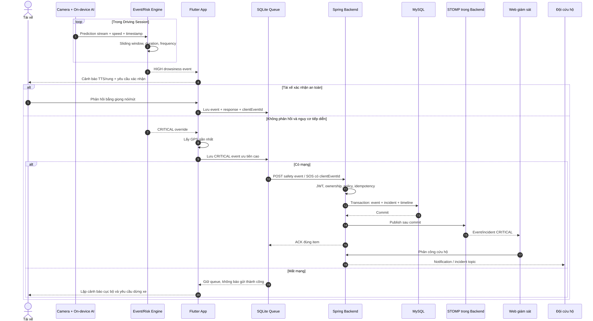
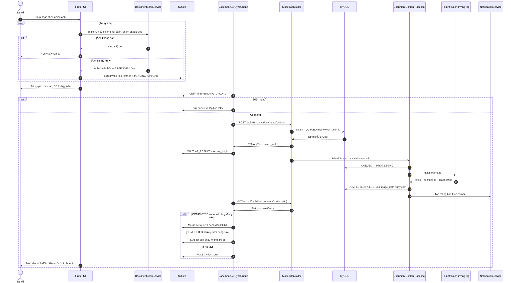

# BÁO CÁO ĐỒ ÁN TỐT NGHIỆP

## Đề tài

**Nghiên cứu và xây dựng hệ thống Agentic AI hỗ trợ an toàn lái xe dựa trên nhận diện hành vi tài xế và cảnh báo cứu hộ tự động**

## MỞ ĐẦU

### 1. Lý do chọn đề tài

Tai nạn giao thông đường bộ vẫn là một vấn đề lớn đối với sức khỏe cộng đồng và sự phát triển kinh tế – xã hội. Theo Tổ chức Y tế Thế giới (WHO), mỗi năm thế giới có khoảng 1,16 triệu người tử vong và từ 20 đến 50 triệu người bị thương không tử vong do tai nạn giao thông; nhiều nạn nhân phải chịu thương tật kéo dài. Tai nạn giao thông đồng thời gây tổn thất đáng kể về chi phí y tế, năng suất lao động và tài sản xã hội [1]. Tại Việt Nam, số liệu được công bố cho năm 2024 ghi nhận 23.837 vụ tai nạn giao thông, làm 10.996 người tử vong và 17.705 người bị thương [2]. Mặc dù các biện pháp quản lý và xử lý vi phạm ngày càng được tăng cường, số người chết và bị thương vẫn ở mức đáng lo ngại. Điều đó cho thấy bên cạnh hạ tầng, phương tiện và thực thi pháp luật, việc hỗ trợ người điều khiển phương tiện phát hiện sớm trạng thái nguy hiểm cũng có ý nghĩa thiết thực.

Trong các yếu tố thuộc về con người, mệt mỏi, buồn ngủ, mất tập trung và sử dụng điện thoại khi lái xe đều có thể làm giảm khả năng quan sát và kéo dài thời gian phản ứng. Đáng chú ý, số vụ tai nạn liên quan đến buồn ngủ thường khó được thống kê đầy đủ vì sau tai nạn không phải lúc nào cũng tồn tại dấu vết khách quan để xác định tài xế đã buồn ngủ hay ngủ gật. Cơ quan An toàn Giao thông Đường bộ Hoa Kỳ (NHTSA) cũng lưu ý rằng số liệu về tai nạn, thương tích và tử vong do lái xe trong trạng thái buồn ngủ rất khó xác định chính xác [3]. Vì vậy, nguy cơ này có thể lớn hơn con số được ghi nhận trong các báo cáo tai nạn.

Trong đời sống, cụm từ “giấc ngủ trắng” thường được sử dụng để mô tả trạng thái người lái rơi vào cơn ngủ thoáng qua, mơ màng hoặc mất nhận thức trong thời gian rất ngắn khi vẫn đang điều khiển phương tiện. Đây không phải là một thuật ngữ chẩn đoán y khoa thống nhất; trong phạm vi đề tài, khái niệm này được tiếp cận dưới góc độ an toàn lái xe, gắn với buồn ngủ, ngủ gật hoặc mất tỉnh táo thoáng qua. Trước khi trạng thái nguy hiểm xảy ra, tài xế có thể xuất hiện các dấu hiệu như mí mắt nặng, nhắm mắt kéo dài, chớp mắt bất thường, ngáp nhiều, cúi đầu, tư thế đầu lệch, khó duy trì sự tập trung hoặc không nhớ rõ một đoạn đường vừa đi qua [4]. Chỉ một khoảng mất kiểm soát ngắn ở vận tốc cao cũng có thể khiến phương tiện đi được một quãng đường đáng kể mà tài xế không kịp quan sát hay xử lý tình huống.

Nguy cơ trên đặc biệt đáng quan tâm đối với tài xế vận tải đường dài. Nhóm tài xế này thường phải di chuyển liên tục trong nhiều giờ, làm việc vào ban đêm hoặc thời điểm nhịp sinh học suy giảm, đối mặt với áp lực tiến độ giao hàng và điều kiện đường sá thay đổi. Trong nhiều chặng vận tải chỉ có một tài xế trong cabin. Việc lái xe một mình không được xem là nguyên nhân trực tiếp duy nhất gây tai nạn, nhưng làm thiếu đi một người đồng hành có thể trò chuyện, quan sát dấu hiệu mệt mỏi, nhắc tài xế nghỉ ngơi hoặc hỗ trợ gọi trợ giúp khi có bất thường. Do đó, một trợ lý số có khả năng giao tiếp rảnh tay, nhắc nhở theo ngữ cảnh và chủ động chuyển cấp cảnh báo có thể đóng vai trò như một lớp hỗ trợ bổ sung cho tài xế; hệ thống không thay thế trách nhiệm tự đánh giá sức khỏe, tuân thủ thời gian lái xe và chủ động dừng nghỉ.

Bên cạnh buồn ngủ, việc sử dụng điện thoại khi phương tiện đang di chuyển tạo ra đồng thời sự xao nhãng về thị giác, nhận thức và thao tác. NHTSA ghi nhận tại Hoa Kỳ trong năm 2022 có 3.308 người tử vong và khoảng 289.310 người bị thương trong các vụ tai nạn có liên quan đến tài xế mất tập trung [5]. Số liệu này không được sử dụng để suy rộng trực tiếp cho Việt Nam, nhưng cho thấy tính nghiêm trọng của hành vi mất tập trung và nhu cầu phát hiện, nhắc nhở kịp thời. Đối với đề tài, điện thoại vừa là thiết bị triển khai hệ thống vừa là đối tượng hành vi cần nhận diện. Vì vậy, chức năng phát hiện sử dụng điện thoại được giới hạn ở kịch bản có hai thiết bị: một điện thoại được gắn cố định trong cabin để chạy ứng dụng SafeFleet và camera hướng về tài xế; một điện thoại khác được tài xế cầm hoặc sử dụng trong khi lái xe. Cách xác định phạm vi này giúp tránh tuyên bố quá mức rằng ứng dụng có thể dùng camera của chính thiết bị đang bị cầm để quan sát đầy đủ hành vi đó.

Các giải pháp giám sát tài xế hiện nay thường tập trung vào một chuỗi xử lý ngắn: camera nhận hình ảnh, mô hình nhận diện một trạng thái bất thường và thiết bị phát âm thanh cảnh báo. Cơ chế này hữu ích nhưng chưa giải quyết đầy đủ một tình huống kéo dài. Một cảnh báo đơn lẻ không trả lời được các câu hỏi tiếp theo như: mức rủi ro hiện tại là bao nhiêu; tài xế đã phản hồi hay chưa; có cần lặp lại cảnh báo, đề nghị dừng nghỉ hoặc chuyển thành sự kiện khẩn cấp không; vị trí phương tiện ở đâu; trung tâm điều hành đã tiếp nhận sự kiện chưa; và toàn bộ quá trình có được lưu lại để đối soát hay không. Nếu chỉ đưa video liên tục lên máy chủ để xử lý thì hệ thống lại phụ thuộc mạng, tăng độ trễ, chi phí lưu trữ và rủi ro riêng tư đối với dữ liệu cabin.

Song song với bài toán an toàn, quá trình khảo sát mã nguồn và nghiệp vụ của dự án cho thấy doanh nghiệp vận tải còn gặp vấn đề trong quản lý dữ liệu vận hành. Thông tin về tài xế, phương tiện, chuyến đi, vị trí, cảnh báo, sự cố, phiếu giao nhận và nhật trình có thể nằm trên giấy, tệp bảng tính hoặc nhiều nguồn rời rạc. Quy trình ghi tay rồi nhập lại dữ liệu làm phát sinh thao tác lặp, sai sót, khó tìm kiếm, khó kiểm tra lịch sử thay đổi và tốn không gian lưu trữ chứng từ. Khi dữ liệu không được cập nhật kịp thời, bộ phận điều phối cũng khó nắm được trạng thái thực của phương tiện và phản ứng nhanh trước cảnh báo. Vì vậy, đề tài không chỉ nghiên cứu một mô hình nhận diện hành vi đơn lẻ mà còn hướng đến bài toán chuyển đổi số: số hóa nhật trình và chứng từ bằng OCR có bước kiểm tra của con người; tổ chức dữ liệu tập trung; tự động xử lý và đồng bộ dữ liệu; tối ưu việc lưu trữ bằng cách ưu tiên sự kiện, metadata và bằng chứng cần thiết thay vì truyền video cabin liên tục; đồng thời cung cấp web app phục vụ quản lý đội xe.

Sự phát triển của Computer Vision, Deep Learning, mô hình học theo chuỗi thời gian, xử lý ngôn ngữ tự nhiên, nhận dạng tiếng nói, GPS, API bản đồ và nền tảng điện thoại thông minh tạo điều kiện để xây dựng một giải pháp tích hợp với chi phí tiếp cận thấp hơn thiết bị chuyên dụng. Nghiên cứu trước đây cũng cho thấy khả năng triển khai giám sát buồn ngủ theo thời gian thực trên nền tảng di động, đồng thời chỉ ra rằng hiệu quả thực tế phụ thuộc mạnh vào dữ liệu, năng lực thiết bị và điều kiện quan sát [6]. Điện thoại có sẵn camera, GPS, loa, micro, rung và kết nối mạng, phù hợp để thực hiện cảnh báo tại chỗ, tương tác giọng nói, ghi nhận vị trí và đồng bộ sự kiện. Tuy nhiên, thiết bị này có giới hạn về hiệu năng, pin, nhiệt độ, quyền chạy nền và chất lượng camera, nên cần lựa chọn kiến trúc xử lý phù hợp thay vì đưa toàn bộ tính toán lên máy chủ hoặc thực hiện mọi tác vụ trên thiết bị.

Trong kiến trúc được đề xuất, Computer Vision chịu trách nhiệm quan sát và chuyển tín hiệu hình ảnh thành các đặc trưng hoặc sự kiện như mắt nhắm kéo dài, tỷ lệ nhắm mắt trong một cửa sổ thời gian, ngáp, tư thế đầu bất thường và sự xuất hiện của điện thoại thứ hai. Agentic AI không thay thế mô hình nhận diện này. Agentic AI đóng vai trò tầng điều phối: tiếp nhận sự kiện đã được chuẩn hóa, kết hợp ngữ cảnh chuyến đi, tốc độ, thời gian kéo dài, phản hồi giọng nói và dữ liệu vị trí; từ đó lựa chọn công cụ hoặc hành động phù hợp trong phạm vi được cấp quyền. Chuỗi xử lý hướng đến là: **quan sát → nhận diện → tổng hợp theo thời gian → đánh giá rủi ro → cảnh báo → yêu cầu tài xế phản hồi → nếu không phản hồi thì lấy vị trí và gửi sự kiện về trung tâm/người liên hệ đã cấu hình**. Các thao tác làm thay đổi trạng thái nghiệp vụ phải có kiểm soát quyền, nhật ký và bước xác nhận khi cần thiết.

Ngoài cảnh báo an toàn, trợ lý còn hướng đến việc giúp tài xế thao tác rảnh tay trong các tình huống phù hợp, chẳng hạn hỏi thông tin chuyến, tìm kiếm hoặc mở chức năng dẫn đường, xác nhận trạng thái an toàn, gửi yêu cầu hỗ trợ và tra cứu thông tin vận hành. Cách tiếp cận này giảm nhu cầu chạm vào màn hình khi đang lái xe và phù hợp với bối cảnh tài xế đường dài thường làm việc một mình. Ở phía doanh nghiệp, cùng một nền tảng cung cấp dữ liệu realtime, lịch sử sự kiện, báo cáo và công cụ số hóa giấy tờ, qua đó liên kết mục tiêu an toàn với mục tiêu quản trị vận hành.

Từ các lý do trên, đề tài **“Nghiên cứu và xây dựng hệ thống Agentic AI hỗ trợ an toàn lái xe dựa trên nhận diện hành vi tài xế và cảnh báo cứu hộ tự động”** được lựa chọn nhằm nghiên cứu một hệ thống hỗ trợ nhiều lớp, có khả năng phản ứng nhanh trên thiết bị di động, điều phối theo ngữ cảnh và kết nối với nền tảng quản lý doanh nghiệp. Đề tài hướng đến prototype có thể kiểm chứng về kỹ thuật, không tuyên bố thay thế thiết bị an toàn được chứng nhận, người đồng hành, nhân viên điều phối hoặc cơ quan cứu hộ chuyên nghiệp.

### 2. Mục tiêu nghiên cứu

#### 2.1. Mục tiêu tổng quát

Nghiên cứu và xây dựng prototype hệ thống SafeFleet ứng dụng Computer Vision và Agentic AI để hỗ trợ an toàn cho tài xế vận tải đường dài theo thời gian thực. Hệ thống hướng đến khả năng nhận diện một số hành vi nguy hiểm, đánh giá mức độ rủi ro, cảnh báo và tương tác rảnh tay với tài xế; đồng thời kết nối dữ liệu mobile – backend – web để phục vụ giám sát, xử lý sự cố, quản lý vận hành và số hóa quy trình giấy tờ của doanh nghiệp.

#### 2.2. Mục tiêu cụ thể

- Nghiên cứu bài toán giám sát trạng thái tài xế bằng camera trên điện thoại, tập trung vào buồn ngủ/ngủ gật và hành vi sử dụng điện thoại thứ hai khi phương tiện đang di chuyển.
- Nghiên cứu cơ chế tổng hợp tín hiệu theo thời gian và đánh giá rủi ro từ trạng thái mắt, tỷ lệ PERCLOS, ngáp, tư thế đầu, độ tin cậy phát hiện điện thoại, tốc độ xe và thời gian kéo dài của hành vi.
- Xây dựng cơ chế cảnh báo tại chỗ bằng giao diện, âm thanh, giọng nói và rung theo nhiều mức độ; hạn chế cảnh báo lặp bằng ngưỡng thời gian và khoảng nghỉ giữa các cảnh báo.
- Xây dựng trợ lý AI hỗ trợ tương tác văn bản/giọng nói, cho phép tài xế nhận thông tin, phản hồi trạng thái an toàn, tìm kiếm địa điểm hoặc chức năng, gửi yêu cầu hỗ trợ và thực hiện một số thao tác theo cơ chế rảnh tay.
- Nghiên cứu vai trò của Agentic AI trong việc lập kế hoạch, lựa chọn công cụ, kiểm tra kết quả và điều phối hành động dựa trên dữ liệu thật của đúng tài khoản; các hành động quan trọng phải được giới hạn quyền và yêu cầu xác nhận.
- Xây dựng cơ chế tạo sự kiện khẩn cấp khi trạng thái nguy hiểm kéo dài hoặc tài xế không phản hồi; gắn dữ liệu GPS và gửi thông tin về trung tâm quản lý hoặc đầu mối đã cấu hình để hỗ trợ xử lý.
- Xây dựng ứng dụng mobile cho tài xế có khả năng quản lý chuyến, checklist, dẫn đường, gửi GPS, ghi nhận cảnh báo, SOS, thông báo và đồng bộ dữ liệu sau khi mất kết nối.
- Xây dựng web dashboard cho doanh nghiệp để quản lý tài xế, phương tiện, chuyến đi, thiết bị, vị trí xe, cảnh báo, sự cố, bảo trì và báo cáo theo thời gian thực.
- Số hóa nhật trình và một số chứng từ vận tải từ ảnh chụp bằng OCR; hỗ trợ hàng đợi xử lý, đối chiếu thủ công, lưu trữ có cấu trúc và xuất dữ liệu, qua đó giảm nhập liệu lặp và phụ thuộc vào giấy tờ.
- Đánh giá hệ thống theo các tiêu chí phù hợp như độ chính xác hoặc precision/recall/F1 của mô hình trên tập dữ liệu đánh giá, độ trễ cảnh báo, FPS, mức sử dụng tài nguyên trên điện thoại, độ trễ đồng bộ và tính ổn định của toàn bộ luồng mobile – backend – AI – web.

### 3. Đối tượng và phạm vi nghiên cứu

#### 3.1. Đối tượng nghiên cứu

Đối tượng nghiên cứu của đề tài bao gồm:

- Các biểu hiện quan sát được có liên quan đến trạng thái buồn ngủ/ngủ gật của tài xế như độ mở mắt, thời gian nhắm mắt, PERCLOS, ngáp và tư thế đầu.
- Hành vi cầm hoặc sử dụng điện thoại thứ hai trong khi phương tiện đang di chuyển.
- Phương pháp Computer Vision, mô hình học sâu và mô hình thời gian phục vụ nhận diện trạng thái tài xế trên thiết bị di động.
- Cơ chế đánh giá rủi ro, cảnh báo nhiều cấp, thu nhận phản hồi và chuyển cấp sự kiện an toàn.
- Agentic AI, xử lý ngôn ngữ tự nhiên, nhận dạng giọng nói, tổng hợp giọng nói, tool calling, kiểm soát quyền và xác nhận hành động.
- Dữ liệu GPS, API bản đồ, telemetry, trạng thái chuyến, sự kiện an toàn và nhật trình vận tải.
- Phương pháp OCR và quy trình có con người kiểm tra nhằm chuyển dữ liệu từ chứng từ giấy thành dữ liệu có cấu trúc.
- Kiến trúc tích hợp ứng dụng mobile, backend API, dịch vụ AI, cơ sở dữ liệu, lưu trữ bằng chứng, WebSocket và web dashboard.

#### 3.2. Phạm vi nghiên cứu

Đối tượng sử dụng chính của ứng dụng mobile là tài xế vận tải đường dài, đặc biệt trong các chặng chỉ có một tài xế trong cabin. Đối tượng sử dụng web gồm quản trị viên, quản lý đội xe, nhân viên điều phối, cán bộ an toàn và bộ phận tiếp nhận sự cố/cứu hộ của doanh nghiệp.

Trong phạm vi đồ án, hệ thống tập trung vào bốn nhóm dữ liệu và chức năng cốt lõi: (1) tín hiệu và sự kiện buồn ngủ/ngủ gật; (2) sự kiện phát hiện sử dụng điện thoại; (3) dữ liệu vị trí, tuyến đường và bản đồ được khai thác qua GPS/API; (4) dữ liệu nhật trình, chuyến đi và chứng từ vận hành. Camera trước của điện thoại được gắn cố định và hướng vào cabin. Xử lý nhận diện cần phản hồi nhanh được ưu tiên thực hiện trên thiết bị; máy chủ nhận metadata và sự kiện thay vì nhận video cabin liên tục.

Chức năng phát hiện điện thoại chỉ áp dụng cho trường hợp tài xế có hai điện thoại: thiết bị thứ nhất được cố định để chạy SafeFleet, còn thiết bị thứ hai xuất hiện trong vùng quan sát của camera khi tài xế cầm hoặc sử dụng. Hệ thống không khẳng định phát hiện được mọi hình thức mất tập trung, không suy đoán ý định của tài xế và không thay thế việc kiểm tra vi phạm của cơ quan chức năng.

Prototype không can thiệp vào vô lăng, phanh, động cơ, CAN Bus hoặc hệ thống điều khiển của xe; không thực hiện lái xe tự động. “Cảnh báo cứu hộ tự động” trong phạm vi đề tài được hiểu là tự động tạo và chuyển sự kiện, trạng thái nguy hiểm cùng vị trí tới trung tâm quản lý hoặc người liên hệ đã cấu hình khi thỏa điều kiện. Việc kết nối và tự động gọi trực tiếp các đầu số cứu hộ, y tế hoặc cơ quan nhà nước nằm ngoài phạm vi nếu chưa có hạ tầng, thỏa thuận và phê duyệt cần thiết.

Đề tài xây dựng và đánh giá prototype trên các tập dữ liệu, video thử nghiệm và môi trường thiết bị có thể tiếp cận. Kết quả chưa được xem là chứng nhận an toàn để triển khai thương mại. Việc áp dụng thực tế cần tiếp tục thu thập dữ liệu cabin có sự đồng ý, đánh giá trong điều kiện ngày/đêm, kính mắt, che khuất, rung xe và nhiều dòng điện thoại; đồng thời kiểm thử pin, nhiệt, chạy nền, mạng yếu, bảo mật, quyền riêng tư và tỷ lệ cảnh báo sai theo giờ lái.

### 4. Phương pháp nghiên cứu

Đề tài sử dụng kết hợp các phương pháp nghiên cứu sau:

**Phương pháp nghiên cứu tài liệu:** Thu thập, chọn lọc và hệ thống hóa các tài liệu về Driver Monitoring System, buồn ngủ khi lái xe, PERCLOS, nhận diện khuôn mặt, phát hiện đối tượng, mô hình học theo chuỗi thời gian, OCR, Agentic AI, tool calling, GPS, bản đồ số, hệ thống realtime và kiến trúc offline-first. Kết quả khảo sát được dùng để xác định dấu hiệu đầu vào, lựa chọn nhóm phương pháp, nhận diện hạn chế và xây dựng tiêu chí đánh giá.

**Phương pháp phân tích bài toán và yêu cầu:** Khảo sát hai nhóm nhu cầu gồm an toàn tài xế và vận hành doanh nghiệp; xác định actor, use case, dữ liệu đầu vào – đầu ra, luồng nghiệp vụ và ràng buộc. Các yêu cầu được phân tách thành những module có thể kiểm thử như giám sát cabin, cảnh báo, trợ lý giọng nói, GPS/bản đồ, chuyến đi, sự cố, nhật trình/OCR, đồng bộ ngoại tuyến và web quản lý.

**Phương pháp thu thập và xử lý dữ liệu:** Tổ chức dữ liệu thành các nhóm phục vụ nhận diện buồn ngủ, phát hiện điện thoại, GPS/bản đồ và nhật trình/chứng từ. Với dữ liệu dùng huấn luyện hoặc đánh giá mô hình, tiến hành kiểm tra chất lượng, chuẩn hóa, gán nhãn và phân chia tập huấn luyện – xác thực – kiểm thử khi điều kiện dữ liệu cho phép. Dữ liệu ảnh cabin và vị trí cần được thu thập có sự đồng ý, giảm thiểu dữ liệu cá nhân và áp dụng thời hạn lưu trữ phù hợp.

**Phương pháp mô hình hóa và xây dựng thử nghiệm:** Thiết kế kiến trúc theo các lớp mobile – backend – AI service – database/object storage – web. Các tác vụ realtime nhạy cảm như xử lý camera và cảnh báo ban đầu được đặt trên thiết bị; dữ liệu nghiệp vụ, realtime dashboard, OCR server và điều phối agent được tổ chức ở phía máy chủ. Hợp đồng REST/WebSocket được sử dụng để tích hợp các module và hàng đợi cục bộ hỗ trợ lưu – gửi lại khi mất mạng.

**Phương pháp thực nghiệm mô hình nhận diện:** Thực hiện tiền xử lý hình ảnh, trích xuất đặc trưng khuôn mặt, tổng hợp chuỗi thời gian và thử nghiệm mô hình/luật phát hiện. Đối với buồn ngủ, đánh giá các tín hiệu như độ mở mắt, PERCLOS, ngáp và tư thế đầu; đối với điện thoại, sử dụng độ tin cậy phát hiện kết hợp tốc độ và thời gian xuất hiện để hạn chế cảnh báo tức thời sai. Các ngưỡng cần được hiệu chỉnh trên tập xác thực thay vì chỉ lựa chọn chủ quan.

**Phương pháp xây dựng và đánh giá Agentic AI:** Xây dựng vòng lặp nhận yêu cầu – lập kế hoạch – chọn công cụ – thực thi – kiểm tra – lập lại kế hoạch hoặc trả kết quả. Công cụ được cấp theo quyền của tài khoản, dữ liệu trả lời phải dựa trên kết quả công cụ, còn thao tác thay đổi trạng thái cần xác nhận. Agent được đánh giá bằng bộ tình huống chuẩn, tập trung vào lựa chọn đúng công cụ, trả lời đúng phạm vi dữ liệu, khả năng yêu cầu làm rõ, không thực hiện hành động trái quyền và xử lý an toàn khi dịch vụ AI không sẵn sàng.

**Phương pháp thực nghiệm OCR và chuyển đổi số:** Chụp/scan chứng từ, kiểm tra chất lượng ảnh, hiệu chỉnh góc và độ tương phản, nhận dạng trường dữ liệu, đưa kết quả vào màn hình đối chiếu và chỉ lưu chính thức sau bước kiểm tra cần thiết. Độ chính xác được xem xét theo từng trường quan trọng, tỷ lệ khớp chính xác, CER/WER và thời gian xử lý; kết quả độ tin cậy thấp phải được chuyển sang người dùng xác nhận.

**Phương pháp kiểm thử và đánh giá hệ thống:** Kết hợp kiểm thử đơn vị, widget/component, tích hợp API–cơ sở dữ liệu, kiểm thử luồng nghiệp vụ, phân tích tĩnh, build ứng dụng và thử nghiệm trên thiết bị. Các chỉ số dự kiến gồm độ chính xác, precision, recall, F1-score, confusion matrix, FPS, thời gian từ phát hiện đến cảnh báo, số cảnh báo sai trên một giờ, độ trễ API/realtime, khả năng đồng bộ sau mất mạng và mức tiêu thụ tài nguyên. Kết quả trên dữ liệu mô phỏng hoặc tập mẫu nhỏ phải được ghi rõ giới hạn và không suy rộng thành hiệu quả ngoài thực địa.

### 5. Ý nghĩa khoa học và thực tiễn của đề tài

#### 5.1. Ý nghĩa khoa học

Đề tài góp phần hệ thống hóa cơ sở lý thuyết và quy trình kỹ thuật để kết hợp Computer Vision với Agentic AI trong một bài toán hỗ trợ an toàn. Thay vì xem kết quả nhận diện ở từng khung hình là quyết định cuối cùng, đề tài nghiên cứu cách chuyển các tín hiệu mức thấp thành sự kiện có ngữ nghĩa, tổng hợp chúng theo thời gian và đặt trong ngữ cảnh vận hành. Cách tiếp cận này làm rõ sự phân vai: mô hình nhận diện chịu trách nhiệm quan sát, bộ đánh giá rủi ro chịu trách nhiệm tổng hợp, còn agent chịu trách nhiệm điều phối công cụ và hành động trong phạm vi được kiểm soát.

Đề tài cũng tạo cơ sở thực nghiệm cho việc đánh giá mô hình trên thiết bị di động có tài nguyên giới hạn. Các yếu tố như độ trễ, FPS, nhiệt độ, pin, quyền chạy nền, mất mạng và sai khác giữa các thiết bị được xem là một phần của bài toán nghiên cứu, không chỉ là chi tiết triển khai. Việc kết hợp mô hình thời gian với các luật an toàn và cơ chế fallback giúp khảo sát khả năng duy trì hoạt động khi một thành phần AI không sẵn sàng hoặc độ tin cậy chưa đủ cao.

Ngoài ra, đề tài nghiên cứu mối liên hệ giữa dữ liệu an toàn và dữ liệu vận hành gồm GPS, chuyến đi, sự kiện, nhật trình và phản hồi giọng nói. Quy trình Agentic AI có kiểm soát quyền, xác nhận và nhật ký cung cấp một trường hợp nghiên cứu về cách đưa mô hình ngôn ngữ vào hệ thống nghiệp vụ mà không trao toàn quyền quyết định cho mô hình. Đề tài không đặt mục tiêu tạo ra một thuật toán hoàn toàn mới, mà tập trung đề xuất, tích hợp và đánh giá một kiến trúc tổng thể phù hợp với bài toán vận tải.

#### 5.2. Ý nghĩa thực tiễn

Đối với tài xế vận tải đường dài, hệ thống có tiềm năng cung cấp thêm một lớp hỗ trợ khi phải lái xe một mình: theo dõi dấu hiệu buồn ngủ, cảnh báo hành vi sử dụng điện thoại thứ hai, tương tác bằng giọng nói, hỗ trợ tìm kiếm thông tin và gửi yêu cầu trợ giúp mà không buộc tài xế thực hiện nhiều thao tác trên màn hình. Cảnh báo sớm không thay thế việc nghỉ ngơi, nhưng có thể giúp tài xế nhận biết trạng thái bất thường và chủ động dừng xe ở vị trí an toàn.

Đối với doanh nghiệp vận tải, web dashboard và luồng dữ liệu tập trung giúp theo dõi vị trí phương tiện, trạng thái chuyến, cảnh báo và sự cố theo thời gian gần thực; hỗ trợ điều phối và truy vết lịch sử xử lý. Việc chỉ đồng bộ metadata, sự kiện và bằng chứng cần thiết thay cho video cabin liên tục có thể giảm nhu cầu băng thông và dung lượng lưu trữ, đồng thời hạn chế thu thập dữ liệu nhạy cảm không cần thiết.

Quy trình OCR, đối chiếu và lưu dữ liệu có cấu trúc góp phần chuyển đổi hoạt động dựa trên phiếu giấy, nhật trình viết tay và bảng tính rời rạc sang quy trình web/app. Điều này có thể giảm nhập liệu lặp, giảm thất lạc tài liệu, tăng khả năng tìm kiếm, tổng hợp báo cáo và đối soát. Hàng đợi ngoại tuyến giúp tài xế tiếp tục ghi nhận dữ liệu khi mạng yếu và đồng bộ lại khi kết nối được khôi phục, phù hợp với đặc thù các tuyến vận tải đường dài.

Về khả năng mở rộng, prototype có thể là nền tảng tham khảo cho xe tải, xe khách, taxi, xe dịch vụ và hệ thống quản lý đội xe. Sau khi có dữ liệu thực địa, quy trình bảo vệ dữ liệu và đánh giá an toàn đầy đủ, hệ thống có thể được mở rộng thêm hành vi mất tập trung, phân tích rủi ro theo tài xế, gợi ý thời điểm nghỉ, tích hợp thiết bị chuyên dụng hoặc kết nối với quy trình cứu hộ của doanh nghiệp.

### 6. Cấu trúc luận văn

Ngoài phần Mở đầu, Kết luận và hướng phát triển, Tài liệu tham khảo và Phụ lục, nội dung chính của luận văn được tổ chức thành ba chương:

- **Chương 1 – Tổng quan về vấn đề nghiên cứu:** Trình bày tổng quan bài toán giám sát và hỗ trợ an toàn tài xế, bối cảnh chuyển đổi số doanh nghiệp vận tải, các nghiên cứu liên quan, phương pháp hiện có, ưu điểm, hạn chế và khoảng trống mà đề tài hướng đến giải quyết.
- **Chương 2 – Phương pháp nghiên cứu và xây dựng giải pháp:** Phân tích yêu cầu, đầu vào – đầu ra, tiêu chí đánh giá; trình bày giải pháp tổng thể, kiến trúc hệ thống, pipeline xử lý, dữ liệu, thuật toán, công cụ và quá trình triển khai các module mobile, backend, AI, cơ sở dữ liệu và web.
- **Chương 3 – Kết quả nghiên cứu và thảo luận:** Mô tả môi trường thực nghiệm, kết quả đạt được của mô hình và hệ thống, đánh giá theo các tiêu chí đã xác định, so sánh khi có điều kiện, phân tích hạn chế và rút ra bài học.

## CHƯƠNG 1: TỔNG QUAN VỀ VẤN ĐỀ NGHIÊN CỨU

### 1.1. Giới thiệu bài toán/lĩnh vực

#### 1.1.1. Mô tả tổng quan bài toán

Trong quá trình điều khiển phương tiện, năng lực quan sát, nhận thức và phản ứng của tài xế ảnh hưởng trực tiếp đến mức độ an toàn của chuyến đi. Sự suy giảm tỉnh táo do mệt mỏi hoặc buồn ngủ có thể làm tài xế phản ứng chậm, bỏ sót tín hiệu giao thông và mất khả năng kiểm soát phương tiện trong một khoảng thời gian ngắn. Tương tự, việc sử dụng điện thoại làm phân tán đồng thời sự chú ý về thị giác, nhận thức và thao tác. Các nguy cơ này đặc biệt đáng quan tâm đối với tài xế vận tải đường dài vì thời gian làm việc kéo dài, hành trình đơn điệu, điều kiện lái xe ban đêm và việc thường xuyên chỉ có một người trong cabin.

Bài toán giám sát tài xế, thường được gọi là Driver Monitoring System (DMS), hướng tới việc quan sát người lái bằng camera hoặc cảm biến, phân tích trạng thái và phát hiện sớm những biểu hiện có khả năng gây mất an toàn. Với cách tiếp cận dựa trên thị giác máy tính, camera hướng vào cabin cung cấp chuỗi khung hình về khuôn mặt, bàn tay và vùng không gian xung quanh tài xế. Từ dữ liệu này, hệ thống có thể trích xuất trạng thái mắt, miệng, tư thế đầu, hướng nhìn và sự xuất hiện của những vật thể liên quan như điện thoại.

Một DMS cơ bản thường thực hiện tuần tự các bước thu nhận hình ảnh, phát hiện khuôn mặt hoặc vật thể, phân loại trạng thái và phát cảnh báo. Chuỗi xử lý này phù hợp với những dấu hiệu rõ ràng nhưng chưa đủ để diễn giải đầy đủ mức độ nguy hiểm. Một lần nhắm mắt trong một khung hình có thể chỉ là chớp mắt sinh lý. Một chiếc điện thoại xuất hiện trong cabin chưa đồng nghĩa với việc tài xế đang sử dụng. Ngược lại, trạng thái mắt nhắm kéo dài, đầu cúi, hành vi lặp lại và việc không phản hồi sau cảnh báo tạo ra một ngữ cảnh có rủi ro cao hơn đáng kể.

Vì vậy, bài toán cần được xem xét ở ba tầng khác nhau. Tầng nhận diện hành vi trả lời câu hỏi tài xế đang biểu hiện dấu hiệu gì. Tầng đánh giá rủi ro trả lời câu hỏi trạng thái đó nguy hiểm đến mức nào khi xét đến thời lượng, tần suất, tốc độ xe và lịch sử cảnh báo. Tầng điều phối hành động trả lời câu hỏi hệ thống cần thực hiện việc gì tiếp theo. Việc tách ba tầng giúp tránh đồng nhất một dự đoán của mô hình với một quyết định an toàn và tạo cơ sở để kiểm soát từng loại sai số.

Đối với buồn ngủ, dữ liệu tại một thời điểm không phản ánh đầy đủ diễn tiến sinh lý. Hệ thống cần theo dõi các dấu hiệu như độ mở mắt, tỷ lệ thời gian mắt nhắm, hành vi ngáp, tư thế đầu và sự thay đổi của chúng trong một cửa sổ thời gian. Phân tích chuỗi cho phép phân biệt chớp mắt bình thường với nhắm mắt kéo dài, đồng thời nhận biết xu hướng suy giảm tỉnh táo thay vì chỉ phản ứng khi trạng thái nguy hiểm đã rõ rệt. Đây là cơ sở của các phương pháp sử dụng PERCLOS, cửa sổ trượt, mô hình tuần tự và Transformer.

Đối với hành vi sử dụng điện thoại, phát hiện vật thể mới chỉ xác định sự hiện diện và vị trí của thiết bị. Để suy luận hành vi, cần xem xét thêm quan hệ giữa điện thoại với bàn tay, khuôn mặt, vùng tai, hướng đầu và thời gian thiết bị xuất hiện. Trong phạm vi đồ án, điện thoại chạy SafeFleet được gắn cố định và đóng vai trò thiết bị giám sát. Đối tượng được nhận diện là điện thoại thứ hai mà tài xế cầm hoặc sử dụng. Giới hạn này phù hợp với khả năng quan sát của camera và giúp xác định rõ điều kiện áp dụng của chức năng.

Sau khi hành vi được nhận diện và tổng hợp theo thời gian, hệ thống cần hình thành sự kiện có cấu trúc. Sự kiện không chỉ chứa nhãn dự đoán mà còn cần thời điểm, độ tin cậy, thời lượng, tốc độ phương tiện, vị trí, số lần cảnh báo và trạng thái phản hồi của tài xế. Cấu trúc này là đầu vào thích hợp cho tầng đánh giá rủi ro và Agentic AI. Video thô không nên được đưa trực tiếp cho mô hình ngôn ngữ để quyết định hành động, bởi cách làm đó vừa tốn tài nguyên vừa làm giảm khả năng kiểm soát và giải thích.

Agentic AI trong đề tài được hiểu là một cơ chế điều phối có khả năng quan sát trạng thái đã được chuẩn hóa, lập kế hoạch, lựa chọn công cụ, tiếp nhận kết quả và điều chỉnh bước xử lý tiếp theo. Agent không thay thế mô hình thị giác máy tính và cũng không tự quyết định mọi vấn đề an toàn. Vai trò phù hợp của agent là kết nối các khả năng đã được định nghĩa trước, chẳng hạn phát cảnh báo bằng giọng nói, yêu cầu tài xế xác nhận, lấy vị trí GPS, mở chức năng dẫn đường, gửi yêu cầu hỗ trợ hoặc tạo sự kiện để trung tâm điều hành tiếp nhận.

Trong miền an toàn, mọi hành động của agent phải chịu ràng buộc bởi luật nghiệp vụ và quyền truy cập. Khi mức rủi ro thấp, hệ thống có thể chỉ nhắc nhở. Khi dấu hiệu kéo dài, hệ thống tăng mức cảnh báo và yêu cầu phản hồi. Chỉ khi điều kiện nguy hiểm, lịch sử cảnh báo và trạng thái không phản hồi đồng thời thỏa mãn, hệ thống mới được phép tạo sự kiện khẩn cấp và chuyển vị trí tới đầu mối đã cấu hình. Quy trình này tạo thành một vòng lặp quan sát, đánh giá, hành động và kiểm tra thay vì một phản ứng đơn bước.

Bài toán của đồ án còn gắn với hoạt động quản trị doanh nghiệp vận tải. Dữ liệu an toàn chỉ phát huy đầy đủ giá trị khi được liên kết với tài xế, phương tiện, phiên lái, chuyến đi và vị trí. Mặt khác, nhật trình và chứng từ vận hành nếu tiếp tục được ghi chép trên giấy hoặc tổng hợp thủ công sẽ gây trùng lặp nhập liệu, khó truy vết và khó khai thác. Vì vậy, phạm vi nghiên cứu được mở rộng từ cảnh báo tại thiết bị sang một hệ thống tích hợp mobile, dịch vụ AI, backend và web. Hệ thống đồng thời xử lý bốn nhóm dữ liệu chính gồm dữ liệu buồn ngủ, dữ liệu sử dụng điện thoại, dữ liệu bản đồ và vị trí qua API, cùng dữ liệu nhật trình và chứng từ.

Như vậy, bài toán tổng quát của đề tài không phải chỉ là phân loại hình ảnh tài xế. Bài toán đặt ra là xây dựng một chuỗi hỗ trợ hoàn chỉnh từ nhận diện hành vi, tổng hợp theo thời gian, đánh giá rủi ro, giao tiếp rảnh tay, điều phối hành động, ghi nhận sự kiện đến hỗ trợ quản lý và số hóa dữ liệu vận hành. Các thành phần phải hoạt động với độ trễ phù hợp trên điện thoại, duy trì được chức năng thiết yếu khi kết nối không ổn định và bảo đảm rằng quyết định quan trọng không phụ thuộc duy nhất vào đầu ra xác suất của một mô hình.

#### 1.1.2. Tầm quan trọng và ứng dụng

Đối với tài xế, ý nghĩa trước hết của hệ thống là phát hiện sớm dấu hiệu suy giảm tỉnh táo và hành vi mất tập trung. Một cảnh báo đúng thời điểm có thể giúp người lái nhận ra trạng thái mà bản thân chưa tự đánh giá được, từ đó giảm tốc độ, tìm vị trí dừng phù hợp và nghỉ ngơi. Trợ lý giọng nói còn cho phép tài xế tiếp nhận thông tin hoặc gửi yêu cầu mà không phải thực hiện nhiều thao tác trên màn hình. Giá trị này đặc biệt rõ đối với người lái xe đường dài một mình, nhưng hệ thống vẫn chỉ là công cụ hỗ trợ và không thay thế nghĩa vụ chủ động bảo đảm sức khỏe của tài xế.

Đối với doanh nghiệp vận tải, dữ liệu được gắn với phiên lái và chuyến đi tạo điều kiện theo dõi tình trạng phương tiện, tiếp nhận cảnh báo, đánh giá lịch sử sự kiện và phối hợp xử lý. Thay vì chỉ biết vị trí xe, người quản lý có thể xem vị trí trong mối liên hệ với trạng thái chuyến, mức rủi ro và sự cố đang diễn ra. Dữ liệu lịch sử cũng hỗ trợ xác định những tuyến đường, khung giờ hoặc nhóm tình huống có tần suất cảnh báo cao, qua đó cung cấp căn cứ cho việc bố trí lịch lái và hoạt động đào tạo an toàn.

Đối với quy trình hỗ trợ khẩn cấp, việc kết hợp sự kiện nguy hiểm với vị trí GPS giúp giảm thời gian thu thập thông tin ban đầu. Nếu tài xế không phản hồi sau các bước cảnh báo, hệ thống có thể tự động tạo sự kiện và chuyển dữ liệu tới trung tâm điều hành hoặc người liên hệ đã cấu hình. Chức năng này không đồng nghĩa với việc tự động kết nối cơ quan cứu hộ công cộng. Giá trị của nó nằm ở khả năng duy trì luồng thông tin khi tài xế không thể chủ động thao tác.

Đối với chuyển đổi số doanh nghiệp, việc số hóa nhật trình và chứng từ giúp hình thành nguồn dữ liệu có cấu trúc, có thể tìm kiếm và tổng hợp. OCR rút ngắn thao tác nhập lại nội dung, trong khi bước đối chiếu của người dùng giúp kiểm soát sai số nhận dạng. Hàng đợi xử lý và đồng bộ ngoại tuyến phù hợp với bối cảnh tài xế có thể chụp tài liệu hoặc phát sinh sự kiện tại khu vực mạng yếu. Khi kết nối được khôi phục, dữ liệu được chuyển về hệ thống mà không yêu cầu người dùng thực hiện lại toàn bộ quy trình.

Về lưu trữ và quyền riêng tư, xử lý camera cabin trên thiết bị giúp hạn chế truyền video liên tục. Máy chủ ưu tiên lưu metadata, sự kiện và bằng chứng cần thiết theo chính sách thay vì lưu toàn bộ luồng hình ảnh. Cách tiếp cận này giảm băng thông, dung lượng và phạm vi dữ liệu nhạy cảm phải quản lý. Đây là một yêu cầu thực tiễn quan trọng vì hệ thống giám sát cabin có thể ghi nhận khuôn mặt, giọng nói, vị trí và thói quen làm việc của tài xế.

Khả năng ứng dụng của hướng nghiên cứu không giới hạn ở một loại phương tiện. Sau khi được đánh giá đầy đủ bằng dữ liệu thực địa, hệ thống có thể được điều chỉnh cho xe tải đường dài, xe khách, taxi, xe dịch vụ và đội xe doanh nghiệp. Kiến trúc mô đun cũng tạo điều kiện bổ sung các hành vi khác như mất tập trung kéo dài, không thắt dây an toàn hoặc trạng thái sức khỏe bất thường. Tuy nhiên, mỗi chức năng mở rộng cần có dữ liệu, tiêu chí đánh giá và cơ chế an toàn riêng.

### 1.2. Các nghiên cứu liên quan

#### 1.2.1. Các công trình trong nước

Nghiên cứu trong nước về giám sát tài xế chủ yếu hướng tới giải pháp không xâm lấn, chi phí thấp và có thể triển khai bằng camera phổ thông. Các công trình thường khai thác đặc trưng khuôn mặt, mô hình học sâu hoặc thiết bị nhúng để phát hiện buồn ngủ. Gần đây, hướng nghiên cứu đã mở rộng sang thiết bị di động, phân tích hành vi sử dụng điện thoại và kết nối dữ liệu với máy chủ.

Công trình “Nghiên cứu và xây dựng hệ thống cảnh báo thông minh hỗ trợ an toàn lái xe dựa trên nhận diện hành vi tài xế” của Nguyễn Quang Hà, Lê Thị Hương Ly và Nguyễn Minh Đức tập trung vào hai nhóm hành vi là buồn ngủ và sử dụng điện thoại [7]. Nghiên cứu tổ chức hệ thống theo kiến trúc đa nhánh để phản ánh sự khác biệt về bản chất dữ liệu. Nhánh buồn ngủ sử dụng EAR, MAR, tư thế đầu và biến thiên của các đặc trưng này theo chuỗi thời gian. Mô hình STGT kết hợp TransMIL được sử dụng để học quan hệ không gian và phụ thuộc dài hạn. Nhánh điện thoại sử dụng YOLO để phát hiện thiết bị, sau đó kết hợp thông tin bàn tay, khuôn mặt và hướng đầu để suy luận các trạng thái như thiết bị xuất hiện, cầm điện thoại, gọi điện, mất tập trung và nhắn tin.

Kết quả được báo cáo trong công trình [7] cho thấy nhánh buồn ngủ đạt Video Accuracy 82,31 phần trăm trên UTA Real Life Drowsiness Dataset với quy trình đánh giá năm fold theo đối tượng. Phiên bản sử dụng đặc trưng hình học và SVM đạt 62,15 phần trăm, Bi LSTM đạt 72,54 phần trăm, STGT đơn giản đạt 77,15 phần trăm và STGT kết hợp TransMIL đạt 82,31 phần trăm. Đối với nhánh điện thoại, hệ thống vượt qua sáu trong bảy kịch bản kiểm thử; trường hợp điện thoại và tay đều bị che khuất hoàn toàn không được nhận diện đúng. Báo cáo tổng hợp độ chính xác của nhánh này ở mức 85,7 phần trăm và tốc độ xử lý khoảng 20 đến 30 FPS trên cấu hình thử nghiệm.

Giá trị của công trình [7] nằm ở việc mô hình hóa buồn ngủ theo thời gian và chuyển bài toán điện thoại từ phát hiện vật thể sang suy luận hành vi có ngữ cảnh. Nghiên cứu cũng chỉ ra các giới hạn quan trọng gồm sự nhầm lẫn giữa trạng thái lờ đờ và buồn ngủ, suy giảm hiệu quả khi che khuất hoàn toàn, độ trễ do làm mượt theo thời gian và nhu cầu mở rộng dữ liệu ban đêm. Các nhánh sinh cảnh báo riêng và được điều phối ở tầng trên, nhưng chưa hình thành một cơ chế tổng hợp rủi ro chung gắn với phản hồi tài xế, vị trí, quyền truy cập và chuỗi hành động hỗ trợ sau cảnh báo.

Công trình “Xây dựng hệ thống hỏi đáp pháp lý đa phương thức tiếng Việt” của Lê Thị Hương Ly và Nguyễn Quang Hà nghiên cứu bài toán truy xuất điều luật và trả lời câu hỏi pháp lý giao thông từ văn bản kết hợp hình ảnh biển báo [8]. Dữ liệu tri thức gồm Luật Trật tự, an toàn giao thông đường bộ và quy chuẩn báo hiệu đường bộ, cùng 1.577 ảnh biển báo. Nhóm tác giả chuẩn hóa văn bản, cắt và gắn ảnh biển báo với nội dung tương ứng, tạo biểu diễn vector, truy xuất đồng thời theo văn bản và hình ảnh, sau đó sử dụng mô hình ngôn ngữ để suy luận trên các điều luật được truy xuất.

Trong nhiệm vụ truy xuất, phương pháp kết hợp phát hiện hình ảnh, embedding, đồ thị tri thức và hợp nhất đa phương thức đạt F2 Score 0,623 [8]. Trong nhiệm vụ hỏi đáp, quy trình kết hợp truy xuất tăng cường, loại bỏ ngữ cảnh không phù hợp, suy luận và biểu quyết đạt độ chính xác 91,089 phần trăm trên 101 câu hỏi công khai. Công trình cho thấy mô hình ngôn ngữ cho kết quả tốt hơn khi được cung cấp tri thức đã chọn lọc thay vì chỉ dựa vào tham số đã học. Tuy nhiên, chất lượng trả lời còn phụ thuộc vào phát hiện hình ảnh và truy xuất; dữ liệu đánh giá chưa bao phủ đầy đủ tình huống thực tế; các câu hỏi pháp lý phức tạp vẫn có thể bị suy luận sai.

Công trình [8] không nghiên cứu giám sát tài xế, nhưng có ý nghĩa phương pháp đối với lớp trợ lý thông minh của đồ án. Kinh nghiệm chuẩn hóa nguồn dữ liệu, truy xuất thông tin đa phương thức, tạo ngữ cảnh có căn cứ và kiểm tra kết quả trước khi trả lời cung cấp nền tảng để xây dựng agent làm việc với dữ liệu nghiệp vụ. Điểm cần điều chỉnh khi chuyển sang miền an toàn lái xe là câu trả lời ngôn ngữ không được đồng nhất với hành động. Mọi thao tác ảnh hưởng đến trạng thái chuyến hoặc phát sinh cảnh báo khẩn cấp cần đi qua công cụ được định nghĩa, kiểm tra quyền và luật an toàn.

Nguyễn Vũ Hải và cộng sự xây dựng hệ thống cảnh báo ngủ gật sử dụng Raspberry Pi, camera và loa cảnh báo [9]. Ảnh từ camera được phân tích trên thiết bị nhúng, sự kiện được gửi về máy chủ và người dùng có thể tra cứu qua ứng dụng di động hoặc website. Công trình thể hiện khả năng kết nối từ nhận diện tại cabin đến lưu trữ tập trung với chi phí phần cứng hợp lý. Tuy nhiên, phạm vi chủ yếu là phát hiện ngủ gật và cảnh báo, chưa đề cập đến suy luận đa hành vi, phản hồi giọng nói hoặc lựa chọn hành động theo mức rủi ro.

Điền Thị Hồng Hà nghiên cứu hệ thống theo dõi trạng thái buồn ngủ dựa trên thị giác máy tính, có khả năng ghi hình, phát hiện khuôn mặt, dự đoán trạng thái, gửi cảnh báo về máy chủ và hiển thị trên website [10]. Kết quả cho thấy mô hình hoạt động ổn định trong phạm vi thử nghiệm và chứng minh khả năng tích hợp giữa nhận diện với giám sát từ xa. Dù vậy, đánh giá mới ở mức cơ bản, chưa phân tích sâu sai số theo điều kiện lái xe và chưa mở rộng tới chuỗi xử lý sau cảnh báo.

Vũ Đình Đạt và Đoàn Ngọc Phương đề xuất hệ thống giám sát người lái trên smartphone Android sử dụng 468 điểm mốc khuôn mặt của MediaPipe [11]. Hệ thống phát hiện nhắm mắt, lệch hướng đầu và ngáp bằng đặc trưng hình học ba chiều, đồng thời dùng bộ lọc thời gian để chỉ cảnh báo khi trạng thái bất thường được duy trì. Thực nghiệm với 12 người trong điều kiện đủ sáng và ánh sáng yếu đạt độ chính xác 91,47 phần trăm cho nhắm mắt, 88,15 phần trăm cho lệch hướng đầu và 84,76 phần trăm cho ngáp; độ trễ nằm trong khoảng 287 đến 421 mili giây. Công trình khẳng định tính khả thi của xử lý trực tiếp trên điện thoại, nhưng quy mô người tham gia còn nhỏ và hiệu năng vẫn phụ thuộc ánh sáng cùng các ngưỡng cố định.

Tổng hợp các nghiên cứu trong nước cho thấy nền tảng nhận diện hành vi, xử lý trên thiết bị phổ thông, lưu sự kiện lên máy chủ và giao tiếp với dữ liệu có cấu trúc đã được hình thành. Tuy nhiên, các thành phần này thường được nghiên cứu riêng. Khoảng cách từ một mô hình nhận diện đến một quy trình hỗ trợ tài xế và quản trị doanh nghiệp hoàn chỉnh vẫn còn đáng kể.

#### 1.2.2. Các công trình quốc tế

Các nghiên cứu quốc tế về buồn ngủ đã chuyển dần từ chỉ số hình học tại từng khung hình sang mô hình hóa chuỗi. Ghoddoosian, Galib và Athitsos công bố UTA Real Life Drowsiness Dataset gồm khoảng 30 giờ video của 60 người, với ba trạng thái tỉnh táo, giảm tỉnh táo và buồn ngủ [12]. Nhóm tác giả sử dụng chuỗi đặc trưng chớp mắt làm đầu vào cho HM LSTM nhằm phát hiện sớm sự suy giảm tỉnh táo. Công trình chứng minh rằng quan hệ theo thời gian của tín hiệu mắt có giá trị đối với phân loại buồn ngủ, đồng thời cung cấp một bộ dữ liệu thực tế được sử dụng rộng rãi trong các nghiên cứu tiếp theo.

Wijnands và cộng sự nghiên cứu giám sát buồn ngủ theo thời gian thực trên nền tảng di động bằng mạng nơ ron ba chiều [6]. Ứng dụng điện thoại tổ chức các luồng riêng để duy trì chồng khung hình mới nhất, thực hiện suy luận và xử lý kết quả cảnh báo. Công trình cho thấy mô hình học sâu có thể triển khai trên smartphone, nhưng cũng nhấn mạnh tác động của kiến trúc mô hình và thiết bị tới thời gian suy luận. Đây là bằng chứng quan trọng cho tính khả thi của hướng mobile, đồng thời cho thấy việc đánh giá chỉ bằng độ chính xác là chưa đủ; hiệu năng, nhiệt và năng lượng cũng phải được xem xét.

Trong phát hiện buồn ngủ dựa trên dấu hiệu mắt, EAR là một đặc trưng hình học phổ biến. Soukupová và Čech đề xuất theo dõi sự thay đổi của EAR từ các mốc quanh mắt để phát hiện chớp mắt trong video thời gian thực [15]. EAR có ưu điểm là đơn giản, ít tốn tài nguyên và diễn giải trực quan. Tuy nhiên, phép đo phụ thuộc chất lượng landmark và có thể sai khi góc đầu lớn, mắt bị che hoặc ánh sáng kém. Đối với đánh giá dài hạn, PERCLOS đo tỷ lệ thời gian mí mắt che phủ đồng tử trong một cửa sổ quan sát và đã được nghiên cứu như một chỉ báo về suy giảm tỉnh táo [16]. PERCLOS ổn định hơn một quan sát đơn lẻ nhưng phản ứng chậm hơn và vẫn cần xác định cửa sổ cùng ngưỡng phù hợp.

Đối với hành vi sử dụng điện thoại, Li và cộng sự đề xuất hệ thống hai giai đoạn dựa trên ảnh RGB [13]. Giai đoạn đầu dùng YOLO để xác định bàn tay phải và tai phải; giai đoạn sau dùng các hộp giới hạn này để phân loại trạng thái lái bình thường, thao tác màn hình cảm ứng và gọi điện thoại. Nghiên cứu sử dụng 106.677 khung hình từ 20 người trong mô phỏng lái xe, đạt F1 Score lần lượt 0,84, 0,69 và 0,82 cho ba lớp, F1 Score tổng thể 0,74 và tốc độ 28 FPS. Kết quả cho thấy quan hệ không gian giữa bộ phận cơ thể và thiết bị có giá trị hơn việc chỉ xác định điện thoại xuất hiện. Tuy nhiên, dữ liệu mô phỏng và góc camera xác định trước hạn chế khả năng suy rộng sang nhiều cabin khác nhau.

Các nghiên cứu phân loại mất tập trung khác thường coi toàn bộ ảnh là đầu vào của CNN và gán một nhãn hành vi như nhắn tin, gọi điện, ăn uống hoặc điều chỉnh thiết bị. Cách tiếp cận này học được mẫu hình tổng thể nhưng dễ phụ thuộc nền, vị trí camera và tư thế đặc trưng trong tập huấn luyện. Phát hiện đối tượng giúp xác định vị trí rõ hơn, trong khi phân tích tay, mặt và hướng nhìn bổ sung ngữ cảnh. Xu hướng chung là kết hợp nhiều vùng quan tâm và thông tin thời gian, đổi lại chi phí gán nhãn và tính toán tăng lên.

Trong lĩnh vực phản ứng khẩn cấp, Aloul và cộng sự phát triển iBump, một ứng dụng smartphone sử dụng cảm biến để phát hiện va chạm, ước lượng mức độ và lấy vị trí GPS nhằm gửi thông báo [17]. Hướng nghiên cứu này tận dụng các cảm biến có sẵn trên điện thoại để rút ngắn thời gian báo sự cố. Hạn chế của phương pháp dựa trên gia tốc là phải phân biệt va chạm thật với rung động hoặc rơi thiết bị, đồng thời cần thử nghiệm an toàn trong nhiều loại phương tiện. Các hệ thống dạng này chủ yếu xử lý hậu quả sau va chạm và ít liên kết với diễn tiến hành vi của tài xế trước sự cố.

Đối với Agentic AI, Yao và cộng sự đề xuất ReAct, trong đó mô hình ngôn ngữ xen kẽ quá trình suy luận với hành động và sử dụng quan sát từ môi trường để cập nhật kế hoạch [18]. Mẫu tương tác suy luận, hành động và quan sát giúp hệ thống truy xuất dữ liệu ngoài mô hình, xử lý ngoại lệ và điều chỉnh bước tiếp theo. Schick và cộng sự với Toolformer nghiên cứu khả năng mô hình ngôn ngữ học khi nào cần gọi API, chọn công cụ nào, truyền tham số gì và sử dụng kết quả ra sao [19]. Hai hướng này tạo cơ sở cho agent có khả năng thao tác với dữ liệu và dịch vụ thay vì chỉ sinh văn bản.

Tuy nhiên, khả năng gọi công cụ làm tăng rủi ro. Sai lầm trong một câu trả lời có thể chỉ tạo thông tin không chính xác, trong khi sai lầm trong chuỗi công cụ có thể làm thay đổi dữ liệu, tiết lộ thông tin hoặc kích hoạt hành động không phù hợp. Nghiên cứu về sử dụng công cụ an toàn nhấn mạnh rằng rủi ro có thể xuất hiện từ sự kết hợp giữa nhiều công cụ và luồng dữ liệu, ngay cả khi từng công cụ riêng lẻ có vẻ an toàn [20]. Vì vậy, agent trong miền hỗ trợ lái xe cần giới hạn phạm vi, dùng danh sách công cụ cho phép, xác thực ở biên công cụ, kiểm tra trạng thái và duy trì sự tham gia của con người đối với hành động nhạy cảm.

Nhìn chung, công trình quốc tế đã giải quyết tốt nhiều bài toán thành phần gồm nhận diện buồn ngủ theo chuỗi, nhận diện mất tập trung theo ngữ cảnh, xử lý trên thiết bị di động, xác định vị trí khi có sự cố và điều phối công cụ bằng mô hình ngôn ngữ. Vấn đề còn thiếu là tích hợp các thành phần này thành một quy trình thống nhất có khả năng vận hành trong giới hạn tài nguyên, quyền riêng tư và an toàn của một hệ thống thực tế.

#### 1.2.3. So sánh các hướng tiếp cận

Bảng 1.1 tổng hợp các nhóm hướng tiếp cận theo khả năng nhận diện, sử dụng thông tin thời gian, đánh giá rủi ro và hỗ trợ hành động. Mức “hạn chế” cho biết khả năng có thể xuất hiện trong một số công trình nhưng không phải thành phần cốt lõi của hướng nghiên cứu.

| Hướng tiếp cận | Nhận diện hành vi | Phân tích thời gian | Đánh giá rủi ro | Lựa chọn hành động | GPS và hỗ trợ khẩn cấp | Khả năng giải thích |
|---|---:|---:|---:|---:|---:|---:|
| Chỉ số hình học và luật ngưỡng | Có | Có ở mức cửa sổ | Hạn chế | Theo luật cố định | Không | Cao |
| Phân loại ảnh bằng CNN | Có | Không hoặc hạn chế | Không | Không | Không | Thấp |
| Phát hiện đối tượng | Có | Hạn chế | Không | Không | Không | Trung bình |
| Mô hình chuỗi LSTM hoặc Transformer | Có | Có | Có thể suy ra mức trạng thái | Không | Không | Trung bình |
| DMS đa tín hiệu | Có | Có | Có | Chủ yếu theo luật | Có thể tích hợp | Trung bình đến cao |
| Phát hiện tai nạn bằng smartphone | Ít phân tích hành vi | Có với cảm biến | Có theo ngưỡng va chạm | Theo luật | Có | Cao |
| Agentic AI dùng công cụ | Phụ thuộc dữ liệu đầu vào | Có thể sử dụng lịch sử | Có thể sử dụng mức rủi ro đã tính | Có | Qua công cụ | Phụ thuộc thiết kế |

Nhóm chỉ số hình học phù hợp với thiết bị hạn chế tài nguyên và cho phép giải thích nguyên nhân cảnh báo. Điểm yếu là sự phụ thuộc vào landmark, ánh sáng và ngưỡng. Mô hình học sâu cải thiện khả năng biểu diễn nhưng đòi hỏi dữ liệu đại diện và khó giải thích hơn. Phân tích thời gian phù hợp với bản chất tích lũy của buồn ngủ, song làm tăng độ trễ và yêu cầu lưu trạng thái.

Phát hiện đối tượng có lợi thế về tốc độ và định vị điện thoại nhưng không đủ để kết luận hành vi. Suy luận ngữ cảnh từ bàn tay, khuôn mặt và hướng đầu giúp tăng ý nghĩa của kết quả. DMS đa tín hiệu tiến gần hơn tới đánh giá rủi ro, nhưng phần lớn vẫn dùng chuỗi luật cố định và chưa hỗ trợ hội thoại hoặc tác vụ nghiệp vụ phức tạp.

Agentic AI có khả năng sử dụng ngôn ngữ tự nhiên, lập kế hoạch và phối hợp công cụ, nhưng không phù hợp để thay thế pipeline thị giác thời gian thực. Mô hình ngôn ngữ cũng không nên là lớp duy nhất quyết định cảnh báo khẩn cấp. Hướng kết hợp hợp lý là để Computer Vision thực hiện nhận diện, bộ xử lý thời gian tạo sự kiện, bộ đánh giá rủi ro áp dụng tiêu chí kiểm soát được, còn agent chọn công cụ trong phạm vi đã được Safety Guardrail cho phép.

Từ bảng so sánh có thể nhận thấy không một phương pháp đơn lẻ đáp ứng toàn bộ yêu cầu. Giải pháp phù hợp cần tận dụng tốc độ của xử lý trên thiết bị, khả năng mô hình hóa của học sâu, tính minh bạch của luật an toàn và sự linh hoạt của agent. Sự kết hợp chỉ có ý nghĩa khi ranh giới trách nhiệm giữa các thành phần được xác định rõ.

### 1.3. Các phương pháp/kỹ thuật hiện có

#### 1.3.1. Mô hình, thuật toán liên quan

**Phát hiện đối tượng.** Phân loại ảnh ánh xạ toàn bộ ảnh vào một hoặc nhiều nhãn, trong khi phát hiện đối tượng đồng thời xác định lớp và vị trí của từng đối tượng. Với ảnh đầu vào \(I\), mô hình phát hiện sinh tập kết quả:

\[
D(I)=\{(b_i,c_i,p_i)\}_{i=1}^{N}
\]

Trong đó, \(b_i\) là hộp giới hạn, \(c_i\) là lớp và \(p_i\) là độ tin cậy. YOLO biểu diễn phát hiện đối tượng như một bài toán hồi quy trực tiếp từ ảnh tới hộp giới hạn và xác suất lớp trong một lần suy luận [14]. Đặc điểm này phù hợp với yêu cầu gần thời gian thực. Trong bài toán tài xế, hộp giới hạn của điện thoại cung cấp vị trí để tính khoảng cách tới tay, mặt hoặc tai. Tuy nhiên, độ tin cậy phát hiện không phải là xác suất tài xế đang vi phạm; nó chỉ phản ánh mức tin cậy về sự tồn tại của đối tượng theo mô hình.

**Facial Landmark.** Facial Landmark xác định các điểm mốc hình học trên mắt, miệng, mũi và đường viền khuôn mặt. Từ các điểm quanh mắt \(p_1,\ldots,p_6\), EAR có thể được tính theo công thức:

\[
EAR=\frac{\lVert p_2-p_6\rVert+\lVert p_3-p_5\rVert}{2\lVert p_1-p_4\rVert}
\]

Khi mắt mở, khoảng cách theo phương đứng lớn hơn và EAR thường cao hơn. Khi mắt khép, EAR giảm. Giá trị tuyệt đối khác nhau theo khuôn mặt, góc camera và thư viện landmark, vì vậy cần hiệu chỉnh theo người dùng hoặc dữ liệu xác thực. Tương tự, MAR sử dụng khoảng cách giữa các điểm môi để mô tả độ mở miệng. MAR tăng trong lúc ngáp nhưng cũng có thể tăng khi nói, do đó không nên dùng đơn lẻ để kết luận buồn ngủ.

**PERCLOS.** PERCLOS phản ánh tỷ lệ thời gian mắt được xem là nhắm trong một cửa sổ quan sát. Với \(n\) quan sát và biến \(z_t\) nhận giá trị 1 khi mắt nhắm, PERCLOS được ước lượng như sau:

\[
PERCLOS=\frac{1}{n}\sum_{t=1}^{n}z_t
\]

Chỉ số này giảm ảnh hưởng của một lần chớp mắt nhưng phụ thuộc độ dài cửa sổ. Cửa sổ quá ngắn làm chỉ số dao động; cửa sổ quá dài làm cảnh báo chậm. PERCLOS cũng không phản ánh đầy đủ trường hợp tài xế mất tỉnh táo trong khi mắt chưa khép rõ, vì vậy cần kết hợp tư thế đầu, ngáp và phản hồi của tài xế.

**Ước lượng tư thế đầu.** Tư thế đầu thường được mô tả bằng ba góc yaw, pitch và roll. Yaw phản ánh quay trái hoặc phải, pitch phản ánh cúi hoặc ngẩng, còn roll phản ánh nghiêng đầu. Trong DMS, yaw lớn kéo dài có thể biểu hiện nhìn lệch khỏi hướng lái; pitch dương hoặc âm bất thường tùy hệ tọa độ có thể biểu hiện cúi đầu. Giá trị này phải được hiệu chỉnh với vị trí gắn điện thoại vì một góc camera lệch có thể tạo sai số hệ thống.

**Phân tích theo thời gian.** Một chuỗi quan sát được ký hiệu \(X=(x_1,x_2,\ldots,x_T)\), trong đó mỗi \(x_t\) chứa EAR, MAR, tư thế đầu và các đặc trưng liên quan. Phương pháp đơn giản dùng số khung hình liên tiếp, cửa sổ trượt, majority voting hoặc trung bình trượt hàm mũ. Các mô hình Bi LSTM học quan hệ tuần tự theo hai chiều trong đoạn dữ liệu huấn luyện. Transformer dùng self attention để đánh trọng số quan hệ giữa các thời điểm và thuận lợi hơn khi cần mô hình hóa phụ thuộc dài hạn. STGT mở rộng ý tưởng này bằng cách biểu diễn đồng thời quan hệ giữa các đặc trưng và thời gian, trong khi TransMIL tổng hợp nhiều đoạn con để tập trung vào những đoạn có giá trị quyết định [7].

Phân tích thời gian làm giảm dao động dự đoán nhưng tạo ra sự đánh đổi. Hệ thống cần đủ quan sát trước khi kết luận, do đó độ trễ tăng. Thiết kế phù hợp có thể duy trì hai đường xử lý: đường phản ứng nhanh đối với nhắm mắt kéo dài rõ rệt và đường đánh giá xu hướng đối với sự suy giảm tỉnh táo tích lũy. Hai đường phải có quy tắc phối hợp rõ ràng để không phát cảnh báo mâu thuẫn.

**Suy luận hành vi sử dụng điện thoại.** Sau khi phát hiện điện thoại, tay và khuôn mặt, hệ thống xây dựng các quan hệ không gian. Ví dụ, khoảng cách chuẩn hóa giữa tâm điện thoại \(q\) và tâm bàn tay \(h\) có thể được tính bởi:

\[
d_{hp}=\frac{\lVert h-q\rVert_2}{\sqrt{W^2+H^2}}
\]

Trong đó, \(W\) và \(H\) là kích thước khung hình. Khi \(d_{hp}\) nhỏ, bằng chứng về hành vi cầm thiết bị tăng. Vị trí điện thoại gần tai kết hợp với bàn tay có thể biểu hiện gọi điện; điện thoại ở thấp hơn khuôn mặt kết hợp với pitch cho thấy cúi đầu có thể biểu hiện nhắn tin. Suy luận theo luật minh bạch và dễ kiểm soát, nhưng các ngưỡng phải được hiệu chỉnh theo góc camera và tỷ lệ cơ thể.

**Đánh giá rủi ro.** Detection và Risk Assessment là hai nhiệm vụ khác nhau. Detection trả về loại hành vi và độ tin cậy. Risk Assessment kết hợp loại hành vi với thời lượng, tần suất, tốc độ, lịch sử và phản hồi. Một mô hình khái niệm có thể được biểu diễn như sau:

\[
R=w_bB+w_dD+w_fF+w_sS+w_hH
\]

Trong đó, \(B\) biểu diễn mức nghiêm trọng của hành vi, \(D\) là thời lượng, \(F\) là tần suất, \(S\) là ngữ cảnh vận tốc và \(H\) là lịch sử cảnh báo hoặc trạng thái không phản hồi. Các trọng số \(w\) chỉ mang tính mô hình hóa và phải được hiệu chỉnh hoặc xác lập bằng quy tắc an toàn trước khi sử dụng. Đối với prototype, phân tầng rủi ro theo luật thường dễ kiểm tra hơn một điểm số hoàn toàn do mô hình học ra.

**Mô hình ngôn ngữ lớn.** LLM xử lý và sinh ngôn ngữ dựa trên ngữ cảnh đầu vào. Trong hệ thống hỗ trợ tài xế, LLM phù hợp với việc hiểu yêu cầu, yêu cầu làm rõ, lập kế hoạch và tổng hợp câu trả lời. Đầu vào của LLM nên là sự kiện có cấu trúc, lịch sử hội thoại và dữ liệu nghiệp vụ đã được truy xuất. LLM không nên nhận video cabin liên tục để trực tiếp thay thế mô hình nhận diện. Việc tách này giảm chi phí, tăng khả năng kiểm thử và hạn chế dữ liệu nhạy cảm chuyển ra khỏi thiết bị.

**Truy xuất tăng cường.** Retrieval Augmented Generation cung cấp cho mô hình ngôn ngữ các đoạn dữ liệu liên quan trước khi sinh câu trả lời. Tài liệu được làm sạch, chia đoạn, tạo embedding và lưu trong cơ sở dữ liệu vector. Khi có câu hỏi, hệ thống truy xuất các đoạn gần nhất, có thể xếp hạng lại, rồi đưa bằng chứng vào prompt. Công trình hỏi đáp pháp lý [8] cho thấy hiệu quả của việc kết hợp văn bản, hình ảnh, đồ thị tri thức và mô hình ngôn ngữ. Trong miền vận tải, nguyên lý này có thể áp dụng cho quy trình, hướng dẫn, dữ liệu chuyến và thông tin vận hành, với điều kiện mọi tài liệu đều có phiên bản và quyền truy cập rõ ràng.

**Agentic AI và Tool Calling.** Agent nhận mục tiêu cùng trạng thái môi trường, lập kế hoạch và lựa chọn một công cụ từ tập được cấp quyền. Sau mỗi lần gọi, kết quả công cụ trở thành quan sát mới để agent quyết định tiếp tục, lập lại kế hoạch hay kết thúc. Chu trình khái quát gồm:

\[
Observe \rightarrow Reason \rightarrow Plan \rightarrow Act \rightarrow Observe
\]

Tool Calling biến hành động thành giao diện có tên, mô tả và lược đồ tham số. Ví dụ, agent có thể dùng công cụ lấy chuyến hiện tại, lấy vị trí, mở màn hình bản đồ, chuẩn bị lệnh thay đổi trạng thái hoặc tạo yêu cầu hỗ trợ. Việc gọi API qua công cụ giúp phân tách phần suy luận xác suất khỏi phần thực thi xác định. Backend vẫn phải xác thực người dùng và kiểm tra quyền, không được tin vào tham số do mô hình sinh ra.

**Safety Guardrail.** Safety Guardrail là lớp kiểm soát độc lập với LLM. Một hành động đề xuất \(a\) chỉ được thực thi khi chính sách \(G\) chấp nhận trạng thái \(s\), người dùng \(u\) và tham số \(p\):

\[
Allow(a)=G(s,u,p)\in\{0,1\}
\]

Đối với thao tác đọc dữ liệu, guardrail kiểm tra quyền sở hữu và phạm vi tài khoản. Đối với thao tác thay đổi trạng thái, hệ thống yêu cầu xác nhận và khóa chống lặp. Đối với cảnh báo khẩn cấp, điều kiện có thể gồm mức rủi ro tới hạn, cảnh báo trước đã được phát, thời gian chờ đã hết và tài xế không phản hồi. LLM có thể đề xuất hành động nhưng không được tự vô hiệu hóa các điều kiện này.

**GPS, bản đồ và xử lý khẩn cấp.** GPS cung cấp tọa độ, thời gian, tốc độ và độ chính xác. API bản đồ bổ sung tìm kiếm địa điểm, xây dựng tuyến và hiển thị vị trí. Dữ liệu GPS có thể nhiễu, đến sai thứ tự hoặc bị gián đoạn, vì vậy máy chủ cần kiểm tra thời gian, phạm vi tọa độ và quan hệ giữa tài xế với phương tiện. Trong sự kiện khẩn cấp, vị trí mới nhất phải kèm thời điểm và mức độ tin cậy để người tiếp nhận không hiểu một điểm cũ là vị trí hiện tại.

**OCR và số hóa nhật trình.** OCR chuyển ảnh chứng từ thành văn bản và trường dữ liệu. Pipeline thường gồm phát hiện biên tài liệu, hiệu chỉnh phối cảnh, xoay, tăng tương phản, nhận dạng và ánh xạ trường. Chứng từ vận tải có thể bị nghiêng, bóng sáng, cong hoặc chứa tiếng Việt dài, do đó kết quả cần có confidence và bước đối chiếu. Cơ chế xử lý bất đồng bộ giúp tài xế tiếp tục công việc trong khi server thực hiện OCR. Đây là giải pháp phù hợp hơn việc khóa giao diện cho tới khi toàn bộ tài liệu được nhận dạng.

#### 1.3.2. Ưu điểm và hạn chế

Bảng 1.2 trình bày sự đánh đổi chính của các kỹ thuật. Việc lựa chọn cần dựa trên dữ liệu, thiết bị mục tiêu và mức độ an toàn của hành động sử dụng kết quả, không chỉ dựa trên một chỉ số độ chính xác.

| Kỹ thuật | Ưu điểm | Hạn chế | Vai trò phù hợp |
|---|---|---|---|
| EAR, MAR và luật ngưỡng | Nhẹ, nhanh, dễ giải thích | Nhạy với landmark, góc nhìn, kính và ánh sáng | Tín hiệu tức thời và phương án dự phòng |
| PERCLOS | Phản ánh tỷ lệ nhắm mắt theo thời gian | Phụ thuộc cửa sổ, có độ trễ | Đánh giá xu hướng buồn ngủ |
| Head Pose | Nhận biết cúi đầu và nhìn lệch | Phụ thuộc hiệu chỉnh camera | Bổ sung ngữ cảnh mất tập trung |
| YOLO và Object Detection | Định vị nhanh, phù hợp realtime | Sự xuất hiện vật thể chưa chứng minh hành vi | Phát hiện điện thoại và vùng quan tâm |
| Suy luận ngữ cảnh theo luật | Minh bạch, dễ kiểm soát | Ngưỡng khó tổng quát cho mọi cabin | Chuyển đối tượng thành trạng thái hành vi |
| Bi LSTM | Học chuỗi, chi phí vừa phải | Hạn chế với phụ thuộc rất dài | Mô hình thời gian cơ bản |
| Transformer, STGT và TransMIL | Học quan hệ dài hạn và thời điểm quan trọng | Cần dữ liệu, tính toán và hiệu chỉnh | Đánh giá diễn tiến buồn ngủ |
| LLM | Hiểu ngôn ngữ và tổng hợp linh hoạt | Có thể tạo thông tin sai, phụ thuộc dịch vụ | Hội thoại và lập kế hoạch cấp cao |
| Agentic AI | Phối hợp nhiều công cụ, xử lý tác vụ nhiều bước | Rủi ro gọi sai công cụ hoặc sai tham số | Điều phối dữ liệu và tác vụ được kiểm soát |
| Safety Guardrail | Giới hạn quyền và hành động nguy hiểm | Cần chính sách đầy đủ, tăng độ phức tạp | Kiểm soát mọi hành động nhạy cảm |
| GPS và API bản đồ | Cung cấp vị trí và tuyến đường | Nhiễu, phụ thuộc mạng và dịch vụ ngoài | Theo dõi chuyến và hỗ trợ sự cố |
| OCR | Giảm nhập liệu giấy tờ | Sai khi ảnh kém, cần người đối chiếu | Số hóa nhật trình và chứng từ |

Các kỹ thuật nhẹ như EAR và luật ngưỡng có lợi thế trên điện thoại nhưng không đủ ổn định trong mọi điều kiện. Mô hình chuỗi làm tăng khả năng nhận biết diễn tiến nhưng không thể loại bỏ hoàn toàn ảnh hưởng của dữ liệu đầu vào. Vì vậy, một hệ thống thực tế nên có cơ chế phát hiện lỗi, fallback và hiệu chỉnh cá nhân thay vì phụ thuộc duy nhất vào một mô hình.

Agentic AI đem lại khả năng tương tác và điều phối linh hoạt, song cũng tạo ra lớp bất định mới. Guardrail theo luật có thể làm giảm sự linh hoạt nhưng là cần thiết trong miền an toàn. Nguyên tắc phù hợp là agent được tự chủ trong việc chọn cách thu thập và trình bày thông tin ở mức rủi ro thấp, còn hành động tác động đến dữ liệu, con người hoặc quy trình khẩn cấp phải có điều kiện xác định và khả năng kiểm toán.

GPS, bản đồ, OCR và đồng bộ ngoại tuyến không trực tiếp cải thiện độ chính xác nhận diện hành vi nhưng giúp biến mô hình thành một hệ thống có giá trị sử dụng. Đồng thời, các thành phần này mở rộng bề mặt lỗi và quyền riêng tư. Do đó, chất lượng tổng thể phải được đánh giá theo chuỗi hoàn chỉnh từ cảm biến tới người tiếp nhận, không chỉ theo kết quả của mô hình AI.

### 1.4. Nhận xét và khoảng trống nghiên cứu

#### 1.4.1. Những vấn đề đã giải quyết

Các nghiên cứu hiện có đã xác lập được nhiều thành phần kỹ thuật quan trọng. Facial Landmark cho phép trích xuất dấu hiệu mắt, miệng và tư thế đầu với chi phí phù hợp cho xử lý thời gian thực. EAR, MAR và PERCLOS cung cấp các chỉ báo có thể giải thích. Mô hình chuỗi như LSTM, Transformer, STGT và TransMIL chứng minh lợi ích của việc xem buồn ngủ là một quá trình thay đổi theo thời gian thay vì một nhãn tại từng khung hình.

Trong bài toán mất tập trung, Object Detection đã đạt tốc độ phù hợp để phát hiện điện thoại. Việc bổ sung vị trí tay, mặt, tai và hướng đầu giúp chuyển kết quả từ mức vật thể sang mức hành vi. Các công trình trong nước và quốc tế đều cho thấy giải pháp có thể chạy gần thời gian thực trên phần cứng phổ thông hoặc smartphone, dù hiệu năng phụ thuộc cấu hình và điều kiện môi trường.

Đối với phản ứng sau sự cố, smartphone đã được chứng minh có thể cung cấp cảm biến, GPS và kết nối để phát hiện hoặc báo cáo tai nạn. Web và máy chủ cho phép tập trung sự kiện để người quản lý theo dõi. Ở lớp tương tác, các nghiên cứu về truy xuất tăng cường và hỏi đáp đa phương thức cho thấy mô hình ngôn ngữ có thể trả lời có căn cứ hơn khi được cung cấp dữ liệu đã truy xuất. ReAct và Toolformer tạo cơ sở cho việc kết hợp suy luận với công cụ bên ngoài.

Như vậy, khả năng nhận diện, phân tích chuỗi, truy xuất dữ liệu, định vị và gọi công cụ đều đã có cơ sở nghiên cứu. Vấn đề trọng tâm không còn là chứng minh từng kỹ thuật có tồn tại, mà là xác định cách tích hợp chúng thành một hệ thống có ranh giới trách nhiệm, tiêu chí an toàn và khả năng vận hành rõ ràng.

#### 1.4.2. Những vấn đề còn tồn tại

Thứ nhất, kết quả nhận diện còn tách biệt với quy trình ra quyết định. Nhiều hệ thống kết thúc ở bước phát âm thanh sau khi mô hình vượt ngưỡng. Cách làm này chưa biểu diễn đầy đủ vòng đời của một sự kiện gồm phát hiện, xác minh, cảnh báo, chờ phản hồi, chuyển cấp độ, chuyển thông tin và ghi nhận kết quả xử lý.

Thứ hai, việc tổng hợp theo thời gian chưa đồng đều giữa các hành vi. Buồn ngủ đã được nghiên cứu sâu theo chuỗi, nhưng điện thoại ở nhiều hệ thống vẫn được quyết định theo từng khung hình. Một tín hiệu ngắn hoặc lỗi phát hiện có thể sinh cảnh báo sai. Ngược lại, làm mượt quá mạnh làm tăng độ trễ. Cần một cơ chế thời gian có tham số riêng cho từng loại hành vi và khả năng ghi lại nguyên nhân quyết định.

Thứ ba, mức rủi ro thường bị đồng nhất với độ tin cậy của mô hình. Confidence cao về sự xuất hiện của điện thoại không đồng nghĩa với rủi ro cao khi xe đang dừng. Điểm buồn ngủ cũng cần được xem cùng tốc độ, thời lượng, tần suất và phản hồi. Thiếu tầng Risk Assessment làm hệ thống khó lựa chọn mức cảnh báo phù hợp và khó giải thích vì sao một sự kiện được chuyển sang cấp độ cao hơn.

Thứ tư, các nghiên cứu về nhận diện hành vi và nghiên cứu về phản ứng khẩn cấp thường tách rời. Hệ thống phát hiện buồn ngủ ít khi kết nối với GPS, trạng thái chuyến và trung tâm điều hành. Ngược lại, hệ thống phát hiện tai nạn dựa trên cảm biến thường không khai thác diễn tiến hành vi trước sự cố. Việc liên kết hai nhóm dữ liệu có thể giúp tạo ngữ cảnh đầy đủ hơn nhưng cũng đòi hỏi kiểm soát quyền riêng tư.

Thứ năm, tương tác với tài xế vẫn phụ thuộc nhiều vào màn hình hoặc cảnh báo một chiều. Đối với người lái xe một mình, hệ thống cần có khả năng giao tiếp bằng giọng nói, nhận xác nhận và hỗ trợ tác vụ rảnh tay. Tuy nhiên, nhận dạng giọng nói có thể sai trong cabin ồn; do đó lệnh quan trọng không được thực thi chỉ từ một transcript thiếu chắc chắn.

Thứ sáu, Agentic AI có khả năng điều phối nhưng chưa mặc nhiên an toàn. Mô hình có thể chọn sai công cụ, tạo tham số không hợp lệ, lặp hành động hoặc sử dụng dữ liệu ngoài phạm vi tài khoản. Một prompt yêu cầu mô hình “luôn an toàn” không đủ thay thế kiểm soát ở backend. Cần danh sách công cụ theo quyền, xác nhận hành động, idempotency, audit log và guardrail xác định độc lập.

Thứ bảy, đánh giá hiện tại còn thiếu dữ liệu thực địa đại diện. Kết quả trên UTA RLDD, kịch bản mô phỏng hoặc nhóm người tham gia nhỏ có giá trị chứng minh phương pháp nhưng chưa bảo đảm hiệu quả với tài xế Việt Nam trong điều kiện ban đêm, đeo kính, rung xe, ánh sáng ngược và thiết bị khác nhau. Các chỉ số accuracy tổng hợp cũng chưa đủ; hệ thống an toàn cần sensitivity, specificity, false alert per hour, time to alert và đánh giá theo nhóm điều kiện.

Thứ tám, nhiều công trình chưa xem xét đầy đủ yêu cầu sản phẩm. Một mô hình hoạt động trên máy phát triển chưa chứng minh khả năng chạy nền, chịu nhiệt, tiết kiệm pin, hoạt động khi mất mạng và đồng bộ không trùng lặp. Dữ liệu cảnh báo nếu không gắn với tài xế, phương tiện, chuyến và quy trình xử lý sẽ khó tạo giá trị cho doanh nghiệp.

Cuối cùng, bài toán số hóa vận hành thường đứng ngoài nghiên cứu DMS. Trong thực tế, tài xế và doanh nghiệp còn phải xử lý nhật trình, chứng từ, vị trí và báo cáo. Nếu hệ thống an toàn là một ứng dụng riêng lẻ, người dùng phải chuyển đổi giữa nhiều công cụ và tiếp tục nhập liệu thủ công. Khoảng trống vì vậy nằm ở cả nghiên cứu tích hợp và thiết kế hệ thống, không chỉ ở độ chính xác của mô hình.

#### 1.4.3. Định hướng giải quyết của đề tài

Từ các khoảng trống đã xác định, đề tài định hướng xây dựng một hệ thống tích hợp theo chuỗi xử lý gồm nhận diện hành vi, xử lý sự kiện theo thời gian, đánh giá rủi ro, điều phối bằng Agentic AI, kiểm tra Safety Guardrail và thực hiện công cụ. Cấu trúc logic được khái quát như sau:

\[
Driver\ Observation
\rightarrow Behavior\ Recognition
\rightarrow Temporal\ Event\ Processing
\rightarrow Risk\ Assessment
\rightarrow Agentic\ AI
\rightarrow Safety\ Guardrail
\rightarrow Alert\ or\ Support\ Action
\]

Ở tầng nhận diện, camera điện thoại được gắn cố định để quan sát tài xế. Nhánh buồn ngủ sử dụng các đặc trưng mắt, miệng, tư thế đầu và mô hình thời gian. Nhánh điện thoại xác định thiết bị thứ hai và áp dụng ngữ cảnh chuyển động của xe. Xử lý được ưu tiên trên thiết bị nhằm giảm độ trễ và tránh truyền video cabin liên tục.

Ở tầng sự kiện, dự đoán khung hình được tổng hợp bằng thời lượng, cửa sổ quan sát và cooldown. Đầu ra là sự kiện có cấu trúc thay vì nhãn rời rạc. Tầng đánh giá rủi ro kết hợp sự kiện với tốc độ, lịch sử cảnh báo và phản hồi của tài xế để xác định mức cảnh báo. Các tiêu chí phải có khả năng cấu hình, kiểm thử và giải thích.

Ở tầng Agentic AI, agent tiếp nhận yêu cầu bằng văn bản hoặc giọng nói và sử dụng các công cụ được cấp quyền để đọc dữ liệu chuyến, mở chức năng, lấy vị trí hoặc chuẩn bị thao tác nghiệp vụ. Agent thực hiện vòng lặp lập kế hoạch, gọi công cụ, kiểm tra kết quả và điều chỉnh. Dữ liệu trả lời phải dựa trên kết quả công cụ thay vì được suy đoán từ mô hình.

Ở tầng an toàn, backend xác thực lại người dùng, đối tượng và trạng thái. Thao tác thay đổi dữ liệu phải có xác nhận; sự kiện khẩn cấp phải thỏa điều kiện rủi ro và không phản hồi; yêu cầu lặp phải có khóa idempotency. Khi AI service không sẵn sàng, chức năng cảnh báo cục bộ và các luật an toàn cơ bản vẫn phải hoạt động.

Ở tầng sản phẩm, dữ liệu được liên kết với ứng dụng tài xế, backend, cơ sở dữ liệu và web quản lý. GPS và bản đồ hỗ trợ theo dõi chuyến, tìm kiếm địa điểm và chuyển vị trí khi có sự cố. OCR cùng quy trình đối chiếu hỗ trợ số hóa nhật trình và chứng từ. Hàng đợi ngoại tuyến duy trì khả năng ghi nhận dữ liệu khi mạng không ổn định.

Định hướng này không nhằm thay thế một kỹ thuật bằng một kỹ thuật khác, mà tổ chức các kỹ thuật theo đúng vai trò. Computer Vision cung cấp quan sát, mô hình thời gian cung cấp diễn tiến, Risk Assessment cung cấp mức nguy hiểm, Agentic AI cung cấp khả năng phối hợp, còn Safety Guardrail bảo đảm giới hạn hành động. Kiến trúc và phương pháp triển khai cụ thể sẽ được trình bày tại Chương 2.

### Tiểu kết Chương 1

Chương 1 đã trình bày tổng quan bài toán giám sát và hỗ trợ tài xế, trong đó buồn ngủ và sử dụng điện thoại đại diện cho hai nhóm nguy cơ có bản chất khác nhau. Buồn ngủ cần được phân tích như một quá trình tích lũy theo thời gian, còn hành vi điện thoại cần được diễn giải trong quan hệ giữa thiết bị, bàn tay, khuôn mặt, hướng nhìn và trạng thái chuyển động của xe.

Kết quả khảo sát cho thấy các nghiên cứu trong nước và quốc tế đã đạt được tiến bộ về đặc trưng khuôn mặt, phát hiện đối tượng, mô hình chuỗi, xử lý mobile, GPS, truy xuất tri thức và agent dùng công cụ. Hai công trình nghiên cứu được sử dụng trực tiếp làm cơ sở tham khảo đã cung cấp nền tảng về nhận diện đa nhánh và về xử lý thông tin đa phương thức có căn cứ. Tuy nhiên, các hướng nghiên cứu vẫn còn phân tách giữa nhận diện, đánh giá rủi ro, tương tác, xử lý khẩn cấp và quản trị vận hành.

Khoảng trống chính nằm ở nhu cầu xây dựng một pipeline thống nhất, trong đó kết quả Computer Vision được tổng hợp thành sự kiện, đánh giá theo ngữ cảnh và chuyển cho Agentic AI điều phối dưới sự kiểm soát của Safety Guardrail. Đề tài đồng thời mở rộng phạm vi sang GPS, bản đồ, nhật trình và web quản lý để đáp ứng yêu cầu của một hệ thống có khả năng sử dụng trong quy trình doanh nghiệp. Chương 2 sẽ cụ thể hóa định hướng này bằng yêu cầu, kiến trúc, dữ liệu, thuật toán và thiết kế triển khai.

## CHƯƠNG 2: PHƯƠNG PHÁP NGHIÊN CỨU VÀ XÂY DỰNG GIẢI PHÁP

Chương này trình bày giải pháp mục tiêu của đề tài khi được hoàn thiện, thay vì chỉ liệt kê các chức năng đang có ở thời điểm viết báo cáo. Mỗi thành phần được mô tả theo trách nhiệm, dữ liệu vào, dữ liệu ra, cơ chế an toàn và tiêu chí kiểm chứng. Các ngưỡng, trọng số và chỉ tiêu hiệu năng trong chương này là tham số thiết kế; giá trị cuối cùng chỉ được chấp nhận sau khi hiệu chuẩn và đánh giá thực nghiệm trong Chương 3.

### 2.1. Phân tích bài toán

#### 2.1.1. Yêu cầu hệ thống

##### 2.1.1.1. Tác nhân và vai trò

Hệ thống phục vụ bốn nhóm người dùng chính. Tài xế là người trực tiếp sử dụng điện thoại được gắn cố định trong cabin để nhận chuyến, dẫn đường, giám sát hành vi, nhận cảnh báo và tương tác bằng giọng nói. Nhân viên điều phối và an toàn sử dụng web dashboard để theo dõi vị trí, trạng thái chuyến, mức rủi ro và xử lý sự kiện. Đội cứu hộ chỉ được tiếp cận các sự cố được phân công và cập nhật tiến trình xử lý. Quản trị viên quản lý tài khoản, vai trò, cấu hình vận hành và cấu hình dịch vụ AI.

Agentic AI không được biểu diễn là tác nhân trong sơ đồ Use Case vì đây là một thành phần nội bộ của SafeFleet, không phải thực thể nằm ngoài biên hệ thống. Tương tự, camera, cơ sở dữ liệu và mô hình nhận diện là các thành phần kỹ thuật, không phải actor nghiệp vụ. Cách phân định này tránh nhầm lẫn giữa người khởi tạo mục tiêu và module thực thi mục tiêu.

**Hình 2.1. Sơ đồ Use Case tổng quát của hệ thống mục tiêu**



##### 2.1.1.2. Yêu cầu chức năng

Yêu cầu chức năng được gán mã để có thể truy vết từ thiết kế sang module triển khai và kịch bản kiểm thử. Phạm vi không chỉ dừng ở nhận diện bằng camera mà bao phủ toàn bộ vòng đời chuyến, sự kiện an toàn, hỗ trợ khẩn cấp và số hóa nghiệp vụ.

| Mã | Yêu cầu chức năng | Kết quả mong đợi |
|---|---|---|
| FR01 | Xác thực và phân quyền | Hệ thống hỗ trợ đăng nhập, access token, refresh token, đăng xuất, RBAC và kiểm tra quyền sở hữu dữ liệu. |
| FR02 | Quản lý vòng đời chuyến | Tài xế xem phân công, checklist, nhận chuyến, bắt đầu, tạm dừng, tiếp tục và hoàn thành chuyến; các trạng thái liên quan được cập nhật trong cùng giao dịch. |
| FR03 | Ghi nhận GPS và dẫn đường | Ứng dụng thu thập vị trí, tốc độ, hướng, sai số và thời gian; hỗ trợ tìm địa điểm, chọn tuyến, phát hiện lệch tuyến và tính lại lộ trình. |
| FR04 | Thu nhận hình ảnh cabin | Điện thoại giám sát sử dụng camera trước, gắn timestamp và thông tin phiên; frame được xử lý cục bộ và không bị truyền liên tục lên máy chủ. |
| FR05 | Phát hiện buồn ngủ và ngủ gật | Hệ thống tổng hợp độ mở mắt, PERCLOS, ngáp, tư thế đầu và đặc trưng chuỗi thời gian để phát hiện nguy cơ. |
| FR06 | Phát hiện sử dụng điện thoại thứ hai | Camera của điện thoại giám sát phát hiện một điện thoại khác ở tay, gần tai hoặc trong vùng thao tác của tài xế khi xe đang chạy; thiết bị giám sát được gắn cố định không được tính là vi phạm. |
| FR07 | Tổng hợp sự kiện theo thời gian | Kết quả từng frame được đưa qua sliding window, duration, hysteresis và cooldown; hệ thống không tạo cảnh báo chỉ từ một frame đơn lẻ. |
| FR08 | Đánh giá rủi ro | Risk Engine kết hợp loại hành vi, độ tin cậy, thời lượng, tần suất, tốc độ, lịch sử cảnh báo và phản hồi để tạo risk score và risk level. |
| FR09 | Cảnh báo tại chỗ và thu phản hồi | Ứng dụng phát âm thanh, rung, giao diện và TTS theo cấp độ; tài xế có thể xác nhận bằng giọng nói hoặc nút lớn mà không cần thao tác phức tạp. |
| FR10 | Chuyển cấp sự kiện khẩn cấp | Khi rủi ro nghiêm trọng kéo dài hoặc tài xế không phản hồi, hệ thống tạo incident, gắn GPS gần nhất, gửi thông tin về trung tâm và thông báo đầu mối được cấu hình. |
| FR11 | Trợ lý Agentic AI rảnh tay | Agent tiếp nhận giọng nói hoặc văn bản, lập kế hoạch, truy xuất dữ liệu thật của đúng tài khoản, chọn tool và trả kết quả bằng giọng nói. |
| FR12 | Kiểm soát hành động của Agent | Tool Registry chỉ công bố tool phù hợp với vai trò; Safety Guard kiểm tra schema, quyền, ownership, tiền điều kiện và yêu cầu xác nhận đối với thao tác thay đổi trạng thái. |
| FR13 | Giám sát thời gian thực | Web dashboard hiển thị xe, chuyến, vị trí mới nhất, cảnh báo, SOS, sự cố và trạng thái kết nối; WebSocket có REST polling dự phòng. |
| FR14 | Điều phối và xử lý sự cố | Người có quyền có thể acknowledge, phân công cứu hộ, cập nhật timeline, chuyển trạng thái và đóng sự cố. |
| FR15 | Số hóa nhật trình và chứng từ | Ứng dụng chụp/chọn ảnh, đánh giá chất lượng, hiệu chỉnh phối cảnh, xếp hàng OCR, trích xuất trường, đối chiếu thủ công và xuất báo cáo. |
| FR16 | Đồng bộ khi mất mạng | GPS, safety event, SOS, workflow, báo ngập và OCR job được xếp hàng cục bộ; retry giữ nguyên `clientEventId` và chỉ xóa item sau ACK tương ứng. |
| FR17 | Quản lý evidence và truy vết | Metadata, lý do cảnh báo, phản hồi, hành động Agent, policy result và timeline được ghi thời gian; evidence ảnh chỉ lưu khi có căn cứ và quyền phù hợp. |
| FR18 | Báo cáo và chuyển đổi số | Doanh nghiệp có thể tổng hợp chuyến, giờ lái, sự kiện an toàn, sự cố, tình trạng xe và nhật trình từ dữ liệu có cấu trúc thay cho đối soát giấy tờ rời rạc. |

##### 2.1.1.3. Yêu cầu phi chức năng

| Mã | Thuộc tính | Yêu cầu thiết kế |
|---|---|---|
| NFR01 | Tính kịp thời | Các chức năng an toàn cơ bản phải xử lý và phát cảnh báo trên điện thoại; không chờ round trip tới backend hoặc LLM. |
| NFR02 | Tính liên tục | Khi mất Internet, camera, Risk Engine và cảnh báo cục bộ vẫn hoạt động. Dữ liệu cần gửi được giữ trong queue. |
| NFR03 | Tính nhất quán | Các lệnh retry không được tạo trùng safety event, SOS, workflow receipt hoặc timeline. |
| NFR04 | Bảo mật | Kết nối sử dụng TLS ở môi trường triển khai; mật khẩu được băm; API áp dụng JWT, RBAC, ownership, validation và giới hạn tần suất. |
| NFR05 | Quyền riêng tư | Video cabin không được stream liên tục. Hệ thống ưu tiên lưu metadata; evidence phải được bảo vệ, có thời hạn lưu và nhật ký truy cập. |
| NFR06 | An toàn Agent | LLM không trực tiếp ghi cơ sở dữ liệu, không tự tạo tool và không được là điều kiện duy nhất cho hành động khẩn cấp. |
| NFR07 | Khả năng giải thích | Mỗi cảnh báo và tool call phải lưu lý do, dữ liệu đầu vào chính, policy result và trạng thái thực thi. |
| NFR08 | Hiệu năng thiết bị | Chu kỳ suy luận phải duy trì được trong chuyến dài mà không làm nhiệt độ, pin hoặc bộ nhớ vượt giới hạn cho phép của thiết bị mục tiêu. |
| NFR09 | Khả năng phục hồi | WebSocket có polling fallback; OCR job dở dang được phục hồi; mobile queue có backoff và trạng thái lỗi minh bạch. |
| NFR10 | Khả năng bảo trì | Mobile, backend, AI service và web được phân module; schema thay đổi qua migration; các provider bên ngoài được đóng gói sau interface. |
| NFR11 | Khả năng sử dụng | Tài xế có thể thực hiện luồng chính bằng giọng nói, nút lớn và phản hồi ngắn; giao diện không khuyến khích nhìn lâu vào màn hình khi xe chạy. |
| NFR12 | Khả năng kiểm thử | Từng tầng Detection, Event, Risk, Agent, Guard và Tool có đầu vào/ra định kiểu, cho phép kiểm thử độc lập và end to end. |

#### 2.1.2. Đầu vào/đầu ra

Dữ liệu được phân tách theo cấp độ để tránh đưa raw frame hoặc văn bản tự do trực tiếp vào tầng ra quyết định. Tầng cảm biến tạo frame, GPS và timestamp. Tầng nhận diện chuyển frame thành kết quả mô hình. Event Processor tổng hợp kết quả theo thời gian. Risk Engine bổ sung ngữ cảnh vận hành. Chỉ sau đó Agent mới nhận structured context để giao tiếp hoặc chọn công cụ.

| Thành phần | Đầu vào | Đầu ra |
|---|---|---|
| Frame Acquisition | Camera frame, orientation, timestamp, session ID | Frame hợp lệ hoặc lý do loại bỏ |
| Face Feature Extractor | Frame cabin | Face box, landmark, EAR, MAR, pitch, yaw, roll, chất lượng khuôn mặt |
| Phone Detector | Frame cabin | Bounding box điện thoại, confidence và quan hệ không gian với tay/tai/mặt |
| Drowsiness Model | Chuỗi đặc trưng đã chuẩn hóa | Score buồn ngủ, xu hướng và model confidence |
| Temporal Event Processor | Prediction stream, timestamp | Behavior event, duration, positive ratio, average confidence |
| Risk Engine | Event, speed, history, previous warning, driver response | Risk score, risk level, reason codes và action class |
| Agent Context Builder | Risk state, trip, GPS, actor, conversation, data scope | Structured context đã giới hạn theo quyền |
| Agent Planner | Câu hỏi và structured context | Kế hoạch, tool proposal hoặc yêu cầu làm rõ |
| Safety Guard | Tool proposal, actor, policy, system state | `ALLOW`, `DENY` hoặc `REQUIRE_CONFIRMATION` kèm lý do |
| Tool Executor | Hành động đã cho phép | Kết quả thực thi có reference ID và audit metadata |
| OCR Pipeline | Ảnh phiếu đã kiểm tra, metadata chủ sở hữu | Trường dữ liệu, confidence, raw text, review status |
| Realtime Gateway | Dữ liệu đã commit | Bản tin theo topic cho web/app có quyền |

Ví dụ, kết quả phát hiện điện thoại ở cấp model có thể được biểu diễn như sau:

```json
{
  "class": "phone",
  "confidence": 0.93,
  "bbox": [126, 214, 318, 462],
  "nearHand": true,
  "nearEar": false,
  "fixedDevice": false,
  "capturedAt": "2026-08-13T21:15:20+07:00"
}
```

Event Processor không chuyển ngay kết quả trên thành vi phạm. Sau khi tích lũy đủ bằng chứng trong cửa sổ thời gian, nó tạo event ổn định:

```json
{
  "eventType": "PHONE_USAGE",
  "durationMs": 5200,
  "positiveRatio": 0.86,
  "averageConfidence": 0.90,
  "speedKph": 47.3,
  "source": "on-device-phone-detector"
}
```

Structured context cho Agent không chứa raw video. Ngữ cảnh chỉ bao gồm các thuộc tính cần thiết, đã được backend hoặc local policy xác định:

```json
{
  "driverId": 128,
  "tripId": 4021,
  "eventType": "DROWSINESS",
  "durationMs": 7800,
  "riskScore": 0.88,
  "riskLevel": "CRITICAL",
  "previousWarningCount": 2,
  "driverResponse": "NO_RESPONSE",
  "lastKnownLocation": {"lat": 21.0285, "lng": 105.8542},
  "allowedTools": ["get_current_trip", "get_location", "create_incident"]
}
```

Đầu ra cuối cùng của hệ thống có thể là cảnh báo tại điện thoại, phản hồi bằng TTS, bản ghi safety event, incident, notification, bản tin realtime, bản ghi audit hoặc báo cáo tổng hợp. Mọi đầu ra thay đổi trạng thái đều phải có reference ID từ backend; phần văn bản do LLM sinh không được coi là bằng chứng cho việc hành động đã thành công.

#### 2.1.3. Ràng buộc và tiêu chí đánh giá

##### 2.1.3.1. Ràng buộc

Ràng buộc đầu tiên đến từ thiết bị triển khai. Điện thoại có năng lực CPU, GPU/NPU, bộ nhớ, pin và khả năng tản nhiệt hạn chế so với máy tính. Việc chạy camera, GPS, dẫn đường, STT và mô hình AI đồng thời có thể gây giảm FPS hoặc thermal throttling. Do đó, pipeline phải lấy mẫu frame, tách tần suất chạy từng model và có chế độ suy giảm an toàn khi thiết bị quá tải.

Chất lượng camera cabin phụ thuộc góc lắp, rung, ánh sáng ban đêm, ngược sáng, kính, khẩu trang và che khuất. Hệ thống không được đồng nhất việc không thấy khuôn mặt với buồn ngủ; nó phải tạo trạng thái chất lượng dữ liệu riêng và hướng dẫn tài xế điều chỉnh thiết bị khi an toàn. Đối với điện thoại, bài toán chỉ có ý nghĩa khi tài xế dùng hai thiết bị: một điện thoại được gắn cố định để chạy SafeFleet và một điện thoại khác bị phát hiện trong vùng tài xế thao tác.

Kết nối mạng trên các tuyến đường dài có thể chập chờn. Hệ thống không thể bảo đảm gửi thông báo ra ngoài khi hoàn toàn mất mạng. Trong trường hợp này, ứng dụng phải tiếp tục cảnh báo cục bộ, lưu dữ liệu với timestamp và thông báo trung thực rằng yêu cầu đang chờ đồng bộ. Queue không được hiển thị trạng thái thành công khi chưa có ACK.

LLM có thể sinh thông tin không chính xác, chọn sai tool, trả output không đúng schema hoặc bị timeout. Các ràng buộc này dẫn đến ba quyết định: luồng an toàn thời gian thực không phụ thuộc LLM; Agent chỉ được gọi tool trong allowlist; và backend luôn kiểm tra lại actor, ownership cũng như trạng thái nghiệp vụ. Chi phí API và thời gian phản hồi được giới hạn bằng max steps, token budget, cache thích hợp và fallback theo luật.

GPS có sai số và có thể mất tín hiệu trong hầm hoặc khu vực nhà cao tầng. Mỗi vị trí phải mang theo accuracy và timestamp; incident sử dụng vị trí hợp lệ gần nhất, không che giấu việc vị trí đã cũ. Dịch vụ bản đồ và định tuyến bên ngoài cũng có giới hạn tần suất, SLA và phạm vi dữ liệu; kết quả tuyến đường chỉ là hỗ trợ và không thay thế biển báo thực tế.

##### 2.1.3.2. Tiêu chí đánh giá

| Nhóm | Chỉ số | Ý nghĩa |
|---|---|---|
| Nhận diện buồn ngủ | Accuracy, Macro F1, Recall lớp nguy hiểm, confusion matrix | Đánh giá khả năng phân biệt trạng thái và ưu tiên không bỏ sót nguy hiểm. |
| Phát hiện điện thoại | Precision, Recall, F1, mAP, AP theo điều kiện che khuất | Tách chất lượng object detector và chất lượng suy luận hành vi. |
| Event Processor | Event Recall, False Event Rate, onset delay, duplicate rate | Kiểm tra khả năng chuyển prediction theo frame thành sự kiện ổn định. |
| Risk Engine | Macro F1 theo risk level, calibration error, missed critical event rate | Đánh giá mức độ phù hợp giữa risk score và mức nguy hiểm. |
| Thời gian thực | FPS, model latency, event latency, end to end alert latency p50/p95 | Phân biệt độ trễ mô hình, độ trễ tổng hợp và độ trễ cảnh báo thực. |
| Thiết bị mobile | CPU, RAM, pin, nhiệt độ, tỷ lệ frame bị bỏ | Đánh giá tính khả thi trong chuyến dài. |
| Agent | Tool Selection Accuracy, Task Success Rate, Invalid Tool Call Rate, Clarification Accuracy | Đánh giá Agent ở cấp hành động, không chỉ chấm câu trả lời. |
| Safety Guard | Policy Recall, unauthorized action block rate, false denial rate | Bảo đảm hành động cấm bị chặn và hành động hợp lệ không bị từ chối quá mức. |
| Cảnh báo | False Alarm Rate, acknowledgement rate, missed critical event rate | Đánh giá hiệu quả từ góc nhìn người dùng. |
| Offline/realtime | Sync success rate, retry latency, duplicate rate, reconnect recovery time | Xác minh dữ liệu không bị mất hoặc nhân đôi khi mạng không ổn định. |
| OCR | Exact Match, Character Error Rate, Word Error Rate, field accuracy, review time | Đánh giá cả nhận dạng văn bản và giá trị giảm thao tác nhập liệu. |
| Bảo mật | Tỷ lệ ca negative authorization bị chặn, evidence access violations | Xác minh phân quyền và ownership. |

### 2.2. Đề xuất giải pháp

#### 2.2.1. Mô hình tổng thể hệ thống

Giải pháp được thiết kế theo mô hình client server lai, trong đó điện thoại không chỉ là giao diện mà còn là nút edge AI thực hiện phần xử lý nhạy cảm với độ trễ. Backend là biên tin cậy về danh tính, quyền, transaction và dữ liệu dùng chung. AI service xử lý các tác vụ nặng hoặc có tính điều phối như Agent và OCR. Web dashboard cung cấp góc nhìn điều hành theo thời gian thực.

Mô hình tổng thể có ba đường xử lý. Đường thứ nhất là luồng an toàn tức thời gồm camera, nhận diện, Event Processor, Risk Engine và cảnh báo tại chỗ. Đường này vẫn hoạt động khi mất mạng. Đường thứ hai là luồng đồng bộ nghiệp vụ gồm GPS, chuyến, safety event, incident, notification và realtime dashboard. Đường thứ ba là luồng Agentic AI và OCR, nơi các yêu cầu được xử lý bất đồng bộ hoặc thông qua tool có kiểm soát.

Để giữ an toàn, LLM không nằm trên critical path của cảnh báo. Khi Risk Engine xác định nguy cơ, ứng dụng phát cảnh báo ngay bằng luật xác định. Agent có vai trò hỗ trợ giao tiếp, tra cứu, tìm địa điểm, giải thích, chuẩn bị thao tác và phối hợp các công cụ. Trong sự kiện khẩn cấp, Agent chỉ là kênh tương tác bổ sung; state machine và safety policy mới là cơ chế quyết định cuối cùng.

**Hình 2.2. Kiến trúc tổng thể của SafeFleet khi hoàn thiện**



Các quyết định kiến trúc chính bao gồm xử lý camera trên thiết bị để giảm độ trễ và rủi ro riêng tư; sử dụng modular monolith cho backend để giữ transaction và triển khai đơn giản; tách AI service vì phụ thuộc Python/model khác với backend Java; sử dụng MySQL làm nguồn sự thật, MinIO làm kho evidence riêng tư và SQLite làm lớp chịu mất mạng. Redis không phải phụ thuộc bắt buộc ở quy mô ban đầu; unique constraint, idempotency record và transaction MySQL đủ để bảo vệ các luồng cốt lõi. Khi hệ thống mở rộng nhiều instance, distributed cache hoặc message broker chỉ được bổ sung sau khi có bằng chứng về nút thắt.

#### 2.2.2. Kiến trúc hệ thống (System Architecture)

##### 2.2.2.1. Tầng thiết bị tài xế

Flutter App quản lý phiên đăng nhập, quyền camera, vị trí và micro; đồng thời cung cấp giao diện cho chuyến, dẫn đường, SOS, cảnh báo, trợ lý và nhật trình. Cabin AI Controller nhận frame, trích xuất đặc trưng khuôn mặt, chạy mô hình STGT và phone detector. Temporal Event Processor hợp nhất kết quả theo thời gian. Local Risk Engine quyết định mức cảnh báo ban đầu. Alert Controller điều khiển âm thanh, rung, TTS và thu phản hồi.

SQLite có bốn nhóm dữ liệu: hàng đợi offline, cache dữ liệu ít thay đổi, phiếu nhật trình nháp và hàng đợi OCR. Hàng đợi an toàn ưu tiên SOS, safety CRITICAL, safety HIGH, workflow, flood và telemetry. Thứ tự này không thay thế bảo đảm gửi dữ liệu, nhưng giúp băng thông hạn chế được dành cho bản tin quan trọng trước.

##### 2.2.2.2. Tầng backend

Backend Spring Boot là biên tin cậy của hệ thống. Security layer xác minh JWT, vai trò và ownership. Application services điều phối các module account, driver, vehicle, device, trip, telemetry, safety, incident, flood, navigation, warehouse document, maintenance, notification và report. Repository layer truy cập MySQL thông qua JPA; Flyway kiểm soát phiên bản schema.

Safety Orchestrator là thành phần mục tiêu nối safety event với incident. Module này không chạy lại computer vision mà xác minh ngữ cảnh, kiểm tra cooldown/idempotency, áp dụng policy chuyển cấp, tạo timeline và phát bản tin sau khi transaction commit. Việc tách safety event và incident giúp không xem mọi cảnh báo là sự cố cần cứu hộ.

STOMP/WebSocket nằm trong backend, không được mô tả như một server độc lập nếu hệ thống dùng simple broker của Spring. Các bản tin realtime chỉ được publish sau commit. Khi client kết nối lại, nó tải snapshot có thẩm quyền từ REST thay vì coi WebSocket là nguồn dữ liệu duy nhất.

##### 2.2.2.3. Tầng AI service và tool

AI service FastAPI gồm Agent Orchestrator, MCP/tool registry, intent fallback, chat fallback, model metadata và OCR. Agent Orchestrator tạo kế hoạch, gọi tool, quan sát kết quả và có thể lập kế hoạch lại trong số bước bị giới hạn. Tool Registry lấy danh sách tool theo token của người dùng; tài xế không thể gọi tool quản trị và Agent không thể truy cập dữ liệu tài xế khác bằng cách tự truyền `driverId`.

Tool được chia thành ba nhóm. Nhóm read only tra cứu chuyến, phân công, an toàn, thông báo, báo cáo và kho tri thức. Nhóm client action chỉ đề nghị mở màn hình hoặc hiển thị dữ liệu trên app. Nhóm mutation chuẩn bị thay đổi trạng thái chuyến, gửi SOS hoặc tạo incident và phải qua confirmation/policy. Kết quả tool được backend trả kèm reference ID; Agent chỉ diễn đạt lại kết quả này.

RAG được thiết kế như một tool truy xuất, không được nhúng lẫn vào prompt tĩnh. Kho tri thức có thể chứa quy định giao thông, quy trình nội bộ và hướng dẫn vận hành. Mỗi đoạn truy xuất phải có `documentId`, phiên bản, điều/khoản hoặc vị trí nguồn. Nếu retrieval không đủ bằng chứng, Agent phải nói rõ không đủ dữ liệu thay vì suy đoán. Hướng thiết kế này kế thừa nguyên tắc truy xuất, căn cứ và sinh câu trả lời có kiểm soát đã được phân tích trong nghiên cứu LegalQA [8].

##### 2.2.2.4. Tầng dữ liệu, web và dịch vụ ngoài

MySQL lưu dữ liệu có cấu trúc và quan hệ. MinIO lưu evidence trong bucket private; client không giữ secret của object storage. Kho vector lưu embedding và metadata của tài liệu, nhưng bản gốc và phiên bản tài liệu vẫn phải được quản lý có thẩm quyền. Next.js web sử dụng REST cho truy vấn/command và STOMP cho cập nhật nhanh. MapLibre hiển thị bản đồ; Photon và OSRM lần lượt phục vụ geocoding và routing.

Dịch vụ notification được đóng gói sau interface. Trong môi trường chưa có credential push, hệ thống dùng notification record, realtime và polling. Khi triển khai thực, FCM, SMS hoặc email chỉ được kích hoạt sau khi cấu hình secret, hạn mức, retry, dead letter và chính sách dữ liệu phù hợp.

#### 2.2.3. Sơ đồ khối/pipeline

##### 2.2.3.1. Luồng hoạt động tổng thể

Luồng hoạt động bắt đầu từ việc quản lý tạo và giao chuyến. Tài xế phải hoàn tất checklist trước khi khởi tạo đồng thời trip workflow, driving session và navigation session. Trong chuyến, GPS, AI cabin và cảnh báo chạy song song. Sự kiện an toàn được đánh giá theo cấp độ; SOS, hỏng xe và nguy cơ không phản hồi được đưa vào luồng incident. Sau chuyến, dữ liệu chuyến và chứng từ được đối chiếu để phục vụ báo cáo.

**Hình 2.3. Sơ đồ hoạt động end to end của chuyến**



##### 2.2.3.2. Pipeline giám sát hành vi và rủi ro

Pipeline cabin có hai nhánh nhận diện. Nhánh buồn ngủ xử lý khuôn mặt, landmark và chuỗi đặc trưng. Nhánh điện thoại phát hiện object và kiểm tra quan hệ với tay, tai, mặt, vùng cabin cũng như tốc độ xe. Hai nhánh chỉ hợp nhất ở cấp prediction/event; không lấy confidence của một model làm risk score cuối cùng.

**Hình 2.4. Pipeline Detection, Temporal Event, Risk và Action**



##### 2.2.3.3. Pipeline Agentic AI

Agent nhận câu lệnh và structured context. Yêu cầu khẩn cấp được chuyển qua policy xác định; yêu cầu thông thường được lập kế hoạch. Mỗi tool call đều qua registry và guard. Sau thực thi, Agent quan sát kết quả, kiểm tra kế hoạch và chỉ trả lời thành công nếu hậu điều kiện đã được xác nhận. Cấu trúc này thể hiện vòng lặp suy luận, hành động và quan sát của Agent [18], đồng thời giới hạn rủi ro tool use đã phân tích ở Chương 1 [20].

**Hình 2.5. Pipeline ra quyết định và thực thi của Agent**



##### 2.2.3.4. Kịch bản buồn ngủ nghiêm trọng và không phản hồi

Kịch bản này là ca kiểm thử quan trọng nhất của giải pháp. Sau khi Event Processor tạo sự kiện buồn ngủ mức HIGH, app cảnh báo và yêu cầu xác nhận. Nếu tài xế phản hồi, sự kiện được ghi nhận nhưng vẫn tiếp tục theo dõi. Nếu không phản hồi và tín hiệu nguy hiểm tiếp diễn, local policy chuyển sang CRITICAL, lấy GPS gần nhất và xếp item ưu tiên cao. Backend tạo event, incident và timeline trong transaction; chỉ sau commit mới phát realtime. Khi mất mạng, app không tuyên bố đã gửi cứu hộ mà tiếp tục cảnh báo tại chỗ và retry.

**Hình 2.6. Sơ đồ tuần tự sự kiện buồn ngủ CRITICAL**



### 2.3. Phương pháp và thuật toán sử dụng

#### 2.3.1. Mô tả chi tiết thuật toán/model

##### 2.3.1.1. Thu nhận frame và kiểm tra chất lượng

Camera trước của điện thoại được khởi tạo sau khi người dùng cấp quyền và bật Driving Mode. Frame được xoay theo sensor orientation, chuyển sang định dạng phù hợp với model và lấy mẫu theo nhịp xử lý. Hệ thống không khởi tạo một inference mới nếu frame trước chưa xong, qua đó tránh hàng đợi frame tăng vô hạn và làm cảnh báo trễ.

Trước khi trích xuất đặc trưng, module kiểm tra có khuôn mặt hay không, kích thước khuôn mặt so với frame, số landmark hợp lệ, góc đầu và khoảng thời gian bị che khuất. Frame không đủ chất lượng được gắn trạng thái `UNRELIABLE_INPUT`, không được tự động xem là `DROWSINESS`. Nếu tình trạng kéo dài, app nhắc điều chỉnh camera và ghi sự kiện chất lượng cảm biến riêng.

##### 2.3.1.2. Phát hiện buồn ngủ và ngủ gật

Nhánh buồn ngủ sử dụng Face Detection và Face Mesh 468 landmark để xác định mắt, miệng và hình học khuôn mặt. Từ các điểm này, hệ thống tính EAR, MAR, pitch, yaw và roll. Một giai đoạn hiệu chuẩn thu thập các frame tài xế nhìn thẳng, mở mắt tự nhiên và không ngáp để ước lượng trung bình và độ lệch chuẩn cá nhân. Chuẩn cá nhân được lưu trong secure storage và chỉ tái sử dụng nếu phiên bản feature extractor tương thích.

Mô hình STGT TFLite nhận cửa sổ 75 bước thời gian. Mỗi bước gồm sáu đặc trưng đã chuẩn hóa và sáu sai phân bậc nhất, tạo tensor `1 × 1 × 75 × 12`. Đặc trưng thứ sáu là chuyển động mống mắt chỉ khi feature extractor cung cấp các điểm iris tương thích. Face Mesh 468 điểm không có các điểm iris tinh chỉnh 468–477; vì vậy bản hoàn thiện phải dùng extractor tương thích hoặc huấn luyện/xuất lại mô hình với năm đặc trưng, thay vì đưa một hằng số giả vào tensor. Chuỗi được nội suy chỉ đối với khoảng thiếu ngắn, làm mượt và suy luận theo chu kỳ thay vì ở mọi frame. Score tức thời, score làm mượt, xu hướng và các tín hiệu bảo vệ được hợp nhất để xác định severity.

Temporal Safety Engine chạy song song như một lớp kiểm tra và fallback. Lớp này theo dõi mắt nhắm liên tục, PERCLOS trong cửa sổ, ngáp và tư thế đầu. Khi model TFLite không tải được, tensor sai kích thước hoặc feature extractor không ổn định, hệ thống chuyển sang temporal rules và hiển thị rõ chế độ đang dùng. Cách kết hợp hình học khuôn mặt và mô hình thời gian phù hợp với kết quả nghiên cứu về nhận diện hành vi tài xế đã trình bày trong [7].

##### 2.3.1.3. Phát hiện sử dụng điện thoại

Trong phiên bản hoàn thiện, nhánh điện thoại sử dụng mô hình object detection chuyên biệt được quantize và đóng gói cho TFLite. Image labeling tổng quát chỉ được xem là fallback thử nghiệm, không phải detector cuối cùng, vì nó không cung cấp bounding box đủ tin cậy để phân tích hành vi. Detector trả về hộp giới hạn và confidence của điện thoại; module ngữ cảnh tính quan hệ với tay, tai, mặt và vùng điều khiển.

Một điện thoại xuất hiện trong ảnh chưa đủ để kết luận tài xế vi phạm. Event chỉ được xem xét khi thiết bị không thuộc vùng cố định của điện thoại giám sát, xe vượt ngưỡng chuyển động, confidence đủ cao và quan hệ không gian thể hiện cầm, gọi hoặc thao tác. Tín hiệu phải tồn tại đủ lâu trong sliding window. Trường hợp che khuất hoàn toàn được gắn mức không chắc chắn thay vì cố suy đoán. Việc kết hợp object, tay, tai và tư thế đầu được lựa chọn vì nghiên cứu liên quan cho thấy quan hệ không gian giữa thiết bị và cơ thể có giá trị hơn sự hiện diện đơn thuần của điện thoại [13].

##### 2.3.1.4. Temporal Event Processor

Event Processor duy trì một cửa sổ quan sát riêng cho từng loại hành vi. Mỗi phần tử chứa timestamp, label, confidence, chất lượng frame và các thuộc tính ngữ cảnh. Prediction có chất lượng thấp bị loại hoặc giảm trọng số. Event được mở khi positive ratio vượt ngưỡng mở trong thời lượng tối thiểu. Event được giữ trong trạng thái active khi tín hiệu dao động ngắn và chỉ đóng khi positive ratio thấp hơn ngưỡng đóng trong một khoảng xác định. Hai ngưỡng mở/đóng khác nhau tạo hysteresis và giảm nhấp nháy trạng thái.

Mỗi event có khóa gồm driver, driving session, event type và client event ID. Trong thời gian cooldown, Event Processor không tạo một event mới giống hệt nếu sự kiện trước chưa kết thúc; thay vào đó, nó cập nhật duration, average confidence và peak confidence. Khi hành vi chấm dứt đủ lâu, event được đóng. Thiết kế này cho phép đo onset delay, event duration và false event rate rõ ràng hơn so với chỉ lưu từng prediction.

Thuật toán khái quát:

```text
Với mỗi prediction mới:
    kiểm tra timestamp và chất lượng đầu vào
    thêm prediction vào cửa sổ của behavior type
    loại các phần tử nằm ngoài cửa sổ
    tính positive ratio, duration và average confidence

    nếu chưa có event và điều kiện mở đạt:
        tạo behavior event ACTIVE
    nếu event đang ACTIVE:
        cập nhật duration, confidence và context
        nếu điều kiện đóng đạt:
            đóng event
    áp dụng cooldown trước khi phát một cảnh báo mới
```

##### 2.3.1.5. Risk Engine và máy trạng thái cảnh báo

Risk Engine nhận event đã ổn định, không nhận raw frame. Đầu vào gồm mức nghiêm trọng cơ sở của hành vi, duration, frequency trong khoảng gần, model confidence, tốc độ, trạng thái chuyến, số lần cảnh báo trước và phản hồi của tài xế. Engine trả về score chuẩn hóa, level và reason codes. Các level gồm `NORMAL`, `WARNING`, `HIGH` và `CRITICAL`.

Risk Engine có hai cơ chế. Cơ chế thứ nhất là công thức chấm điểm dùng cho trường hợp thông thường. Cơ chế thứ hai là critical override dựa trên luật an toàn. Ví dụ, sự kiện buồn ngủ mức HIGH tiếp tục sau nhiều cảnh báo và không có phản hồi có thể được chuyển thẳng sang CRITICAL, ngay cả khi công thức tuyến tính chưa vượt ngưỡng. Override cũng áp dụng cho SOS do người dùng chủ động gửi. Cách thiết kế này tránh để một trọng số chưa hiệu chuẩn làm giảm sai mức độ của tình huống rõ ràng nguy hiểm.

Máy trạng thái cảnh báo chuyển theo hướng `NORMAL → WARNING → HIGH → CRITICAL`, nhưng có thể hạ mức khi tín hiệu đã kết thúc và tài xế xác nhận an toàn. Mỗi chuyển trạng thái phải lưu nguyên nhân. `ACKNOWLEDGED` chỉ có nghĩa tài xế hoặc người quản lý đã tiếp nhận; nó không đồng nghĩa nguy cơ đã biến mất. `RESOLVED` chỉ được đặt khi điều kiện kết thúc event hoặc người có quyền hoàn tất quy trình xử lý.

##### 2.3.1.6. Agent Planner, Tool Registry và Safety Guard

Agent Planner sử dụng hội thoại, ngày giờ hệ thống, structured context và danh sách tool đã lọc để tạo kế hoạch ngắn. Kế hoạch gồm mục tiêu, các bước và expected tools. Trong vòng lặp thực thi, Agent yêu cầu tool, nhận kết quả, so sánh kết quả với kế hoạch và chọn một trong bốn trạng thái: tiếp tục, hoàn thành, lập kế hoạch lại hoặc lỗi. Số bước tối đa được cấu hình để tránh vòng lặp vô hạn.

Tool Registry không tin `driverId` do model sinh ra. Registry dùng authorization của người dùng để gọi backend; backend tự suy ra user/driver và kiểm tra ownership. Tool read only có thể thực thi ngay sau validation. Tool thay đổi trạng thái chỉ tạo confirmation request gồm actor, object, action, tham số, thời hạn và mã chống phát lại. Người dùng xác nhận trên app thì ứng dụng mới gọi application service tương ứng. Nếu mất mạng, action được đưa vào queue với idempotency key và giao diện hiển thị `QUEUED_OFFLINE`, không hiển thị đã thành công.

Safety Guard thực hiện kiểm tra theo thứ tự: tool có trong allowlist; schema hợp lệ; actor có quyền; object thuộc phạm vi; precondition nghiệp vụ đúng; risk policy cho phép; confirmation còn hiệu lực; rate limit/cooldown không bị vi phạm. Kết quả guard luôn có decision và reason code. LLM không được phép tự sửa decision của guard.

| Hành động | Điều kiện tối thiểu | Cơ chế kiểm soát |
|---|---|---|
| `warn_driver` | Risk từ WARNING trở lên | Cho phép tại thiết bị, không cần LLM |
| `read_trip_or_safety_data` | JWT hợp lệ và đúng ownership | Tool read only, audit đầy đủ |
| `open_mobile_screen` | Destination nằm trong allowlist | Chỉ tạo client action, không thay đổi dữ liệu |
| `prepare_trip_action` | Trip thuộc tài xế và transition hợp lệ | Luôn yêu cầu xác nhận người dùng |
| `get_location` | Phiên đang hoạt động hoặc yêu cầu hỗ trợ hợp lệ | Chỉ trả vị trí gần nhất kèm accuracy/timestamp |
| `create_incident` | CRITICAL policy hoặc SOS đã xác nhận | Idempotency, transaction và audit |
| `notify_rescue_or_contact` | Incident đã được tạo và policy cho phép | Ghi delivery status, retry và không báo thành công giả |
| `search_knowledge` | Kho tri thức được bật và user có quyền tài liệu | Trả passage kèm nguồn, không thực hiện mutation |

##### 2.3.1.7. OCR nhật trình bất đồng bộ

OCR được tổ chức theo mô hình human in the loop. Trên điện thoại, Document Scan Service tìm biên giấy, hiệu chỉnh phối cảnh, đánh giá độ nét, độ chói, tỷ lệ trang và độ phân giải. Ảnh mức đỏ phải chụp lại; ảnh mức vàng chỉ tiếp tục sau khi người dùng chấp nhận; ảnh mức xanh được lưu cùng phiếu nháp. Mỗi ảnh tạo một item `PENDING_UPLOAD` và giao diện trả quyền thao tác ngay.

Khi có mạng, app gửi ảnh tới endpoint `/api/v1/mobile/documents/ocr/jobs`. Backend tạo job `QUEUED` theo owner, trả ID kiểu `BIGINT` và lập lịch worker sau commit. Worker chuyển job sang `PROCESSING`, gọi `/ocr/driving-log` của FastAPI và lưu kết quả hoặc lỗi. Pipeline AI thực hiện document rectification, orientation, OCR toàn trang bằng Tesseract tiếng Việt và tiếng Anh, phát hiện anchor, hiệu chỉnh skew cục bộ, VietOCR theo dòng và chấm điểm candidate. Các trường được kiểm tra kiểu dữ liệu, ví dụ ngày hợp lệ, biển số theo cấu trúc và trip count là số không âm.

Kết quả OCR không tự động trở thành dữ liệu cuối cùng. App hiển thị ảnh cạnh các trường, confidence và cảnh báo đối chiếu biển số dự kiến. Người dùng sửa trường thiếu/sai rồi xác nhận. Nếu người dùng đang sửa form khi kết quả server về, app lưu kết quả chờ và không ghi đè. Ảnh tạm trong database được xóa sau khi job kết thúc; nếu cần lưu evidence lâu dài thì ảnh phải được chuyển sang MinIO theo chính sách và quyền riêng biệt.

**Hình 2.7. Sơ đồ tuần tự xử lý OCR bất đồng bộ**



##### 2.3.1.8. Định tuyến và đánh giá tuyến đường

Module bản đồ nhận điểm đi, điểm đến, waypoint, loại xe, thời gian lái còn lại và các điểm ngập đang hoạt động. Photon được dùng để chuyển truy vấn địa danh thành tọa độ; OSRM tạo các tuyến ứng viên. Mỗi tuyến được phân tích khoảng cách, thời gian, giao cắt vùng ngập, hạn chế phương tiện và ảnh hưởng tới thời gian lái. Tuyến có điểm tổng thấp nhất trong số các tuyến an toàn được đề xuất, nhưng tài xế hoặc điều phối viên vẫn là người chấp nhận.

Trong chuyến, vị trí được so với hình học tuyến. Nếu khoảng cách tới tuyến vượt ngưỡng trong nhiều mẫu GPS có accuracy chấp nhận được, hệ thống tạo off route event và yêu cầu tính lại. Một điểm GPS sai không được dùng để tự động kết luận lệch tuyến. Các điểm ngập do người dùng báo có trạng thái xác minh; mức phạt của điểm chưa xác minh phải thấp hơn điểm đã xác minh để tránh một báo cáo sai làm chặn toàn bộ lộ trình.

##### 2.3.1.9. Đồng bộ offline và idempotency

Mỗi item offline có event ID ổn định, type, payload, trạng thái, số lần thử, lỗi cuối và thời điểm tạo. Sync worker lấy item theo ưu tiên, gửi batch hoặc từng item và xử lý ACK theo item. Client không thay idempotency key khi retry. Backend sử dụng unique constraint hoặc idempotency record theo user, operation và client event ID. Nếu nhận lại cùng lệnh, backend trả response đã lưu thay vì thực hiện mutation lần nữa.

Retry sử dụng exponential backoff có jitter và giới hạn tối đa. Lỗi xác thực khiến client thử refresh token trước; lỗi validation không được retry tự động vô hạn; lỗi mạng và lỗi server tạm thời được retry. Item chỉ bị xóa hoặc đánh dấu synced sau ACK đúng ID. Thiết kế này đặc biệt quan trọng với SOS và safety event vì nhân đôi bản ghi có thể làm đội điều hành hiểu sai số lượng sự cố.

#### 2.3.2. Công thức/nguyên lý hoạt động

##### 2.3.2.1. EAR, MAR và PERCLOS

Với sáu điểm quanh mắt $p_1,\ldots,p_6$, Eye Aspect Ratio được tính theo [15]:

\[
EAR=\frac{\lVert p_2-p_6\rVert+\lVert p_3-p_5\rVert}{2\lVert p_1-p_4\rVert}
\]

EAR giảm khi mắt khép. Do đặc điểm khuôn mặt và camera khác nhau, ngưỡng mắt nhắm không nên dùng một giá trị tuyệt đối cho mọi tài xế. Sau giai đoạn hiệu chuẩn, có thể biểu diễn tín hiệu chuẩn hóa:

\[
z_{EAR}(t)=\frac{EAR(t)-\mu_{EAR}}{\max(\sigma_{EAR},\varepsilon_{EAR})}
\]

MAR được tính từ hai khoảng đứng của môi và khoảng ngang miệng theo nguyên lý tương tự. MAR cao trong nhiều frame kết hợp với thay đổi hình học khuôn mặt là dấu hiệu ngáp; một frame miệng mở không đủ để kết luận.

Trong cửa sổ gồm $N$ quan sát hợp lệ, PERCLOS được tính:

\[
PERCLOS=\frac{\sum_{t=1}^{N}\mathbb{1}[EAR(t)<\theta_{eye}]}{N}
\]

Trong đó $\theta_{eye}$ là ngưỡng sau hiệu chuẩn. Nếu tỷ lệ frame hợp lệ trong cửa sổ thấp hơn mức tối thiểu, PERCLOS bị gắn `insufficient quality` thay vì sử dụng như một số đo tin cậy. Chỉ báo này được dùng để đánh giá mức suy giảm tỉnh táo trong cửa sổ dài hơn [16].

##### 2.3.2.2. Chuẩn hóa chuỗi STGT

Với đặc trưng thứ $j$ tại thời điểm $t$, phép chuẩn hóa theo tài xế là:

\[
z_{t,j}=\frac{x_{t,j}-\mu_j}{\max(\sigma_j,\varepsilon_j)}
\]

Sai phân bậc nhất được tính:

\[
\Delta z_{t,j}=z_{t,j}-z_{t-1,j}
\]

Vector tại mỗi thời điểm là $[z_{t,1},\ldots,z_{t,6},\Delta z_{t,1},\ldots,\Delta z_{t,6}]$. Cửa sổ 75 thời điểm tạo tensor $75 \times 12$, sau đó thêm batch/channel theo hợp đồng model. Khoảng thiếu dài hơn giới hạn không được nội suy vì sẽ tạo một chuỗi nhân tạo không có bằng chứng cảm biến.

##### 2.3.2.3. Object detection và IoU

Phone detector trả về tập:

\[
D_t=\{(b_i,c_i,p_i)\}_{i=1}^{m}
\]

Trong đó $b_i$ là bounding box, $c_i$ là lớp và $p_i$ là confidence. Các hộp chồng lấp được xử lý bằng Non Maximum Suppression dựa trên Intersection over Union:

\[
IoU(A,B)=\frac{|A\cap B|}{|A\cup B|}
\]

Confidence sau NMS chỉ phản ánh khả năng có điện thoại trong hộp. Điểm ngữ cảnh sử dụng điện thoại được tính từ object confidence và quan hệ không gian:

\[
C_{phone}=\alpha p_{obj}+\beta h_{hand}+\gamma h_{ear}+\delta h_{face}-\lambda h_{fixed}
\]

Trong đó $h_{hand},h_{ear},h_{face}\in[0,1]$ lần lượt biểu diễn độ gần hoặc giao nhau với vùng tay, tai và mặt; $h_{fixed}$ biểu diễn khả năng thiết bị nằm trong vùng gắn cố định. Các hệ số được học hoặc hiệu chuẩn trên validation set và thỏa điều kiện tổng trọng số dương bằng 1 sau chuẩn hóa. Khi không có hand/ear detector đủ tin cậy, engine phải hạ độ tin cậy thay vì mặc định các giá trị này bằng 1.

##### 2.3.2.4. Tỷ lệ sự kiện theo thời gian

Trong cửa sổ $W$ có $N$ prediction hợp lệ, tỷ lệ dương của hành vi $e$ là:

\[
P_e=\frac{\sum_{i=1}^{N}q_i\mathbb{1}[y_i=e]}{\sum_{i=1}^{N}q_i}
\]

Trong đó $q_i\in[0,1]$ là chất lượng frame. Event được mở khi:

\[
P_e\geq T_{open}\quad\land\quad duration_e\geq T_{duration}
\]

Event được đóng khi $P_e<T_{close}$ trong thời gian $T_{release}$, với $T_{close}<T_{open}$. Hysteresis này làm trạng thái ổn định hơn khi confidence dao động quanh ngưỡng.

##### 2.3.2.5. Risk score

Risk score được đề xuất dưới dạng tổng có trọng số:

\[
R=\operatorname{clip}(w_sS+w_dD+w_fF+w_cC+w_vV+w_hH+w_uU,0,1)
\]

Trong đó $S$ là mức nghiêm trọng cơ sở của hành vi; $D$ là duration đã chuẩn hóa; $F$ là frequency trong khoảng gần; $C$ là độ tin cậy đã hiệu chỉnh; $V$ là yếu tố tốc độ/trạng thái xe; $H$ là lịch sử cảnh báo gần; $U$ là yếu tố không phản hồi. Các trọng số không được chọn chỉ để làm ví dụ đẹp mà phải được xác định từ chuyên gia, validation scenario và phân tích độ nhạy; $\sum w_i=1$ và $w_i\geq0$.

Risk level được ánh xạ bằng ba ngưỡng cấu hình:

\[
Level(R)=
\begin{cases}
NORMAL, & R<T_1\\
WARNING, & T_1\leq R<T_2\\
HIGH, & T_2\leq R<T_3\\
CRITICAL, & R\geq T_3
\end{cases}
\]

Ngoài công thức, critical override có dạng luật:

\[
CRITICAL \Leftarrow (Level=HIGH)\land(no\_response)\land(event\_continues)
\]

Việc tách công thức và override giúp mô hình có thể hiệu chỉnh xác suất nhưng vẫn bảo toàn quy tắc an toàn rõ ràng.

##### 2.3.2.6. Chấm điểm tuyến đường

Với tuyến ứng viên $r$, điểm tổng được tính:

\[
Score(r)=w_t\hat{T}_r+w_l\hat{L}_r+w_fF_r+w_vV_r+w_dD_r
\]

Trong đó $\hat{T}_r$ và $\hat{L}_r$ là thời gian và quãng đường đã chuẩn hóa; $F_r$ là phạt giao cắt điểm ngập; $V_r$ là phạt hạn chế phương tiện; $D_r$ là phạt liên quan thời gian lái còn lại. Tuyến bị chặn bởi điều kiện cứng không được đề xuất dù điểm số thấp. Trọng số được cấu hình theo chính sách doanh nghiệp và kiểm tra trên các tình huống tuyến thực tế.

##### 2.3.2.7. Chất lượng ảnh OCR

Điểm chất lượng ảnh được biểu diễn:

\[
Q=w_bQ_{blur}+w_gQ_{glare}+w_pQ_{page}+w_rQ_{resolution}+w_aQ_{angle}
\]

Trong đó mỗi thành phần thuộc $[0,1]$ và tổng trọng số bằng 1. Mức xanh nghĩa là ảnh có khả năng xử lý tốt; mức vàng có rủi ro nhưng người dùng có thể chấp nhận; mức đỏ là lỗi cứng như không tìm được trang, cắt mất nội dung hoặc quá mờ. $Q$ không phải xác suất mọi trường OCR đều đúng, vì vậy kết quả vẫn phải qua review.

### 2.4. Dữ liệu và công cụ

#### 2.4.1. Dataset sử dụng

Dữ liệu của đề tài được tổ chức thành bốn nhóm tương ứng với bốn miền chính: buồn ngủ, sử dụng điện thoại, bản đồ/vị trí và nhật trình. Ngoài ra, kho tri thức phục vụ Agent được quản lý như một tập tài liệu có phiên bản, không trộn với dữ liệu huấn luyện computer vision.

| Nhóm dữ liệu | Nguồn và nội dung | Mục đích | Nguyên tắc phân chia/kiểm soát |
|---|---|---|---|
| Buồn ngủ công khai | UTA RLDD gồm video của 60 người với các trạng thái tỉnh táo, mức tỉnh táo thấp và buồn ngủ [12]; MRL Eye Images chứa ảnh mắt trong nhiều điều kiện | Huấn luyện/đánh giá đặc trưng thời gian và khả năng nhận biết mắt | Chia theo người, không chia ngẫu nhiên các frame cùng video sang train và test |
| Buồn ngủ thực địa | Video cabin có đồng thuận, nhiều tài xế, ngày/đêm, kính, góc camera và loại xe | Hiệu chuẩn domain mobile/cabin và đánh giá pilot | Tách tài xế giữa train, validation, test; lưu consent và thời hạn dữ liệu |
| Điện thoại | Tập ảnh/video gắn nhãn `normal`, `phone_visible`, `holding`, `calling`, `texting/distraction`, kèm hand/ear/face relation | Huấn luyện detector và contextual classifier | Tách theo tài xế/video/cabin; bổ sung hard negative là điện thoại gắn cố định |
| Bản đồ và GPS | Telemetry, tuyến ứng viên từ API, điểm ngập, off route event | Kiểm thử routing, reroute và risk theo vị trí | Ẩn danh dữ liệu đánh giá; giữ accuracy/timestamp; không coi seed demo là dữ liệu thực địa |
| Nhật trình OCR | Ảnh phiếu nhiều mẫu, thiết bị, độ nghiêng, cong, mờ, chữ in/viết tay và ground truth từng trường | Huấn luyện/đánh giá OCR và candidate scoring | Tách theo biểu mẫu/nguồn ảnh; inference không được đọc ground truth |
| Kho tri thức Agent | Văn bản pháp luật giao thông, biển báo, quy trình nội bộ đã chuẩn hóa, chunk và version | RAG có căn cứ | Mỗi chunk có document ID, version, hiệu lực và quyền truy cập; loại tài liệu hết hiệu lực khỏi chỉ mục hoạt động |

Đối với video, việc lấy nhiều frame liên tiếp có thể tạo cảm giác tập dữ liệu lớn nhưng các mẫu gần như giống nhau. Nếu frame cùng người và cùng video xuất hiện ở cả train và test, kết quả sẽ bị data leakage. Vì vậy, đơn vị phân chia tối thiểu phải là video và tốt hơn là tài xế. Sau khi cố định test set, mọi quyết định threshold, trọng số, augmentation và early stopping chỉ sử dụng train/validation. Số lượng mẫu cuối cùng của dữ liệu tự thu thập, tỷ lệ từng lớp và phân bố điều kiện sẽ được công bố trong Chương 3 sau khi hoàn tất thu thập; không điền số ước đoán vào Chương 2.

Nhãn object detection sử dụng định dạng YOLO hoặc định dạng tương đương gồm class ID và bounding box chuẩn hóa. Nhãn hành vi theo video có thêm thời điểm bắt đầu, kết thúc, loại hành vi, mức độ che khuất và điều kiện sáng. Dữ liệu OCR có ground truth theo field, raw text và polygon/bounding box khi có thể. Dữ liệu pháp luật phải giữ nguyên nguồn, phiên bản và ngày hiệu lực để tránh Agent trả lời từ văn bản cũ.

Tiền xử lý computer vision gồm resize có bảo toàn tỷ lệ, normalize, biến đổi sáng/tương phản, blur nhẹ, occlusion và thay đổi góc trong phạm vi cabin thực tế. Augmentation không được làm biến dạng nhãn hành vi, ví dụ lật ảnh có thể thay đổi vị trí vô lăng hoặc tay nếu bài toán phụ thuộc bố cục. Đối với OCR, augmentation mô phỏng phối cảnh, bóng, nếp gấp và nhiễu camera nhưng không được thay đổi nội dung ground truth.

#### 2.4.2. Công cụ và framework

| Lớp | Công nghệ | Vai trò |
|---|---|---|
| Mobile | Flutter, Dart, Riverpod, GoRouter, Dio | Xây dựng app tài xế, quản lý trạng thái, điều hướng và giao tiếp API |
| Mobile storage | SQLite, secure storage | Queue, cache, phiếu nháp, OCR queue và token/chuẩn cá nhân nhạy cảm |
| Mobile sensing | Camera, Geolocator, permission handler | Thu nhận camera, GPS và quản lý quyền thiết bị |
| Mobile AI | ML Kit Face Detection/Face Mesh, TensorFlow Lite | Trích xuất khuôn mặt, chạy STGT và phone detector tại thiết bị |
| Voice | Speech to Text, Flutter TTS | Tương tác rảnh tay tiếng Việt |
| Backend | Java 21, Spring Boot, Spring Security, JPA, Validation | REST API, JWT/RBAC, nghiệp vụ, transaction và validation |
| Realtime | STOMP/WebSocket trong Spring | Phát telemetry, safety event, incident và notification sau commit |
| Database | MySQL 8.4, InnoDB, Flyway | Dữ liệu quan hệ, khóa ngoại, unique constraint, migration và transaction |
| Object storage | MinIO | Evidence private và tải xuống có kiểm soát |
| AI service | Python, FastAPI, Pydantic | Agent API, MCP/tool, intent, OCR và model metadata |
| Training/inference | PyTorch, OpenCV, Tesseract, VietOCR | Huấn luyện/xuất model, tiền xử lý ảnh và OCR hybrid |
| Agent | Structured output, MCP style tool registry, LLM adapter | Lập kế hoạch, gọi tool, kiểm tra kết quả và fallback |
| RAG | Vector index qua retrieval interface | Lập chỉ mục và truy xuất tài liệu có metadata/phiên bản |
| Web | Next.js, React, TypeScript, MapLibre, Recharts | Dashboard, bản đồ và báo cáo |
| Bản đồ | Photon, OSRM | Geocoding và routing; có provider abstraction/fallback |
| Triển khai | Docker Compose | Đóng gói MySQL, backend, frontend, AI service và MinIO |
| Kiểm thử | JUnit, Testcontainers, pytest, Flutter Test, ESLint/TypeScript build | Kiểm thử đơn vị, tích hợp, hợp đồng và build |

PostgreSQL hoặc Redis không được đưa vào sơ đồ chỉ vì phổ biến nếu hệ thống không sử dụng. MySQL được lựa chọn vì dữ liệu nghiệp vụ có nhiều quan hệ, cần transaction và unique constraint. SQLite phù hợp với queue trên một thiết bị. MinIO tách binary evidence khỏi bảng nghiệp vụ. AI service dùng Python để tận dụng hệ sinh thái model, còn backend Java giữ quyền quyết định nghiệp vụ và bảo mật. Sự phân chia này làm rõ trách nhiệm thay vì biến mọi thành phần thành microservice độc lập.

### 2.5. Triển khai hệ thống (Implementation)

#### 2.5.1. Thiết kế cơ sở dữ liệu

##### 2.5.1.1. Nguyên tắc thiết kế

Schema trung tâm được chuẩn hóa quanh các thực thể người dùng, tài xế, phương tiện, chuyến, phiên lái, telemetry, safety event, incident, agent command và chứng từ OCR. Bảng prediction theo frame không được lưu mặc định vì tạo khối lượng lớn và tăng rủi ro riêng tư. Thay vào đó, hệ thống lưu event đã tổng hợp, metrics cần thiết và evidence có chọn lọc. Các trường trạng thái sử dụng enum có kiểm soát; các quan hệ bắt buộc có khóa ngoại; dữ liệu có thể phát lại dùng unique key/idempotency record.

`DrivingSession` biểu diễn khoảng thời gian giám sát thực tế và có thể thuộc một chuyến. `SafetyEvent` biểu diễn một hành vi hoặc nguy cơ đã qua Temporal Event Processor. `Incident` chỉ được tạo khi sự kiện đạt điều kiện cần xử lý khẩn cấp hoặc do người dùng gửi SOS. Việc tách ba lớp này giúp phân biệt phiên quan sát, cảnh báo và sự cố. Một chuyến có thể có nhiều phiên lái do tạm dừng/tiếp tục; một phiên có nhiều event; chỉ một phần event chuyển thành incident.

Để đáp ứng kiến trúc mục tiêu, bảng `safety_events` cần có `driving_session_id`, average confidence, duration, risk score, driver response và client event ID ổn định. Bảng `safety_event_actions` lưu từng bước cảnh báo, yêu cầu phản hồi, chuyển cấp hoặc notification. Bảng `agent_action_logs` lưu tool, tham số đã rút gọn/mask, policy decision, result status và reference ID. Các bảng này không lưu chain of thought của mô hình; chúng chỉ lưu kế hoạch/tóm tắt lý do vận hành cần thiết để audit.

**Hình 2.8. ERD rút gọn của các thực thể cốt lõi trong thiết kế mục tiêu**



##### 2.5.1.2. Các bảng cốt lõi

| Bảng | Nội dung chính | Quan hệ/kiểm soát quan trọng |
|---|---|---|
| `users`, `roles`, `permissions` | Danh tính, trạng thái, vai trò và quyền | Username/email unique; mật khẩu băm; role permission mapping |
| `drivers`, `vehicles`, `devices` | Hồ sơ tài xế, xe và thiết bị | Theo dõi phân công hiện tại, trạng thái và lịch sử kết nối |
| `trips`, `trip_timelines` | Kế hoạch, trạng thái và lịch sử chuyến | Trip code unique; liên kết driver/vehicle; transition có kiểm soát |
| `driving_sessions` | Phiên lái thực tế | Liên kết trip/driver/vehicle; start, pause, resume, end và thời gian lái |
| `telemetry_logs` | Vị trí, tốc độ, heading, accuracy | Index theo trip/vehicle và thời gian; client event ID cho batch |
| `safety_events` | Event hành vi và risk | Liên kết session/trip; event type, duration, risk, response và status |
| `safety_event_actions` | Vòng đời xử lý event | Lưu action type, reason, policy result và timestamp |
| `incidents`, `incident_timelines` | Sự cố cần điều phối/cứu hộ | Incident code unique; assignment và timeline bất biến theo thời gian |
| `safety_event_evidence` | Metadata evidence | Object key unique, hash, content type, owner và liên kết event/incident |
| `agent_commands`, `agent_action_logs` | Câu lệnh, intent, confirmation và tool trace | Ownership; không lưu secret; mutation có reference ID |
| `document_ocr_jobs` | Job OCR và kết quả field | Owner bắt buộc; trạng thái; confidence; review biển số; xóa ảnh tạm |
| `warehouse_issue_documents` và bảng con | Phiếu xuất kho điện tử | Document version, item, confirmation và audit log |
| `notifications`, `push_tokens`, `pending_push_notifications` | Thông báo trong app và kênh push | Token không trả về client khác; retry có status/attempt |
| `idempotency_records`, `mobile_command_receipts`, `sync_batches` | Chống thực thi trùng và ACK | Unique theo user/client event/operation |

##### 2.5.1.3. Cơ sở dữ liệu cục bộ trên điện thoại

SQLite sử dụng bốn bảng chính. `offline_queue` lưu event ID, type, payload, status, attempts, last error và created time. `cached_documents` lưu snapshot nhỏ phục vụ màn hình khi offline. `driving_log_entries` lưu đường dẫn ảnh, chất lượng, trường OCR, trạng thái review và dữ liệu người dùng đã chỉnh sửa. `document_ocr_queue` liên kết entry ID với server job ID kiểu số nguyên, trạng thái upload/poll và lỗi cuối.

Đường dẫn ảnh cục bộ không được gửi vào backend như dữ liệu nghiệp vụ; file được đọc và upload multipart. Khi người dùng đăng xuất, ứng dụng phải làm sạch token và dữ liệu nhạy cảm theo chính sách nhưng không được xóa im lặng các SOS/safety event chưa đồng bộ. Trường hợp này cần màn hình cảnh báo và quy trình chuyển giao rõ ràng.

#### 2.5.2. Thiết kế giao diện web/app

##### 2.5.2.1. Ứng dụng tài xế

Màn hình đăng nhập có nhiệm vụ xác thực và khôi phục phiên; không hiển thị thông tin kỹ thuật về token. Màn hình thiết lập quyền hướng dẫn cấp camera, vị trí, micro và notification theo từng lý do sử dụng. Home hiển thị chuyến hiện tại, trạng thái đồng bộ, trạng thái AI cabin và các lối vào lớn cho chuyến, bản đồ, SOS, trợ lý và nhật trình.

Driving Mode là giao diện cốt lõi. Màn hình hiển thị trạng thái giám sát, chất lượng khuôn mặt, risk level, tốc độ, thời gian chuyến và cảnh báo hiện tại. Trong khi xe đang chạy, các thao tác thứ cấp bị giảm; phản hồi an toàn dùng nút lớn và giọng nói. Camera preview chỉ hiển thị khi cần hiệu chỉnh hoặc người dùng chủ động mở; không buộc tài xế nhìn liên tục vào hình ảnh của mình.

Cabin Camera cung cấp hướng dẫn gắn máy, vùng đặt khuôn mặt, tiến độ hiệu chuẩn và model mode. Khi dữ liệu không đủ chất lượng, giao diện nói rõ “không thấy rõ khuôn mặt” thay vì hiển thị “buồn ngủ”. Cảnh báo dùng ngôn ngữ ngắn, âm lượng/rung phù hợp và có cooldown. Với CRITICAL, màn hình hiển thị trạng thái kết nối, vị trí gần nhất và tình trạng gửi về trung tâm.

Agent Screen hỗ trợ chat, nhấn để nói và chế độ wake phrase. Mỗi action thay đổi trạng thái hiện một thẻ xác nhận gồm việc sẽ làm, đối tượng, tham số và lựa chọn xác nhận/hủy. Nếu tool chỉ chuẩn bị action, giao diện không dùng từ “đã thực hiện”. Câu trả lời liên quan pháp luật hoặc tài liệu nội bộ hiển thị nguồn rút gọn để người dùng có thể xem lại khi đã dừng xe.

Navigation Screen hiển thị các tuyến ứng viên, thời gian, quãng đường và cảnh báo ngập/hạn chế. SOS Screen ưu tiên thao tác ít bước, lấy vị trí gần nhất và yêu cầu xác nhận theo thiết kế phù hợp; tuy nhiên phải có đường tắt khi người dùng không thể hoàn tất quy trình dài. Notifications và Safety Summary cho phép xem lịch sử sau chuyến, không làm gián đoạn Driving Mode bằng thông tin ít quan trọng.

Nhật trình gồm màn hình danh sách phiếu, chụp/chọn nhiều ảnh, trạng thái queue, màn hình review và xuất báo cáo. Review hiển thị ảnh cạnh trường dữ liệu, confidence, cảnh báo biển số không khớp và dữ liệu do người dùng sửa. Nút xác nhận chỉ bật khi các trường bắt buộc hợp lệ.

##### 2.5.2.2. Web quản lý

Command Center tổng hợp số xe đang hoạt động, xe mất kết nối, cảnh báo HIGH/CRITICAL, SOS chưa tiếp nhận và sự cố đang xử lý. Bản đồ realtime hiển thị vị trí mới nhất cùng thời gian cập nhật; màu sắc của marker phản ánh trạng thái có thẩm quyền từ backend. Khi WebSocket lỗi, giao diện chuyển sang polling, hiển thị nhãn “dữ liệu dự phòng” và thời điểm cập nhật cuối.

Trang cảnh báo phân biệt safety event và incident. Nhân viên an toàn có thể lọc theo loại, severity, tài xế, xe, chuyến và thời gian; xem duration, risk score, lý do, phản hồi tài xế và evidence được cấp quyền. Trang incident cho phép tiếp nhận, phân công đội cứu hộ, ghi timeline, chuyển trạng thái và đóng sự cố. Mọi nút chỉ cập nhật UI sau response thành công của backend.

Trang điều phối quản lý chuyến, tài xế, phương tiện và khả dụng. Trang tài xế/xe hiển thị hồ sơ, trạng thái, lịch sử chuyến, sự kiện an toàn, bảo trì và thiết bị. Trang document review cho phép đối chiếu kết quả OCR và trạng thái biển số. Reports tổng hợp dữ liệu vận hành/an toàn theo phạm vi thời gian và quyền, đồng thời xuất tệp có dấu vết bộ lọc.

Trang quản trị quản lý tài khoản, role, cấu hình ngưỡng, notification provider và Agent AI. API key không bao giờ được trả lại dạng rõ; giao diện chỉ hiển thị trạng thái đã cấu hình và phần đã che. Một thay đổi cấu hình ảnh hưởng an toàn phải có audit, validation và phạm vi áp dụng rõ, không cho phép sửa trực tiếp các trọng số sản xuất mà không có version.

#### 2.5.3. Mô tả các module chính

##### 2.5.3.1. Authentication and Access Control

Module nhận username/password, xác minh mật khẩu băm, phát access/refresh token và hỗ trợ rotation. Security filter xác thực token trước controller. Method authorization kiểm tra role; service tiếp tục kiểm tra ownership để chống trường hợp URL chứa ID của người khác. WebSocket cũng phải xác thực khi STOMP CONNECT và kiểm soát topic subscribe theo vai trò. Module trả lỗi nhất quán, không tiết lộ tài khoản có tồn tại hay không ở luồng nhạy cảm.

##### 2.5.3.2. Trip, Driving Session and Navigation

Trip module quản lý phân công và state transition. Mobile workflow service thực hiện đồng bộ thay đổi trip, driving session và navigation session trong một transaction, nhờ đó tránh trạng thái trip đã chạy nhưng phiên lái chưa tạo. Navigation service gọi provider geocoding/routing, chấm điểm tuyến, ghi session/candidate/event và phát hiện off route từ telemetry. Driver Work Log tổng hợp thời gian liên tục và tổng thời gian để hỗ trợ cảnh báo quá giờ lái.

##### 2.5.3.3. Driver Monitoring

Module trên điện thoại gồm Cabin Safety Controller, Cabin AI Controller, STGT Drowsiness Engine, Temporal Safety Engine, Phone Usage Detector, Local Risk Engine và Alert Controller. Controller quản lý vòng đời camera/foreground service, truyền tốc độ, nhận detection và tạo safety event. Các engine chỉ trả kết quả định kiểu; chúng không gọi backend trực tiếp. Repository chịu trách nhiệm chuyển event sang queue và API.

Phone Usage Detector là thành phần cần thay thế image labeler tổng quát trong bản hoàn thiện. Nó tải TFLite model, kiểm tra hợp đồng tensor/metadata, xử lý NMS và trả bounding box. Context Builder kết hợp box với vùng tay/tai/mặt và fixed device mask. Thay đổi model phải kèm version, checksum, class map, input size, threshold profile và benchmark thiết bị.

##### 2.5.3.4. Temporal Event and Risk Assessment

Temporal Event Processor nhận prediction theo thời gian và quản lý event state. Local Risk Engine bảo đảm cảnh báo gần thời gian thực. Backend Safety Orchestrator tiếp nhận event đã đồng bộ, kiểm tra idempotency, chuẩn hóa severity, áp dụng policy chuyển incident và lưu action timeline. Hai Risk Engine không được mâu thuẫn: local engine chịu trách nhiệm phản ứng tức thời; server policy có thể nâng mức dựa trên dữ liệu tập trung nhưng không được hạ một CRITICAL hợp lệ trước khi người có quyền xử lý.

##### 2.5.3.5. Agentic AI and Knowledge Retrieval

Mobile Agent Controller quản lý STT/TTS, hội thoại, wake mode, client action và confirmation. Backend chuyển token người dùng tới AI service qua header nội bộ được bảo vệ. Agent Orchestrator tạo plan, gọi MCP style tool registry và kiểm tra sau mỗi tool. Tool handler gọi backend bằng token người dùng, vì vậy chính backend vẫn là nơi thực thi quyền và nghiệp vụ.

Knowledge Retrieval Service chuẩn hóa truy vấn, áp dụng filter theo loại tài liệu, hiệu lực và quyền, rồi trả top passages kèm source metadata. Agent không được trả kết luận pháp lý chắc chắn nếu retrieval không đủ hoặc tài liệu đã hết hiệu lực. Đối với câu hỏi có hình biển báo, pipeline tương lai có thể dùng detector/embedding để nhận dạng biển và truy xuất quy định liên quan theo hướng của [8], nhưng chức năng này phải được đánh giá riêng, không gộp điểm với Agent tool calling.

##### 2.5.3.6. Safety Guard and Tool Execution

Guard nhận proposal, actor, resource, current state và policy version. Validation schema được thực hiện trước khi gọi service. Mutation tool tạo confirmation request hoặc bị từ chối; read only tool vẫn bị giới hạn dữ liệu. Tool Executor gọi application service và kiểm tra response. Audit log lưu tool name, user, driver, role, thời gian, decision, result status và reference ID; secret, token, raw prompt nhạy cảm và chain of thought không được lưu.

##### 2.5.3.7. Offline Sync and Realtime Notification

Sync Queue quản lý ưu tiên, retry và ACK. Backend batch endpoint trả kết quả theo từng item. Notification Service tạo bản ghi theo người nhận, phát realtime và đưa push vào pending queue nếu provider được bật. Frontend subscribe topic phù hợp; khi reconnect, nó tải snapshot và hợp nhất theo ID/version. Realtime chỉ là cơ chế thông báo thay đổi, không thay database làm nguồn sự thật.

##### 2.5.3.8. Incident and Rescue Coordination

Incident module tạo mã sự cố, liên kết trip/driver/vehicle, vị trí, severity và mô tả. Service kiểm soát transition `OPEN`, `ACCEPTED`, `PROCESSING`, `ESCALATED`, `RESOLVED`, `CLOSED` hoặc `CANCELLED`. Chỉ người có vai trò phù hợp được phân công cứu hộ và cập nhật timeline. Đội cứu hộ chỉ subscribe topic incident, không tự động thấy telemetry hoặc dữ liệu tài xế ngoài nhiệm vụ được giao.

##### 2.5.3.9. Document OCR and Digital Records

Mobile Document Scan Service chịu trách nhiệm scan/quality; Driving Log Repository lưu phiếu nháp; OCR Sync Queue upload/poll/cancel. Backend Document OCR Job Service kiểm tra file, owner và kích thước; Job Processor quản lý state; Document OCR Service gọi FastAPI; Notification Service báo kết quả. Warehouse document module lưu phiếu điện tử, item, confirmation và audit. Entity OCR sử dụng ID số nguyên lớn theo `BaseEntity`, owner bắt buộc và các trường OCR/review tương ứng với schema; nhờ đó service, API và database có cùng hợp đồng dữ liệu.

##### 2.5.3.10. Web Dashboard and Reporting

Frontend sử dụng API client thống nhất, route guard và access control để ẩn chức năng không thuộc quyền, nhưng bảo mật thực sự vẫn ở backend. Command Center kết hợp snapshot REST với sự kiện STOMP. Reports service tổng hợp bằng query có phạm vi và pagination; export phải lưu người yêu cầu, thời gian, bộ lọc và phiên bản dữ liệu khi cần đối soát. Các biểu đồ chỉ trình bày dữ liệu đã tổng hợp, không suy diễn risk từ màu sắc giao diện.

**Hình 2.9. Sơ đồ lớp logic của các module cốt lõi**



Sơ đồ lớp logic phân biệt lớp đã có trong cấu trúc ứng dụng với lớp mục tiêu cần bổ sung như `PhoneUsageDetector`, `LocalRiskEngine`, `SafetyOrchestrationService` và `SafetyGuard`. Quan hệ `ToolRegistry → MobileController` biểu diễn lời gọi REST có JWT của người dùng, không phải gọi trực tiếp method trong cùng tiến trình. Tương tự, `DocumentOcrJobProcessor → DocumentOcrService` biểu diễn ranh giới xử lý job và lời gọi tới AI service; entity không phụ thuộc trực tiếp vào database class.

### Tiểu kết Chương 2

Chương 2 đã chuyển bài toán an toàn lái xe và chuyển đổi số vận tải thành một thiết kế kỹ thuật có thể triển khai và kiểm chứng. Giải pháp mục tiêu được tổ chức quanh chuỗi `Detection → Temporal Event → Risk → Safety Policy/Agent → Guard → Tool → Action`, trong đó cảnh báo tức thời không phụ thuộc mạng hoặc LLM. Agentic AI được xác định rõ vai trò lập kế hoạch, giao tiếp rảnh tay và gọi công cụ trong phạm vi quyền, còn Safety Guard và backend giữ quyền quyết định đối với hành động nhạy cảm.

Chương cũng đã trình bày kiến trúc mobile, backend, AI service, web và dữ liệu; thuật toán nhận diện buồn ngủ, sử dụng điện thoại, tổng hợp sự kiện, chấm điểm rủi ro, định tuyến, OCR và đồng bộ offline; đồng thời thiết kế cơ sở dữ liệu, giao diện và các module cốt lõi. Các sơ đồ được xây dựng lại để khớp ranh giới triển khai, kiểu dữ liệu, API và trách nhiệm của từng thành phần. Trên cơ sở này, Chương 3 sẽ đánh giá độ chính xác mô hình, hiệu năng thiết bị, độ trễ end to end, chất lượng Event/Risk Engine, độ đúng của Agent/Safety Guard và tính ổn định của luồng mobile, backend, AI và web.

## CHƯƠNG 3: KẾT QUẢ NGHIÊN CỨU VÀ THẢO LUẬN

### 3.1. Môi trường thực nghiệm

#### 3.1.1. Phần cứng và phần mềm

#### 3.1.2. Cấu hình hệ thống

### 3.2. Kết quả đạt được

#### 3.2.1. Kết quả chạy model/hệ thống

#### 3.2.2. Hình ảnh minh họa và biểu đồ

### 3.3. Đánh giá

#### 3.3.1. So sánh với các phương pháp khác

#### 3.3.2. Đánh giá theo các tiêu chí

### 3.4. Thảo luận

#### 3.4.1. Phân tích kết quả

#### 3.4.2. Nguyên nhân và hạn chế

#### 3.4.3. Bài học rút ra

## KẾT LUẬN VÀ HƯỚNG PHÁT TRIỂN

### 1. Tổng kết kết quả đạt được

### 2. Hạn chế của đề tài

### 3. Hướng phát triển trong tương lai

## TÀI LIỆU THAM KHẢO

[1] World Health Organization, “Road traffic injuries,” 20/07/2026. Truy cập ngày 13/08/2026 tại: https://www.who.int/news-room/fact-sheets/detail/road-traffic-injuries.

[2] Báo Điện tử Chính phủ, “Liên Hợp Quốc đồng hành cùng Việt Nam trong bảo đảm an toàn giao thông,” 25/04/2025. Truy cập ngày 13/08/2026 tại: https://baochinhphu.vn/lien-hop-quoc-dong-hanh-cung-viet-nam-trong-bao-dam-an-toan-giao-thong-102250425185915213.htm.

[3] National Highway Traffic Safety Administration, “Drowsy Driving: Avoid Falling Asleep Behind the Wheel.” Truy cập ngày 13/08/2026 tại: https://www.nhtsa.gov/risky-driving/drowsy-driving.

[4] VnExpress Sức khỏe, “Giấc ngủ trắng – trạng thái nguy hiểm khi lái xe,” 30/06/2021. Truy cập ngày 13/08/2026 tại: https://vnexpress.net/giac-ngu-trang-trang-thai-nguy-hiem-khi-lai-xe-4302217.html.

[5] National Highway Traffic Safety Administration, “NHTSA Launches Put the Phone Away or Pay Campaign; Releases 2023 Fatality Early Estimates,” 01/04/2024. Truy cập ngày 13/08/2026 tại: https://www.nhtsa.gov/press-releases/2022-traffic-deaths-2023-early-estimates.

[6] J. S. Wijnands, J. Thompson, G. D. Nice, G. D. P. A. Aschwanden và M. Stevenson, “Real-time monitoring of driver drowsiness on mobile platforms using 3D neural networks,” *Neural Computing and Applications*, 2020. DOI: https://doi.org/10.1007/s00521-019-04506-0.

[7] Nguyễn Quang Hà, Lê Thị Hương Ly và Nguyễn Minh Đức, “Nghiên cứu và xây dựng hệ thống cảnh báo thông minh hỗ trợ an toàn lái xe dựa trên nhận diện hành vi tài xế,” Công trình tham dự Hội nghị Sinh viên Nghiên cứu Khoa học, Trường Đại học CMC, Hà Nội, 2026.

[8] Lê Thị Hương Ly và Nguyễn Quang Hà, “Xây dựng hệ thống hỏi đáp pháp lý đa phương thức tiếng Việt (LegalQA),” Cuộc thi Sinh viên Nghiên cứu Khoa học năm học 2025–2026, Trường Đại học CMC, Hà Nội, 2026.

[9] Nguyễn Vũ Hải, Vũ Quang Huy, Hà Văn Ninh, Trần Quang Quý và Ngô Hữu Huy, “Hệ thống cảnh báo ngủ gật ứng dụng trên ô tô,” *TNU Journal of Science and Technology*, 2023. DOI: https://doi.org/10.34238/tnu-jst.7498.

[10] Điền Thị Hồng Hà, “Nghiên cứu xây dựng hệ thống theo dõi, giám sát trạng thái buồn ngủ dựa trên thị giác máy tính,” *Vinh University Journal of Science, Natural Science, Engineering and Technology*, tập 53, số 3A, tr. 80–90, 2024. DOI: https://doi.org/10.56824/vujs.2024a075a.

[11] Vũ Đình Đạt và Đoàn Ngọc Phương, “Nghiên cứu và ứng dụng thị giác máy tính trong hệ thống giám sát người lái xe trên thiết bị di động,” *TNU Journal of Science and Technology*, tập 231, số 07, 2026.

[12] R. Ghoddoosian, M. Galib và V. Athitsos, “A Realistic Dataset and Baseline Temporal Model for Early Drowsiness Detection,” 2019. arXiv: https://arxiv.org/abs/1904.07312.

[13] L. Li, B. Zhong, C. Hutmacher Jr., Y. Liang, W. J. Horrey và X. Xu, “Detection of driver manual distraction via image-based hand and ear recognition,” *Accident Analysis & Prevention*, tập 137, 105432, 2020. DOI: https://doi.org/10.1016/j.aap.2020.105432.

[14] J. Redmon, S. Divvala, R. Girshick và A. Farhadi, “You Only Look Once: Unified, Real-Time Object Detection,” trong *Proceedings of the IEEE Conference on Computer Vision and Pattern Recognition*, tr. 779–788, 2016.

[15] T. Soukupová và J. Čech, “Real-Time Eye Blink Detection using Facial Landmarks,” Center for Machine Perception, Czech Technical University in Prague, Technical Report, 2016.

[16] United States Federal Motor Carrier Safety Administration, “PERCLOS: A Valid Psychophysiological Measure of Alertness as Assessed by Psychomotor Vigilance,” Báo cáo FHWA-MCRT-98-006, 1998. DOI: https://doi.org/10.21949/1502740.

[17] F. A. Aloul, I. A. Zualkernan, R. Abu-Salma, H. Al-Ali và M. Al-Merri, “iBump: Smartphone application to detect car accidents,” *Computers & Electrical Engineering*, tập 43, tr. 66–75, 2015. DOI: https://doi.org/10.1016/j.compeleceng.2015.03.003.

[18] S. Yao, J. Zhao, D. Yu, N. Du, I. Shafran, K. Narasimhan và Y. Cao, “ReAct: Synergizing Reasoning and Acting in Language Models,” trong *International Conference on Learning Representations*, 2023. arXiv: https://arxiv.org/abs/2210.03629.

[19] T. Schick, J. Dwivedi-Yu, R. Dessì, R. Raileanu, M. Lomeli, L. Zettlemoyer, N. Cancedda và T. Scialom, “Toolformer: Language Models Can Teach Themselves to Use Tools,” 2023. arXiv: https://arxiv.org/abs/2302.04761.

[20] V. Gohar, M. Kırmacı, C. K. Val, V. P. Ranganath, K. T. Stolee và H. R. Shah, “Towards Verifiably Safe Tool Use for LLM Agents,” trong *Proceedings of the IEEE/ACM 48th International Conference on Software Engineering*, 2026. DOI: https://doi.org/10.1145/3786582.3786839.

## PHỤ LỤC

### Phụ lục A. Mã nguồn

### Phụ lục B. Dataset mẫu

### Phụ lục C. Kết quả chi tiết
