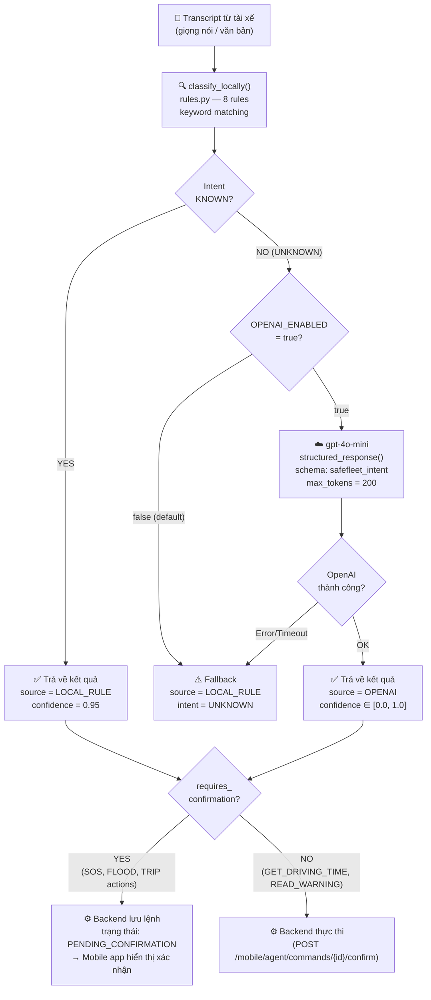
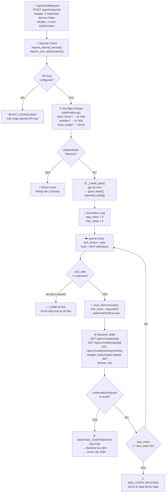

# AI Architecture Diagram — SafeFleet

> **Nguồn:** Toàn bộ thông tin được trích xuất trực tiếp từ source code AI Service và Flutter App.
> Mỗi component đều có file nguồn cụ thể kèm theo.

---

## Biểu Đồ Tổng Thể Kiến Trúc AI

```mermaid
graph TB
    %% ═══════════════════════════════════════════════
    %% PHẦN 1: ON-DEVICE AI (Flutter App)
    %% ═══════════════════════════════════════════════
    subgraph ONDEVICE ["📱 On-Device AI  (Flutter — safe_fleet_driver_ui)"]
        direction TB

        subgraph CAMERA ["📷 Camera Input"]
            CAM["camera ^0.12.0\nCameraController\n30fps preview stream"]
        end

        subgraph MLKIT ["🔍 Google ML Kit Face Mesh"]
            MLK_MESH["FaceMeshDetector\ngoogle_mlkit_face_mesh_detection ^0.5.0\n468 landmarks / frame"]
            MLK_FACE["FaceDetector\ngoogle_mlkit_face_detection ^0.14.0"]
            MLK_OCR["TextRecognizer\ngoogle_mlkit_text_recognition ^0.16.0"]
            MLK_IMG["ImageLabeler\ngoogle_mlkit_image_labeling ^0.15.0\nphoneConfidence score"]
        end

        subgraph FEAT_EXTRACT ["⚙️ Feature Extraction  (stgt_drowsiness_engine.dart)"]
            FEAT["Feature Vector [6 dims]\nleftEyeOpen · rightEyeOpen\nheadPitch · headYaw · headRoll\nmouthOpenRatio · irisMovement\n_featureExtractorVersion:\nmlkit-face-mesh-468-stgt25-v3"]
            CALIB["Calibration Phase\ncalibrationFrames = 75\nbaseline: _baselineKey=cabin_mesh468_stgt25_baseline_v3\n(FlutterSecureStorage)"]
            WINDOW["Sliding Window\nwindowSize = 75 frames\nsamplePeriod = 40ms\nmaxInterpolationGap = 440ms"]
        end

        subgraph TFLITE ["🧠 TFLite Inference  (stgt_drowsiness_engine.dart)"]
            TFL_MODEL["Model: drowsiness_model.tflite\nSource: stgt-fold-1-tflite\nPath: assets/models/\nInput: 75×6 float32 matrix"]
            TFL_SCORE["Score → 1.0..10.0\n≤3: Tỉnh táo\n4-5: Cần chú ý\n6-7: Nguy hiểm\n≥8: Báo động\ndangerScore threshold = 6"]
            TFL_COOL["Cooldown = 20s\n(Duration seconds: 20)"]
        end

        subgraph TEMPORAL_DEV ["⏱️ Temporal Rules  (temporal_safety_engine.dart + temporal.py)"]
            TEMP_EYE["Eye Closed Detection\neyeOpenThreshold = 0.25\neyeClosedSeconds = 2.0s"]
            TEMP_PERCLOS["PERCLOS Algorithm\nwindow = 30s\nthreshold = 0.4 (40%)"]
            TEMP_PHONE["Phone Detection\nphoneThreshold = 0.65\nduration = 2.0s\nminSpeedKph = 5.0"]
            TEMP_COOL["cooldown = 30s\n(TemporalSafetyDetector)"]
        end

        subgraph MODES ["🔄 Detection Modes (DrowsinessModelMode)"]
            MODE1["stgtTflite\n(STGT học sâu)\nTFLite → score 1-10"]
            MODE2["mlKitTemporal\n(ML Kit luật thời gian)\nEye+PERCLOS+Phone rules"]
        end

        CALIB_STORE["🔐 FlutterSecureStorage\nBaseline calibration data\n_baselineKey"]
        ALERT_OUT["🔔 Alert Output\nAm thanh + rung\n→ POST /mobile/safety-events"]
    end

    %% ═══════════════════════════════════════════════
    %% PHẦN 2: AI SERVICE (Python FastAPI)
    %% ═══════════════════════════════════════════════
    subgraph AI_SERVICE ["🤖 AI Service  (safefleet_ai — Python 3.11 / FastAPI 0.116)"]
        direction TB

        subgraph AI_SECURITY ["🔐 Security Layer  (core/security.py)"]
            SEC_SVC["require_internal_service()\nHeader: X-SafeFleet-Service-Token\nsecrets.compare_digest()\nHTTP 403 nếu sai"]
            SEC_USR["require_user_authorization()\nHeader: X-User-Authorization\nBearer <JWT>\nHTTP 401 nếu thiếu"]
        end

        subgraph INTENT_MODULE ["🎯 Intent Classification  (service/intent/)"]
            direction LR
            INT_LOCAL["Local Rules Engine\n(rules.py)\n8 intent rules\nkeyword matching\nVietnamese + no-diacritic\nconfidence = 0.95"]
            INT_OPENAI["OpenAI Classifier\n(service.py)\ngpt-4o-mini\nstructured_response\nmax_output_tokens = 200\nsource = OPENAI"]
            INT_FLOW["classify() flow:\n1. classify_locally()\n2. if UNKNOWN → OpenAI\n3. fallback to LOCAL"]

            INT_LOCAL --> INT_FLOW
            INT_OPENAI --> INT_FLOW
        end

        subgraph INTENTS ["📋 Intent Enum  (intent/models.py)"]
            direction LR
            I1["START_TRIP\n✅ requires_confirmation"]
            I2["PAUSE_TRIP\n✅ requires_confirmation"]
            I3["RESUME_TRIP\n✅ requires_confirmation"]
            I4["COMPLETE_TRIP\n✅ requires_confirmation"]
            I5["REPORT_FLOOD\n✅ requires_confirmation"]
            I6["SEND_SOS\n✅ requires_confirmation"]
            I7["GET_DRIVING_TIME\n❌ no confirmation"]
            I8["READ_LATEST_WARNING\n❌ no confirmation"]
            I9["UNKNOWN\n→ fallback OpenAI"]
        end

        subgraph OCR_MODULE ["📄 OCR Engine  (service/ocr/)"]
            direction TB
            OCR_SVC["OcrService\n(service/ocr/service.py)\nmax upload: 10MB"]
            OCR_HYBRID["Hybrid Pipeline\n(pipeline/run_hybrid.py)\ncv2 · numpy · PIL\npytesseract · VietOCR"]
            OCR_TESS["Tesseract OCR\n/usr/bin/tesseract\ntiếng Việt + biển số"]
            OCR_VIET["VietOCR\nvietocr.tool.predictor\n(Transformer model)\nVIETOCR_MODEL_DIR=/models/vietocr"]
            OCR_ENHANCE["Image Preprocessing\nenhance_for_ocr()\nwarp_document()\nrotate_right_angle()\nchoose_orientation()"]

            OCR_SVC --> OCR_HYBRID
            OCR_HYBRID --> OCR_ENHANCE
            OCR_ENHANCE --> OCR_TESS
            OCR_ENHANCE --> OCR_VIET
        end

        subgraph AGENT_MODULE ["🤖 Data Agent  (service/agent/)"]
            direction TB
            AG_CONFIG["AgentConfigurationStore\n(configuration.py)\nModel: gpt-4o-mini\nBase URL: api.openai.com/v1\nEncryption: AES-GCM (AESGCM)\nKey: SHA-256(AGENT_ENCRYPTION_SECRET)\nPrefix: gcm:v1:\nConfig path: /data/agent_config.json"]

            AG_ORCH["AgentOrchestrator\n(orchestrator.py)\n893 lines"]

            subgraph AG_PRECHECK ["Pre-flight Checks  (clarification.py)"]
                PRE1["requests_other_driver_data()\n→ từ chối xem data người khác"]
                PRE2["requests_unsupported_weather()\n→ từ chối dự báo thời tiết"]
                PRE3["needs_trip_scope_clarification()\n→ hỏi lại khi thiếu ngữ cảnh"]
            end

            subgraph AG_PLAN ["Planning Phase"]
                PLAN["_create_plan()\nOpenAI → Plan {goal, steps[], expected_tools[]}"]
                SHORTCUT1["_open_trip_detail_shortcut()\nTối ưu: nhận dạng trip ID trực tiếp"]
                SHORTCUT2["_deterministic_data_shortcut()\nTối ưu: data có thể lấy không cần LLM"]
            end

            subgraph AG_LOOP ["Execution Loop  (max_steps = 6)"]
                LOOP["while step_index < max_steps:\n  1. openai.chat() → tool_calls\n  2. execute tool via MCP\n  3. append result to messages\n  4. check confirmationRequest\n  5. check clientAction"]
                CONFIRM["AWAITING_CONFIRMATION\n→ stop loop\n→ return to driver for confirm"]
            end

            subgraph AG_TOOLS ["Tool Executor  (tools.py)"]
                T1["list_completed_trips\nstatuses: [COMPLETED]"]
                T2["list_upcoming_trips\nstatuses: [DRAFT,ASSIGNED,ACCEPTED,DELAYED]"]
                T3["list_active_trips\nstatuses: [IN_PROGRESS,RESTING,INCIDENT]"]
                T4["get_trip_detail\nGET /api/v1/mobile/trips/{id}"]
                T5["get_monthly_report\nGET /api/v1/mobile/activity/monthly?month=YYYY-MM"]
            end

            AG_PLAN --> AG_LOOP
            AG_LOOP --> AG_TOOLS
            AG_TOOLS -->|"HTTP GET\nAuthorization: Bearer <JWT>\ntimeout: 15s"| BACKEND_CALL["→ Backend :8080"]
            AG_LOOP --> CONFIRM
        end

        subgraph MCP_MODULE ["🔌 MCP Layer  (service/mcp/)"]
            MCP_REG["McpToolRegistry\n(registry.py — 18528 bytes)\nTool permission per role"]
            MCP_CLI["SafeFleetMcpClient\n(client.py)\nlist_tools() · execute()"]
        end

        subgraph TEMPORAL_SERVER ["⏱️ Temporal Rules Server  (service/temporal.py)"]
            TS_DETECT["TemporalSafetyDetector\neye_open_threshold = 0.25\neye_closed_seconds = 2.0s\nperclos_window = 30s\nperclos_threshold = 0.4\nphone_threshold = 0.65\nmin_speed_kph = 5.0\nphone_duration = 2.0s\ncooldown = 30s"]
            TS_RULES["safefleet_temporal_rules.json\n(mounted read-only: /models/)\nQuy tắc giờ nghỉ bắt buộc\nGiới hạn lái liên tục"]
        end

        subgraph PROVIDER ["🔀 Provider Abstraction  (service/providers/)"]
            PROV_LOCAL["Local Rules\n(default, always first)"]
            PROV_OPENAI["OpenAI Client\n(openai.py)\ngpt-4o-mini\nOPENAI_ENABLED=false (default)\nchat() · structured_response()"]
        end
    end

    %% ═══════════════════════════════════════════════
    %% EXTERNAL
    %% ═══════════════════════════════════════════════
    OPENAI_API["☁️ OpenAI API\napi.openai.com/v1\ngpt-4o-mini\n(tùy chọn, mặc định tắt)"]
    BACKEND_SVC["⚙️ Backend\nSpring Boot :8080\n/api/v1/mobile/*"]
    PG_DB[("🐘 PostgreSQL 17")]

    %% ═══════════════════════════════════════════════
    %% CONNECTIONS — ON-DEVICE
    %% ═══════════════════════════════════════════════
    CAM -->|"frame stream"| MLK_MESH
    CAM -->|"frame stream"| MLK_IMG
    MLK_MESH -->|"468 landmarks"| FEAT
    MLK_IMG -->|"phoneConfidence"| TEMPORAL_DEV
    FEAT --> CALIB
    CALIB -->|"calibrated baseline"| CALIB_STORE
    CALIB_STORE -->|"load baseline"| WINDOW
    WINDOW -->|"75×6 matrix"| TFL_MODEL
    TFL_MODEL --> TFL_SCORE
    TFL_SCORE -->|"score ≥ dangerScore(6)"| TFL_COOL
    TFL_COOL -->|"after 20s cooldown"| ALERT_OUT

    FEAT --> TEMP_EYE
    FEAT --> TEMP_PERCLOS
    MLK_IMG --> TEMP_PHONE
    TEMP_EYE --> TEMP_COOL
    TEMP_PERCLOS --> TEMP_COOL
    TEMP_PHONE --> TEMP_COOL
    TEMP_COOL -->|"after 30s cooldown"| ALERT_OUT

    MODE1 -.->|"uses"| TFL_MODEL
    MODE2 -.->|"uses"| TEMPORAL_DEV

    ALERT_OUT -->|"POST /mobile/safety-events\nBearer JWT"| BACKEND_SVC

    MLK_OCR -->|"text from image"| OCR_HYBRID

    %% ═══════════════════════════════════════════════
    %% CONNECTIONS — AI SERVICE
    %% ═══════════════════════════════════════════════
    SEC_SVC -->|"guard all routers"| INTENT_MODULE
    SEC_SVC -->|"guard all routers"| OCR_MODULE
    SEC_SVC -->|"guard all routers"| AGENT_MODULE
    SEC_USR -->|"guard /agent/respond"| AGENT_MODULE

    INT_FLOW --> INTENTS

    PROV_LOCAL -->|"always first"| INT_LOCAL
    PROV_OPENAI -.->|"fallback if UNKNOWN"| INT_OPENAI

    AG_CONFIG --> AG_ORCH
    AG_ORCH --> AG_PRECHECK
    AG_PRECHECK --> AG_PLAN
    AG_ORCH --> MCP_CLI
    MCP_CLI --> MCP_REG

    PROV_OPENAI -->|"chat() · structured_response()"| OPENAI_API
    AG_ORCH -->|"openai.chat()"| PROV_OPENAI

    TEMPORAL_SERVER --> TS_RULES
    TS_DETECT --> TEMPORAL_SERVER

    %% Styling
    classDef ondev fill:#fff7ed,stroke:#ea580c,color:#7c2d12
    classDef aimod fill:#f0fdf4,stroke:#16a34a,color:#14532d
    classDef ext fill:#fef3c7,stroke:#d97706,color:#78350f
    classDef db fill:#dbeafe,stroke:#2563eb,color:#1e3a8a
    classDef sec fill:#fdf4ff,stroke:#9333ea,color:#581c87

    class ONDEVICE,CAM,MLKIT,FEAT_EXTRACT,TFLITE,TEMPORAL_DEV,MODES,CALIB_STORE,ALERT_OUT,CAM,MLK_MESH,MLK_FACE,MLK_OCR,MLK_IMG,FEAT,CALIB,WINDOW,TFL_MODEL,TFL_SCORE,TFL_COOL,TEMP_EYE,TEMP_PERCLOS,TEMP_PHONE,TEMP_COOL,MODE1,MODE2 ondev
    class AI_SERVICE,INTENT_MODULE,OCR_MODULE,AGENT_MODULE,MCP_MODULE,TEMPORAL_SERVER,PROVIDER,INT_LOCAL,INT_OPENAI,INT_FLOW,OCR_SVC,OCR_HYBRID,OCR_TESS,OCR_VIET,OCR_ENHANCE,AG_CONFIG,AG_ORCH,AG_PRECHECK,AG_PLAN,AG_LOOP,AG_TOOLS,MCP_REG,MCP_CLI,PROV_LOCAL,PROV_OPENAI,TS_DETECT,TS_RULES,PRE1,PRE2,PRE3,PLAN,SHORTCUT1,SHORTCUT2,LOOP,CONFIRM,T1,T2,T3,T4,T5,BACKEND_CALL aimod
    class AI_SECURITY,SEC_SVC,SEC_USR sec
    class OPENAI_API,BACKEND_SVC ext
    class PG_DB db
```

---

## Luồng Intent Classification Chi Tiết

---

## Luồng Data Agent Chi Tiết

---

## Bảng Nguồn Source Code

| Thành phần | File nguồn | Chi tiết |
|---|---|---|
| TFLite model path | `stgt_drowsiness_engine.dart:35` | `assets/models/drowsiness_model.tflite` |
| TFLite model name | `stgt_drowsiness_engine.dart:36` | `stgt-fold-1-tflite` |
| Feature extractor version | `stgt_drowsiness_engine.dart:38` | `mlkit-face-mesh-468-stgt25-v3` |
| Calibration frames | `stgt_drowsiness_engine.dart:28` | `calibrationFrames = 75` |
| Window size | `stgt_drowsiness_engine.dart:29` | `windowSize = 75` |
| Danger threshold | `stgt_drowsiness_engine.dart:31` | `dangerScore = 6` |
| On-device cooldown | `stgt_drowsiness_engine.dart:32` | `cooldown = Duration(seconds: 20)` |
| Detection modes | `temporal_safety_engine.dart:3` | `enum DrowsinessModelMode {stgtTflite, mlKitTemporal}` |
| Eye threshold | `temporal.py:38` | `eye_open_threshold = 0.25` |
| Eye closed duration | `temporal.py:39` | `eye_closed_seconds = 2.0` |
| PERCLOS window | `temporal.py:40` | `perclos_window_seconds = 30.0` |
| PERCLOS threshold | `temporal.py:41` | `perclos_threshold = 0.4` |
| Phone threshold | `temporal.py:42` | `phone_threshold = 0.65` |
| Min speed | `temporal.py:43` | `minimum_speed_kph = 5.0` |
| Phone duration | `temporal.py:44` | `phone_duration_seconds = 2.0` |
| Server temporal cooldown | `temporal.py:45` | `cooldown_seconds = 30.0` |
| Intent rules count | `intent/rules.py:8-17` | 8 rules (SEND_SOS, REPORT_FLOOD, PAUSE_TRIP, RESUME_TRIP, COMPLETE_TRIP, START_TRIP, GET_DRIVING_TIME, READ_LATEST_WARNING) |
| Intent local confidence | `intent/rules.py:37` | `confidence = 0.95` |
| Confirmation required intents | `intent/rules.py:19-26` | START_TRIP, PAUSE_TRIP, RESUME_TRIP, COMPLETE_TRIP, REPORT_FLOOD, SEND_SOS |
| Intent max tokens | `intent/service.py:46` | `max_output_tokens = 200` |
| AI model | `agent/configuration.py:21` | `MODEL = "gpt-4o-mini"` |
| AI base URL | `agent/configuration.py:22` | `DEFAULT_BASE_URL = "https://api.openai.com/v1"` |
| Config encryption | `agent/configuration.py:36` | `AES-GCM, key = SHA-256(AGENT_ENCRYPTION_SECRET)` |
| Config prefix | `agent/configuration.py:23` | `_PREFIX = "gcm:v1:"` |
| Config path | `agent/configuration.py:32` | `/data/agent_config.json` |
| Max steps | `.env.example:21` / `orchestrator.py:105` | `AGENT_MAX_STEPS=6` |
| ALLOWED_TOOLS | `agent/tools.py:11-17` | 5 tools: list_completed/upcoming/active_trips, get_trip_detail, get_monthly_report |
| Tool HTTP timeout | `agent/tools.py:76` | `timeout=15` seconds |
| Internal token check | `core/security.py:17-19` | `secrets.compare_digest()` |
| OCR libraries | `ocr/pipeline/run_hybrid.py:16-21` | `cv2, numpy, pytesseract, VietOCR` |
| VietOCR model dir | `ocr/pipeline/run_hybrid.py:51` | `MODEL_ROOT / "vietocr"` |
