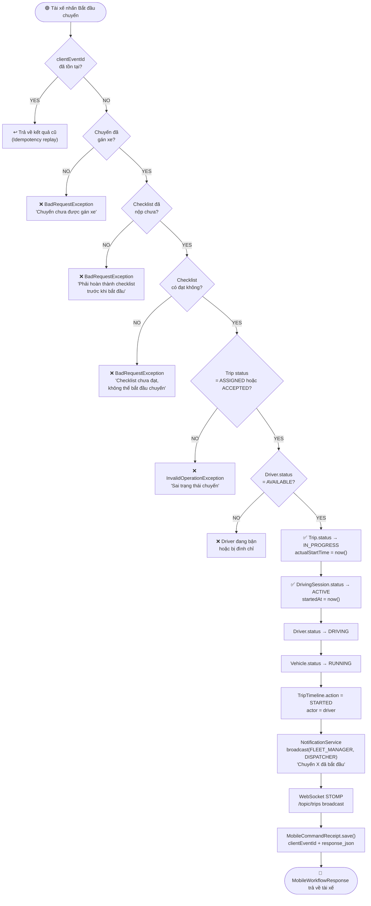
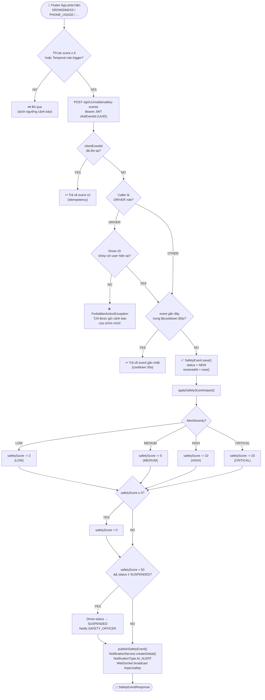
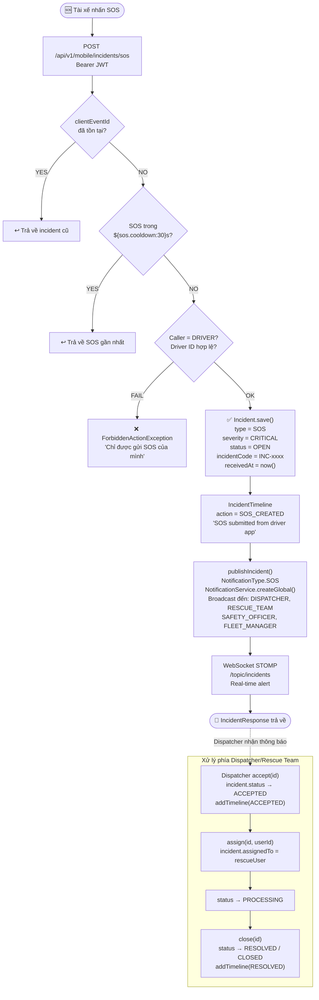
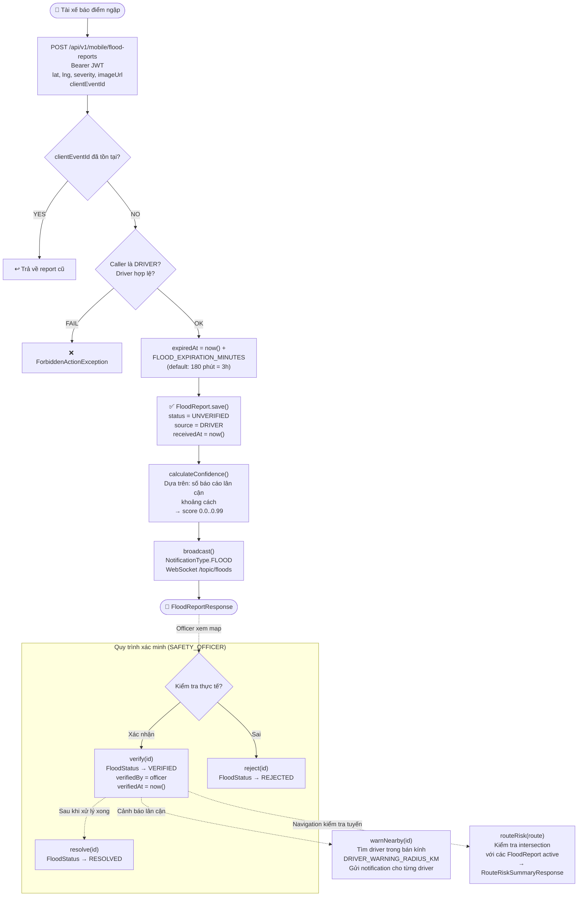
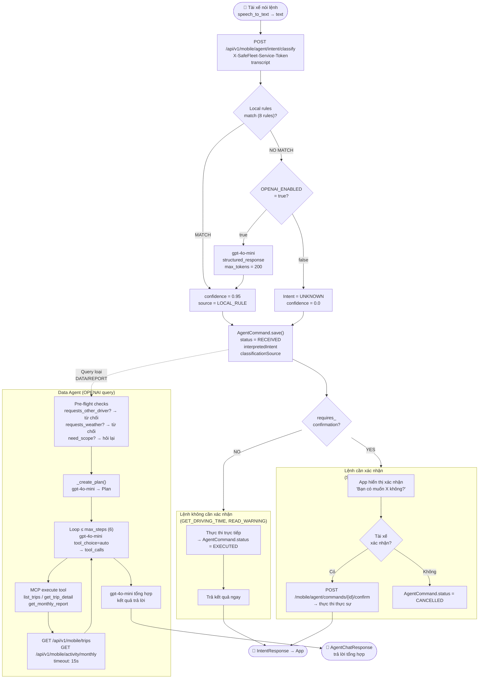

# Activity Diagram — SafeFleet

> **Nguồn:** Toàn bộ luồng nghiệp vụ được trích xuất trực tiếp từ source code backend Java.
> File tham chiếu chính: `MobileAppService.java`, `SafetyEventService.java`, `IncidentService.java`, `FloodReportService.java`

---

## 1. Activity: Bắt Đầu Chuyến Đi (Trip Start Workflow)

> Nguồn: `MobileAppService.java:startWorkflow()`, `TripService.java:start()`

---

## 2. Activity: Gửi Cảnh Báo An Toàn (Safety Event)

> Nguồn: `SafetyEventService.java:create()`, `applySafetyScoreImpact()`

---

## 3. Activity: Gửi SOS Khẩn Cấp

> Nguồn: `IncidentService.java:sos()`, `MobileAppService.java`

---

## 4. Activity: Báo Cáo Điểm Ngập

> Nguồn: `FloodReportService.java:create()`, `warnNearby()`, `routeRisk()`

---

## 5. Activity: OCR Tài Liệu Phiếu Xuất Kho

> Nguồn: `DocumentOcrService.java`, `DocumentOcrJobService.java`, `run_hybrid.py`

```mermaid
flowchart TD
    START(["📷 Tài xế chụp ảnh\nPhiếu xuất kho"])

    UPLOAD["POST /api/v1/mobile/ocr/extract\nMultipart image\nmax 10MB\nBearer JWT"]

    SIZE_CHECK{"image ≤\nOCR_MAX_UPLOAD_BYTES\n(10MB)?"}
    TOO_BIG["❌ 413 Too Large"]

    SAVE_JOB["DocumentOcrJob.save()\nstatus = PROCESSING\nimage_data = BYTEA\nowner_user_id"]

    CALL_AI["POST http://ai-service:8000/ocr/extract\nX-SafeFleet-Service-Token\nMultipart image"]

    subgraph AI_OCR ["AI Service — Hybrid OCR Pipeline (run_hybrid.py)"]
        PREPROCESS["Image Preprocessing\nenhance_for_ocr()\nwarp_document()\nrotate_right_angle()\nchoose_orientation()"]
        TESSERACT["Tesseract OCR\n/usr/bin/tesseract\ntiếng Việt"]
        VIETOCR["VietOCR Transformer\n/models/vietocr/\nVietnamese text recognition"]
        MERGE["Merge kết quả\nchọn độ tin cậy cao hơn"]
        EXTRACT["Trích xuất field:\nvoucher_date · voucher_number\nvehicle_plate · driver_name\ntrip_count · project_address\n+ confidence scores [0..1]"]
    end

    UPDATE_JOB["DocumentOcrJob.update()\nstatus = COMPLETED\nvoucher_date, voucher_number\nvehicle_plate, driver_name\nvehicle_plate_confidence\nelapsed_ms"]

    PLATE_CHECK["Kiểm tra biển số\nplate_review_status\n= PLATE_MATCH / PLATE_MISMATCH\n/ NOT_CHECKED"]

    PLATE_MATCH{"vehicle_plate\nkhớp expected_vehicle_plate?"}
    MISMATCH_ALERT["plate_review_status = PLATE_MISMATCH\nNotify SAFETY_OFFICER để review"]
    MATCH_OK["plate_review_status = PLATE_MATCH"]

    REVIEW["DocumentPlateReviewService\nreview(id, note)\nreviewed_by_user_id\nreviewed_at = now()"]

    END(["🏁 DocumentOcrJobResponse\ntrả về tài xế"])

    START --> UPLOAD
    UPLOAD --> SIZE_CHECK
    SIZE_CHECK -->|"NO"| TOO_BIG
    SIZE_CHECK -->|"YES"| SAVE_JOB
    SAVE_JOB --> CALL_AI
    CALL_AI --> PREPROCESS
    PREPROCESS --> TESSERACT
    PREPROCESS --> VIETOCR
    TESSERACT --> MERGE
    VIETOCR --> MERGE
    MERGE --> EXTRACT
    EXTRACT --> UPDATE_JOB
    UPDATE_JOB --> PLATE_CHECK
    PLATE_CHECK --> PLATE_MATCH
    PLATE_MATCH -->|"NO"| MISMATCH_ALERT
    PLATE_MATCH -->|"YES"| MATCH_OK
    MATCH_OK --> END
    MISMATCH_ALERT -.->|"Officer kiểm tra"| REVIEW
    REVIEW -.-> END
```

---

## 6. Activity: AI Voice Agent — Data Query

> Nguồn: `MobileAppService.java:submitAgentCommand()`, `AgentOrchestrator.py`

---

## Bảng Nguồn Source Code

| Activity | File nguồn | Các điểm quan trọng từ code |
|---|---|---|
| Trip Start Workflow | `mobile/service/MobileAppService.java:457` | idempotency replay, checklist gate, vehicle check, MobileCommandReceipt.save() |
| Checklist gate | `MobileAppService.java:468-472` | `checklistPassed()` — bắt buộc trước khi start |
| Safety Event cooldown | `safety/service/SafetyEventService.java:55-56` | `@Value("${app.safety.cooldown-seconds:30}")` |
| Safety score penalty | `SafetyEventService.java:244-256` | LOW:-2, MED:-5, HIGH:-10, CRIT:-20; suspend if <50 |
| SOS cooldown | `incident/service/IncidentService.java:63` | `@Value("${app.sos.cooldown-seconds:30}")` |
| SOS idempotency | `IncidentService.java:123-126` | clientEventId lookup → return existing |
| Flood expiry | `flood/service/FloodReportService.java:81` | `FLOOD_EXPIRATION_MINUTES` default 180 phút |
| Flood confidence | `FloodReportService.java:187-204` | nearby reports count + verified bonus |
| OCR max upload | `safefleet_ai/service/core/security.py` + `.env` | `OCR_MAX_UPLOAD_BYTES=10485760` (10MB) |
| OCR pipeline | `ocr/pipeline/run_hybrid.py` | `enhance_for_ocr` + `warp_document` + Tesseract + VietOCR |
| Agent max steps | `agent/orchestrator.py:105` | `while step_index < configuration.max_steps` (default 6) |
| Agent confirmation | `agent/orchestrator.py:170-179` | `AWAITING_CONFIRMATION` — stop loop |
| Intent local rules | `intent/rules.py:8-17` | 8 rules, confidence=0.95 |
| Intent OpenAI schema | `intent/service.py:13-21` | Structured JSON schema, max_output_tokens=200 |
