# Context Diagram — SafeFleet

> **Nguồn dữ liệu:** Toàn bộ thông tin trong biểu đồ này được trích xuất trực tiếp từ source code.
> - Roles: `account/enums/RoleName.java`
> - External APIs: `navigation/provider/OsrmRoutingProvider.java`, `location/service/LocationService.java`
> - FCM: `notification/service/PushNotificationService.java`
> - AI Gateway: `infrastructure/ai/SafeFleetAiGateway.java`
> - OpenAI (optional): `safefleet_ai/service/providers/openai.py`
> - WebSocket: `config/WebSocketConfig.java` — endpoint `/ws` (SockJS) và `/ws-native`

---

## Biểu Đồ (Mermaid C4Context)

```mermaid
C4Context
    title Context Diagram — Hệ Thống SafeFleet

    %% ──────────── NGƯỜI DÙNG NỘI BỘ (từ RoleName.java) ────────────
    Person(driver, "Tài xế (DRIVER)", "Lái xe, nhận cảnh báo buồn ngủ, báo SOS, xem bản đồ điều hướng")
    Person(dispatcher, "Điều phối viên (DISPATCHER)", "Điều phối chuyến đi, ra lệnh bằng ngôn ngữ tự nhiên qua AI Agent")
    Person(fleet_manager, "Quản lý đội xe (FLEET_MANAGER)", "Quản lý xe, tài xế, xem báo cáo tổng thể")
    Person(safety_officer, "Cán bộ an toàn (SAFETY_OFFICER)", "Giám sát sự kiện an toàn, xem cảnh báo buồn ngủ")
    Person(rescue_team, "Đội cứu hộ (RESCUE_TEAM)", "Nhận thông báo SOS, xử lý sự cố")
    Person(admin, "Quản trị viên (ADMIN)", "Quản lý tài khoản hệ thống, cấu hình")

    %% ──────────── HỆ THỐNG SAFEFLEET ────────────
    System_Boundary(safefleet, "Hệ Thống SafeFleet") {
        System(mobile_app, "Ứng dụng Tài xế (Flutter)", "Theo dõi hành trình, phát hiện buồn ngủ on-device (TFLite + ML Kit), SOS, điều hướng MapLibre, OCR tài liệu, chat AI Agent")
        System(web_frontend, "Web Quản Lý (Next.js 16)", "Dashboard điều phối, bản đồ realtime (MapLibre GL), báo cáo (Recharts), quản lý đội xe")
        System(backend, "Backend API (Spring Boot 3.3 / Java 21)", "REST API + WebSocket STOMP (endpoint /ws SockJS, /ws-native), JWT Auth, toàn bộ nghiệp vụ")
        System(ai_service, "AI Service (Python FastAPI 0.116)", "OCR (Tesseract), phân loại lệnh (intent), Data Agent tối đa 6 bước, Temporal Rules cục bộ")
        SystemDb(postgres, "PostgreSQL 17", "Dữ liệu nghiệp vụ: tài khoản, tài xế, xe, hành trình, sự kiện an toàn, cảnh báo ngập lụt, sự cố, telemetry GPS...")
        SystemDb(minio, "MinIO (Object Storage)", "Lưu bằng chứng sự cố (ảnh/video), bucket private, tối đa 8MB/file, truy cập qua pre-signed URL")
    }

    %% ──────────── HỆ THỐNG NGOẠI VI ────────────
    System_Ext(osrm, "OSRM (router.project-osrm.org)", "Tính tuyến đường lái xe (routing), trả về GeoJSON với các bước rẽ")
    System_Ext(photon, "Photon — Komoot (photon.komoot.io)", "Geocoding / tìm kiếm địa điểm theo tên, ưu tiên khu vực Hà Nội")
    System_Ext(fcm, "Firebase Cloud Messaging (FCM)", "Đẩy push notification đến thiết bị Android/iOS tài xế (mặc định tắt: FCM_ENABLED=false)")
    System_Ext(openai, "OpenAI API (api.openai.com)", "Chat AI nâng cao cho AI Service (tùy chọn, mặc định tắt: OPENAI_ENABLED=false)")

    %% ──────────── TƯƠNG TÁC NGƯỜI DÙNG ────────────
    Rel(driver, mobile_app, "Sử dụng", "HTTPS REST + WebSocket STOMP (/ws-native)")
    Rel(dispatcher, web_frontend, "Sử dụng", "HTTPS")
    Rel(fleet_manager, web_frontend, "Sử dụng", "HTTPS")
    Rel(safety_officer, web_frontend, "Sử dụng", "HTTPS")
    Rel(rescue_team, web_frontend, "Sử dụng", "HTTPS")
    Rel(admin, web_frontend, "Sử dụng", "HTTPS")

    %% ──────────── TƯƠNG TÁC NỘI BỘ ────────────
    Rel(web_frontend, backend, "Gọi API / WebSocket", "REST JSON + STOMP/SockJS (/ws)")
    Rel(mobile_app, backend, "Gọi API / WebSocket", "REST JSON + STOMP (/ws-native)")
    Rel(backend, ai_service, "Gọi nội bộ (internal token)", "HTTP REST, header X-SafeFleet-Service-Token — /agent/respond, /intent/classify, /agent/config")
    Rel(backend, postgres, "Đọc/Ghi dữ liệu", "JDBC/JPA + Flyway migration")
    Rel(backend, minio, "Lưu/Lấy file evidence", "MinIO Java SDK (S3-compatible)")
    Rel(ai_service, postgres, "Đọc dữ liệu (Data Agent)", "SQL queries")

    %% ──────────── TƯƠNG TÁC NGOẠI VI ────────────
    Rel(backend, osrm, "Tính tuyến đường", "HTTP GET /route/v1/driving, User-Agent: SafeFleet-DATN/1.0")
    Rel(backend, photon, "Tìm kiếm địa điểm (geocoding)", "HTTP GET ?q=&lat=21.0285&lon=105.8542&lang=vi")
    Rel(backend, fcm, "Gửi push notification", "FCM HTTP API (khi FCM_ENABLED=true)")
    Rel(ai_service, openai, "Gọi LLM nâng cao", "OpenAI Chat Completion API (khi OPENAI_ENABLED=true)")
    Rel(fcm, driver, "Đẩy thông báo đến thiết bị", "FCM → Android/iOS")
```

---

## Bảng Nguồn Source Code

| Thành phần trong biểu đồ | File / Dòng code nguồn |
|---|---|
| 6 roles người dùng | `account/enums/RoleName.java` → `ADMIN, FLEET_MANAGER, DISPATCHER, SAFETY_OFFICER, RESCUE_TEAM, DRIVER` |
| WebSocket `/ws` (SockJS) | `config/WebSocketConfig.java:53` → `registry.addEndpoint("/ws").withSockJS()` |
| WebSocket `/ws-native` | `config/WebSocketConfig.java:56` → `registry.addEndpoint("/ws-native")` |
| STOMP broker topics | `config/WebSocketConfig.java:47` → `registry.enableSimpleBroker("/topic", "/queue")` |
| OSRM URL | `navigation/provider/OsrmRoutingProvider.java:28` → `@Value("${app.location.osrm-url:https://router.project-osrm.org/route/v1/driving}")` |
| User-Agent khi gọi OSRM | `OsrmRoutingProvider.java:54` → `.header("User-Agent", "SafeFleet-DATN/1.0")` |
| Photon URL | `location/service/LocationService.java:35` → `@Value("${app.location.photon-url:https://photon.komoot.io/api/}")` |
| Tọa độ Hà Nội | `LocationService.java:29-30` → `HANOI_LAT = 21.0285`, `HANOI_LNG = 105.8542` |
| FCM enabled flag | `notification/service/PushNotificationService.java:27` → `@Value("${app.push.fcm-enabled:false}")` |
| AI Service token header | `infrastructure/ai/SafeFleetAiGateway.java:24` → `"X-SafeFleet-Service-Token"` |
| AI endpoints được gọi | `SafeFleetAiGateway.java:50,73,98` → `/agent/respond`, `/intent/classify`, `/agent/config` |
| AI read timeout | `SafeFleetAiGateway.java:37` → `read-timeout-ms: 120000` (2 phút) |
| OpenAI (optional) | `safefleet_ai/service/providers/openai.py` + `.env.example:19` → `OPENAI_ENABLED=false` |
| MinIO bucket | `.env.example:30` → `MINIO_BUCKET=safefleet-evidence` |
| Evidence max size | `.env.example:32` → `EVIDENCE_MAX_SIZE_BYTES=8388608` (8MB) |
| PostgreSQL version | `docker-compose.yml:5` → `image: postgres:17-alpine` |
