# Class Diagram — SafeFleet Backend

> **Nguồn:** Toàn bộ class, field, method và quan hệ được trích xuất trực tiếp từ source code Java.
> Package root: `com.safefleet.*`

---

## Class Diagram — Domain Model (Entity Layer)

```mermaid
classDiagram
    %% ══════════════════════════════════════
    %% BASE
    %% ══════════════════════════════════════
    class BaseEntity {
        <<abstract>>
        <<MappedSuperclass>>
        +Long id
        +LocalDateTime createdAt
        +LocalDateTime updatedAt
        +boolean deleted
        #prePersist() void
        #preUpdate() void
    }

    %% ══════════════════════════════════════
    %% ACCOUNT DOMAIN
    %% ══════════════════════════════════════
    class UserAccount {
        <<Entity>>
        +String username
        +String email
        +String passwordHash
        +String fullName
        +String phone
        +UserStatus status
        +Role role
    }

    class Role {
        <<Entity>>
        +RoleName name
        +String description
        +Set~Permission~ permissions
    }

    class Permission {
        <<Entity>>
        +String code
        +String description
    }

    class RoleName {
        <<enumeration>>
        ADMIN
        FLEET_MANAGER
        DISPATCHER
        SAFETY_OFFICER
        RESCUE_TEAM
        DRIVER
    }

    %% ══════════════════════════════════════
    %% VEHICLE & DRIVER DOMAIN
    %% ══════════════════════════════════════
    class Driver {
        <<Entity>>
        +UserAccount user
        +String fullName
        +String phone
        +String email
        +String address
        +String licenseNumber
        +String licenseClass
        +LocalDate licenseExpiredAt
        +DriverStatus status
        +Vehicle currentVehicle
        +Integer safetyScore
        +Integer drivingTimeTodayMinutes
        +Integer continuousDrivingMinutes
        +Integer totalTrips
        +Integer totalAlerts
    }

    class Vehicle {
        <<Entity>>
        +String plateNumber
        +VehicleType vehicleType
        +String brand
        +String model
        +Integer year
        +BigDecimal loadCapacity
        +Integer seatCount
        +FuelType fuelType
        +VehicleStatus status
        +Driver currentDriver
        +Device gpsDevice
        +Device cameraDevice
        +LocalDate inspectionExpiredAt
        +LocalDate insuranceExpiredAt
        +Double lastLat
        +Double lastLng
        +Double lastSpeed
        +LocalDateTime lastUpdatedAt
    }

    class Device {
        <<Entity>>
        +String deviceCode
        +String name
        +DeviceType type
        +DeviceStatus status
        +Vehicle vehicle
        +String phone
        +String serialNumber
        +String firmwareVersion
        +LocalDateTime lastSeenAt
    }

    class DriverStatus {
        <<enumeration>>
        AVAILABLE
        DRIVING
        RESTING
        SUSPENDED
        HIGH_RISK
        INACTIVE
    }

    class VehicleStatus {
        <<enumeration>>
        AVAILABLE
        RUNNING
        RESTING
        MAINTENANCE
        OFFLINE
        INACTIVE
    }

    class VehicleType {
        <<enumeration>>
        TRUCK
        VAN
        BUS
        CAR
        PICKUP
        MOTORBIKE
    }

    class FuelType {
        <<enumeration>>
        GASOLINE
        DIESEL
        ELECTRIC
        HYBRID
        CNG
    }

    %% ══════════════════════════════════════
    %% TRIP DOMAIN
    %% ══════════════════════════════════════
    class Trip {
        <<Entity>>
        +String tripCode
        +Vehicle vehicle
        +Driver driver
        +String startLocation
        +Double startLat
        +Double startLng
        +String endLocation
        +Double endLat
        +Double endLng
        +String waypoints
        +String plannedRoute
        +String actualRoute
        +LocalDateTime plannedStartTime
        +LocalDateTime actualStartTime
        +LocalDateTime estimatedEndTime
        +LocalDateTime actualEndTime
        +TripStatus status
        +Integer progress
        +RiskLevel riskLevel
        +String cancelReason
    }

    class TripTimeline {
        <<Entity>>
        +Trip trip
        +String action
        +UserAccount actor
        +String note
    }

    class PreTripChecklist {
        <<Entity>>
        +Trip trip
        +Driver driver
        +Vehicle vehicle
        +boolean exteriorChecked
        +boolean tiresChecked
        +boolean brakeChecked
        +boolean lightsChecked
        +boolean cameraChecked
        +boolean gpsChecked
        +boolean documentsChecked
        +String checklistJson
        +String note
    }

    class TripStatus {
        <<enumeration>>
        DRAFT
        ASSIGNED
        ACCEPTED
        IN_PROGRESS
        RESTING
        COMPLETED
        DELAYED
        INCIDENT
        CANCELLED
    }

    class RiskLevel {
        <<enumeration>>
        LOW
        MEDIUM
        HIGH
        CRITICAL
    }

    %% ══════════════════════════════════════
    %% SAFETY DOMAIN
    %% ══════════════════════════════════════
    class SafetyEvent {
        <<Entity>>
        +SafetyEventType eventType
        +AlertSeverity severity
        +Vehicle vehicle
        +Driver driver
        +Trip trip
        +Double lat
        +Double lng
        +Double speed
        +Double confidence
        +String evidenceUrl
        +SafetyEventStatus status
        +UserAccount handledBy
        +LocalDateTime handledAt
        +String note
        +String clientEventId
        +LocalDateTime receivedAt
    }

    class DrivingSession {
        <<Entity>>
        +Driver driver
        +Vehicle vehicle
        +Trip trip
        +DrivingSessionStatus status
        +LocalDateTime startedAt
        +LocalDateTime pausedAt
        +LocalDateTime resumedAt
        +LocalDateTime endedAt
        +Integer continuousMinutes
        +Integer totalMinutes
        +boolean overDrivingAlertCreated
    }

    class DriverWorkLog {
        <<Entity>>
        +Driver driver
        +Trip trip
        +LocalDate workDate
        +Integer drivingMinutes
        +Integer restMinutes
        +String note
    }

    class SafetyEventType {
        <<enumeration>>
        DROWSINESS
        PHONE_USAGE
        DISTRACTION
        SPEEDING
        OVER_DRIVING_TIME
        ROUTE_DEVIATION
        ABNORMAL_STOP
        GPS_LOST
        FLOOD_RISK
    }

    class AlertSeverity {
        <<enumeration>>
        LOW
        MEDIUM
        HIGH
        CRITICAL
    }

    class DrivingSessionStatus {
        <<enumeration>>
        ACTIVE
        PAUSED
        FINISHED
    }

    %% ══════════════════════════════════════
    %% INCIDENT DOMAIN
    %% ══════════════════════════════════════
    class Incident {
        <<Entity>>
        +String incidentCode
        +IncidentType type
        +AlertSeverity severity
        +Vehicle vehicle
        +Driver driver
        +Trip trip
        +Double lat
        +Double lng
        +String description
        +IncidentStatus status
        +UserAccount assignedTo
        +LocalDateTime acceptedAt
        +LocalDateTime resolvedAt
        +String clientEventId
        +LocalDateTime receivedAt
    }

    class IncidentTimeline {
        <<Entity>>
        +Incident incident
        +String action
        +UserAccount actor
        +String note
    }

    class IncidentType {
        <<enumeration>>
        SOS
        ACCIDENT
        VEHICLE_BREAKDOWN
        DRIVER_UNRESPONSIVE
        FLOOD_STUCK
        GPS_LOST
        MANUAL
    }

    class IncidentStatus {
        <<enumeration>>
        OPEN
        ACCEPTED
        PROCESSING
        ESCALATED
        RESOLVED
        CLOSED
        CANCELLED
    }

    %% ══════════════════════════════════════
    %% FLOOD DOMAIN
    %% ══════════════════════════════════════
    class FloodReport {
        <<Entity>>
        +Double lat
        +Double lng
        +String address
        +FloodSeverity severity
        +FloodSource source
        +Driver reportedByDriver
        +String imageUrl
        +String clientEventId
        +LocalDateTime receivedAt
        +Double confidence
        +FloodStatus status
        +UserAccount verifiedBy
        +LocalDateTime verifiedAt
        +LocalDateTime expiredAt
    }

    class FloodSeverity {
        <<enumeration>>
        NONE
        LOW
        MEDIUM
        HIGH
        BLOCKED
    }

    class FloodStatus {
        <<enumeration>>
        UNVERIFIED
        VERIFIED
        EXPIRED
        REJECTED
        RESOLVED
    }

    %% ══════════════════════════════════════
    %% TELEMETRY DOMAIN
    %% ══════════════════════════════════════
    class TelemetryLog {
        <<Entity>>
        +Vehicle vehicle
        +Driver driver
        +Trip trip
        +Double lat
        +Double lng
        +Double speed
        +Double heading
        +Integer batteryLevel
        +GpsStatus gpsStatus
    }

    class GpsStatus {
        <<enumeration>>
        GOOD
        WEAK
        LOST
        OFFLINE
    }

    %% ══════════════════════════════════════
    %% AGENT & AI DOMAIN
    %% ══════════════════════════════════════
    class AgentCommand {
        <<Entity>>
        +UserAccount user
        +Driver driver
        +Trip trip
        +AgentCommandType commandType
        +String transcript
        +String normalizedCommand
        +AgentIntent interpretedIntent
        +Double confidence
        +boolean requiresConfirmation
        +String classificationSource
        +AgentCommandStatus status
        +String responseText
        +String executedReferenceType
        +Long executedReferenceId
    }

    class AgentIntent {
        <<enumeration>>
        START_TRIP
        PAUSE_TRIP
        RESUME_TRIP
        COMPLETE_TRIP
        GET_DRIVING_TIME
        REPORT_FLOOD
        SEND_SOS
        READ_LATEST_WARNING
        UNKNOWN
    }

    class AgentCommandStatus {
        <<enumeration>>
        RECEIVED
        UNDERSTOOD
        EXECUTED
        CANCELLED
        UNSUPPORTED
        FAILED
    }

    %% ══════════════════════════════════════
    %% MAINTENANCE DOMAIN
    %% ══════════════════════════════════════
    class MaintenanceOrder {
        <<Entity>>
        +String maintenanceCode
        +Vehicle vehicle
        +MaintenanceType type
        +String title
        +String description
        +LocalDate scheduledDate
        +LocalDate completedDate
        +BigDecimal cost
        +MaintenanceStatus status
        +MaintenancePriority priority
        +UserAccount assignedTo
        +String note
    }

    class MaintenancePriority {
        <<enumeration>>
        LOW
        MEDIUM
        HIGH
        URGENT
    }

    %% ══════════════════════════════════════
    %% SERVICE LAYER (key services)
    %% ══════════════════════════════════════
    class MobileAppService {
        <<Service>>
        -TripService tripService
        -SafetyEventService safetyEventService
        -IncidentService incidentService
        -FloodReportService floodReportService
        -NavigationService navigationService
        -NotificationService notificationService
        -SafeFleetAiGateway aiGateway
        +startWorkflow(id, request) MobileWorkflowResponse
        +pauseWorkflow(id, request) MobileWorkflowResponse
        +resumeWorkflow(id, request) MobileWorkflowResponse
        +completeWorkflow(id, request) MobileWorkflowResponse
        +ingestTelemetry(request) TelemetryResponse
        +ingestTelemetryBatch(request) MobileTelemetryBatchResponse
        +createSafetyEvent(request) SafetyEventResponse
        +sendSos(request) IncidentResponse
        +submitAgentCommand(request) MobileAgentCommandResponse
        +confirmAgentCommand(id, request) MobileAgentCommandResponse
        +createFloodReport(request) FloodReportResponse
    }

    class SafeFleetAiGateway {
        <<Component>>
        -RestClient restClient
        -String aiServiceUrl
        -String internalToken
        +classifyIntent(request) IntentClassificationResponse
        +agentRespond(request) AgentChatResponse
        +getAgentConfig() JsonNode
        +updateAgentConfig(body) JsonNode
    }

    class NotificationService {
        <<Service>>
        -NotificationRepository repo
        -WebSocketService wsService
        -PushNotificationService pushService
        +notify(recipient, type, title, content, refType, refId) Notification
        +broadcast(type, title, content, roles) void
        +markRead(id) Notification
    }

    class PushNotificationService {
        <<Service>>
        -boolean fcmEnabled
        -long dispatchIntervalMs
        +register(request) MobilePushTokenResponse
        +unregister(deviceUuid) void
        +dispatchPending() void
    }

    class SafetyEventService {
        <<Service>>
        -ActionRateLimiter rateLimiter
        -SafetyEventRepository repo
        -NotificationService notificationService
        +create(request, driver) SafetyEvent
        +handle(id, user) SafetyEvent
        +recalculateSafetyScore(driverId) Driver
    }

    class IncidentService {
        <<Service>>
        -ActionRateLimiter rateLimiter
        -IncidentRepository repo
        -NotificationService notificationService
        +createSos(request, driver) Incident
        +create(request, user) Incident
        +accept(id, user) Incident
        +assign(id, userId, dispatcher) Incident
        +addTimeline(id, request, user) IncidentTimeline
        +close(id, request, user) Incident
    }

    %% ══════════════════════════════════════
    %% INHERITANCE & COMPOSITION
    %% ══════════════════════════════════════

    BaseEntity <|-- UserAccount
    BaseEntity <|-- Role
    BaseEntity <|-- Permission
    BaseEntity <|-- Driver
    BaseEntity <|-- Vehicle
    BaseEntity <|-- Device
    BaseEntity <|-- Trip
    BaseEntity <|-- TripTimeline
    BaseEntity <|-- PreTripChecklist
    BaseEntity <|-- SafetyEvent
    BaseEntity <|-- DrivingSession
    BaseEntity <|-- DriverWorkLog
    BaseEntity <|-- Incident
    BaseEntity <|-- IncidentTimeline
    BaseEntity <|-- FloodReport
    BaseEntity <|-- TelemetryLog
    BaseEntity <|-- AgentCommand
    BaseEntity <|-- MaintenanceOrder

    %% Role - Permission (many-to-many)
    Role "1" o-- "many" Permission : has

    %% UserAccount relations
    UserAccount --> RoleName : role.name
    Driver --> UserAccount : 1..1 user
    Driver --> DriverStatus : status
    Driver --> Vehicle : currentVehicle

    %% Vehicle relations
    Vehicle --> VehicleType : type
    Vehicle --> VehicleStatus : status
    Vehicle --> FuelType : fuelType
    Vehicle --> Driver : currentDriver
    Vehicle "1" o-- "0..2" Device : gpsDevice/cameraDevice

    %% Trip relations
    Trip --> Vehicle : vehicle
    Trip --> Driver : driver
    Trip --> TripStatus : status
    Trip --> RiskLevel : riskLevel
    Trip "1" o-- "many" TripTimeline : timelines
    Trip "1" o-- "0..1" PreTripChecklist : checklist

    %% Safety relations
    SafetyEvent --> SafetyEventType : eventType
    SafetyEvent --> AlertSeverity : severity
    SafetyEvent --> Driver : driver
    SafetyEvent --> Vehicle : vehicle
    SafetyEvent --> Trip : trip
    DrivingSession --> DrivingSessionStatus : status
    DrivingSession --> Driver : driver

    %% Incident relations
    Incident --> IncidentType : type
    Incident --> IncidentStatus : status
    Incident --> AlertSeverity : severity
    Incident --> Driver : driver
    Incident --> Trip : trip
    Incident "1" o-- "many" IncidentTimeline : timelines

    %% Flood relations
    FloodReport --> FloodSeverity : severity
    FloodReport --> FloodStatus : status
    FloodReport --> Driver : reportedByDriver

    %% Telemetry
    TelemetryLog --> GpsStatus : gpsStatus
    TelemetryLog --> Vehicle : vehicle
    TelemetryLog --> Driver : driver
    TelemetryLog --> Trip : trip

    %% Agent
    AgentCommand --> AgentIntent : interpretedIntent
    AgentCommand --> AgentCommandStatus : status
    AgentCommand --> Driver : driver
    AgentCommand --> Trip : trip

    %% Maintenance
    MaintenanceOrder --> Vehicle : vehicle
    MaintenanceOrder --> MaintenancePriority : priority

    %% Service layer
    MobileAppService --> SafeFleetAiGateway : calls
    MobileAppService --> SafetyEventService : uses
    MobileAppService --> IncidentService : uses
    MobileAppService --> NotificationService : uses
    NotificationService --> PushNotificationService : uses
    SafetyEventService --> NotificationService : uses
    IncidentService --> NotificationService : uses
```

---

## Bảng Nguồn Source Code

| Class | File nguồn | Ghi chú |
|---|---|---|
| `BaseEntity` | `common/domain/BaseEntity.java` | `@MappedSuperclass`, id + audit fields + soft delete |
| `UserAccount` | `account/entity/UserAccount.java` | Username/email unique, `@OneToOne` Driver |
| `Role` / `Permission` | `account/entity/Role.java`, `Permission.java` | Many-to-many qua `role_permissions` |
| `RoleName` | `account/enums/RoleName.java` | 6 roles |
| `Driver` | `driver/entity/Driver.java` | safetyScore=100, `@OneToOne` user, `@ManyToOne` currentVehicle |
| `Vehicle` | `vehicle/entity/Vehicle.java` | gpsDevice + cameraDevice = 2 `@ManyToOne` Device |
| `Trip` | `trip/entity/Trip.java` | waypoints/routes lưu JSON text, `@ManyToOne` vehicle+driver |
| `TripStatus` | `trip/enums/TripStatus.java` | 9 trạng thái |
| `RiskLevel` | `trip/enums/RiskLevel.java` | 4 mức |
| `SafetyEvent` | `safety/entity/SafetyEvent.java` | clientEventId cho idempotency, receivedAt = LocalDateTime.now() |
| `SafetyEventType` | `safety/enums/SafetyEventType.java` | 9 loại cảnh báo |
| `DrivingSession` | `safety/entity/DrivingSession.java` | overDrivingAlertCreated flag |
| `Incident` | `incident/entity/Incident.java` | clientEventId, receivedAt |
| `IncidentType` | `incident/enums/IncidentType.java` | 7 loại |
| `IncidentStatus` | `incident/enums/IncidentStatus.java` | 7 trạng thái |
| `FloodReport` | `flood/entity/FloodReport.java` | source=FloodSource, expiredAt |
| `FloodSeverity` | `flood/enums/FloodSeverity.java` | NONE→BLOCKED (5 mức) |
| `AgentCommand` | `mobile/entity/AgentCommand.java` | requires_confirmation, classificationSource, executedReference |
| `AgentIntent` | `mobile/enums/AgentIntent.java` | 9 intent (mirror Python side) |
| `MobileAppService` | `mobile/service/MobileAppService.java` | Facade tập trung toàn bộ mobile API |
| `SafeFleetAiGateway` | `infrastructure/ai/SafeFleetAiGateway.java` | RestClient với internal token |
| `PushNotificationService` | `notification/service/PushNotificationService.java` | FCM disabled by default |
