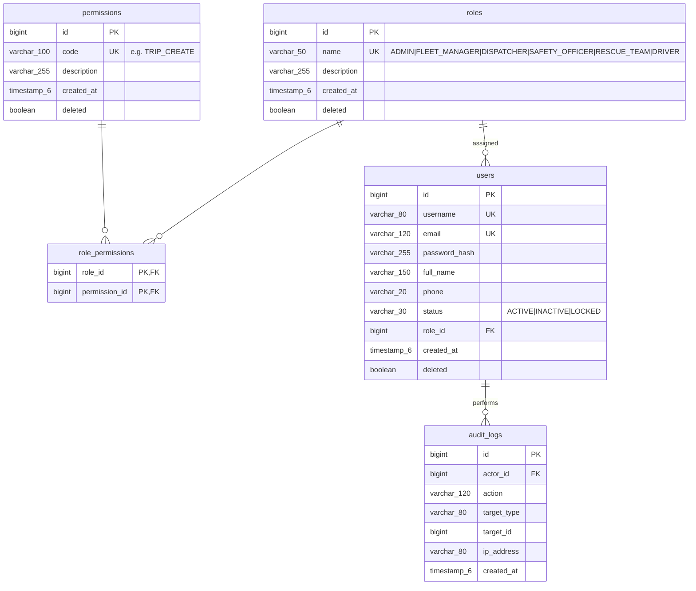
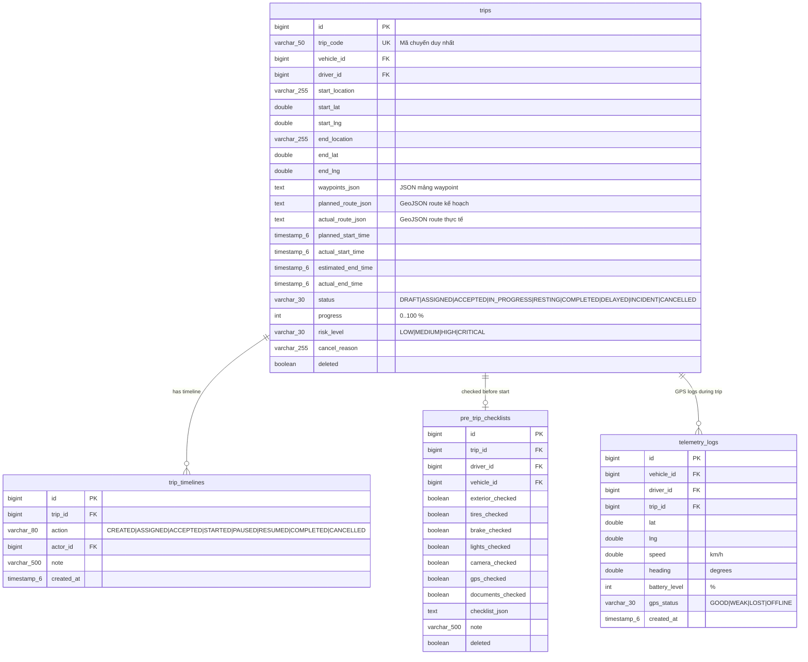
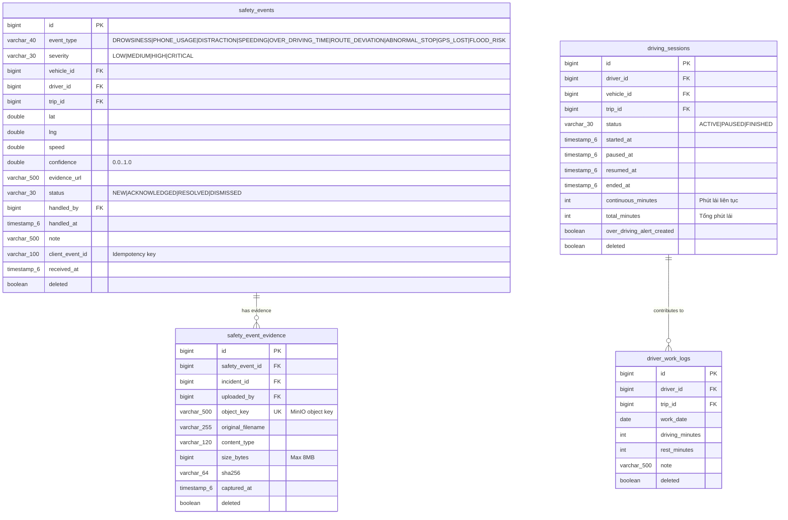
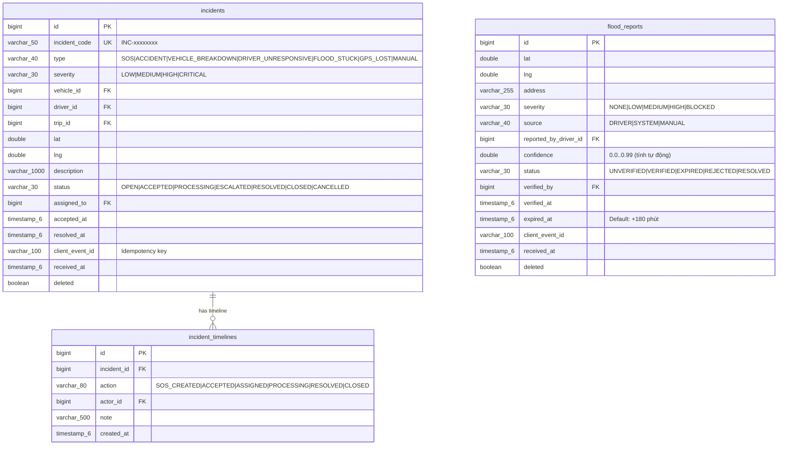
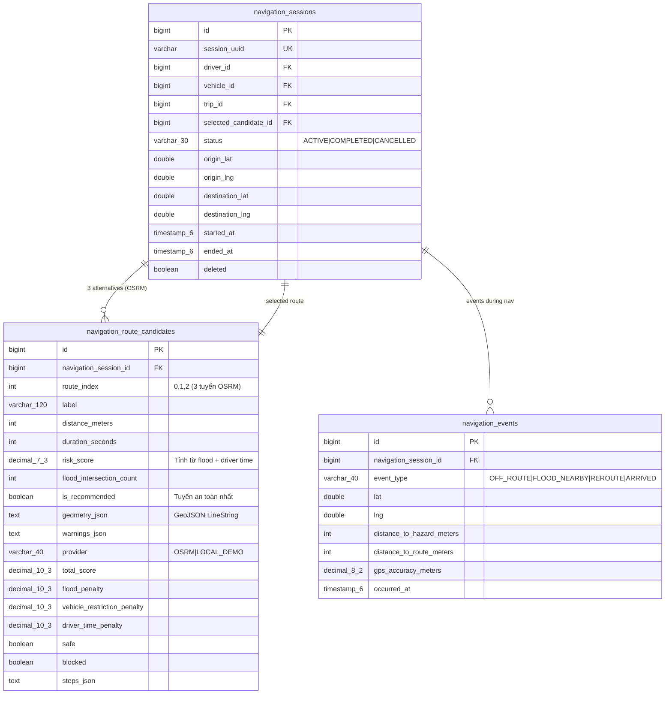
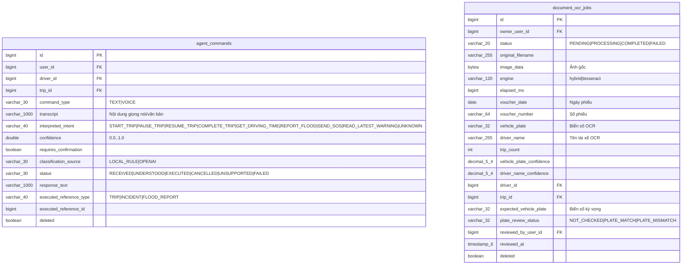
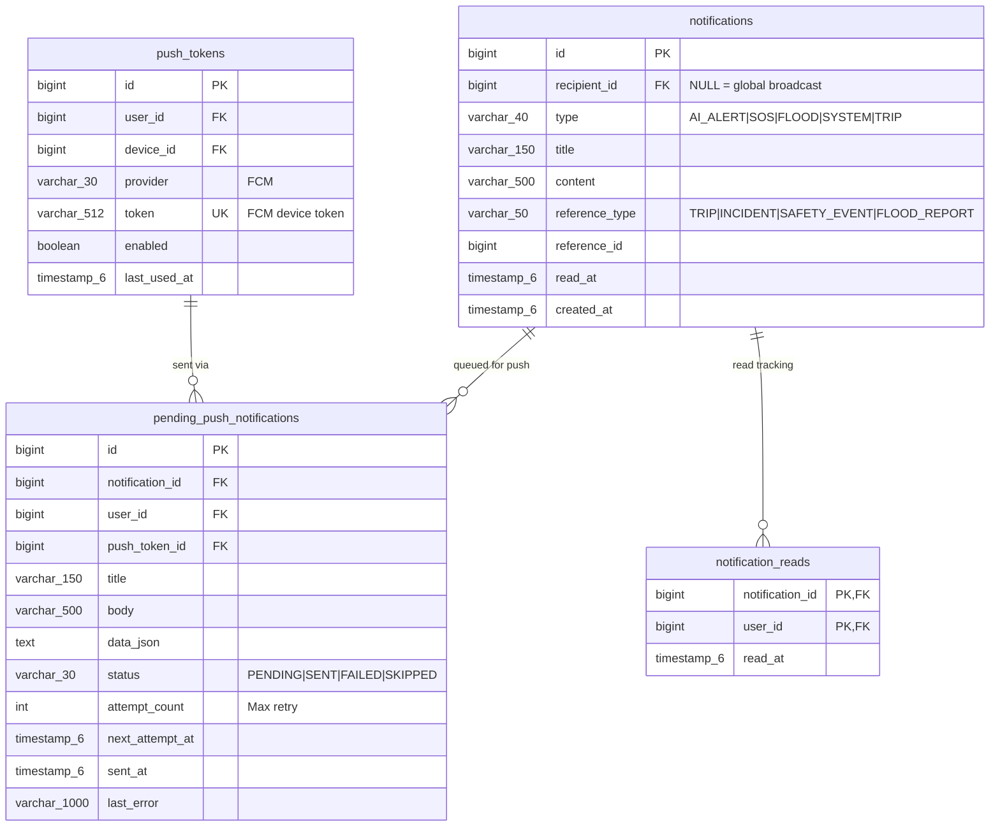

# Database Diagram — SafeFleet

> **Nguồn:** Trích xuất từ 13 Flyway migration SQL (`V1__init_schema.sql` → `V13__remove_legacy_backend_ai_configuration.sql`).
> File này trình bày schema **tập trung theo domain cốt lõi** — phù hợp trình bày trong báo cáo DATN.

---

## Nhóm 1: Account & Phân Quyền



---

## Nhóm 2: Xe & Tài Xế

```mermaid
erDiagram
    users {
        bigint id PK
        varchar_80 username UK
        varchar_30 status
        bigint role_id FK
    }

    drivers {
        bigint id PK
        bigint user_id FK_UK "1 user → 1 driver profile"
        varchar_150 full_name
        varchar_50 license_number UK
        varchar_20 license_class "B1|B2|C|D|E|F"
        date license_expired_at
        varchar_30 status "AVAILABLE|DRIVING|RESTING|SUSPENDED|HIGH_RISK"
        bigint current_vehicle_id FK
        int safety_score "Mặc định 100, giảm theo cảnh báo"
        int driving_time_today_minutes
        int continuous_driving_minutes
        int total_trips
        int total_alerts
        timestamp_6 created_at
        boolean deleted
    }

    vehicles {
        bigint id PK
        varchar_30 plate_number UK
        varchar_30 vehicle_type "TRUCK|VAN|BUS|CAR|PICKUP|MOTORBIKE"
        varchar_80 brand
        varchar_80 model
        int manufacture_year
        varchar_30 fuel_type "GASOLINE|DIESEL|ELECTRIC|HYBRID|CNG"
        varchar_30 status "AVAILABLE|RUNNING|RESTING|MAINTENANCE|OFFLINE"
        bigint current_driver_id FK
        bigint gps_device_id FK
        bigint camera_device_id FK
        date inspection_expired_at
        date insurance_expired_at
        double last_lat
        double last_lng
        double last_speed
        timestamp_6 last_updated_at
        boolean deleted
    }

    devices {
        bigint id PK
        varchar_50 device_code UK
        varchar_40 type "GPS|CAMERA|SENSOR"
        varchar_30 status "ONLINE|OFFLINE|FAULTY"
        bigint vehicle_id FK
        varchar_80 serial_number
        varchar_40 firmware_version
        timestamp_6 last_seen_at
        boolean deleted
    }

    mobile_devices {
        bigint id PK
        bigint user_id FK
        varchar_100 device_uuid UK
        varchar_30 platform "ANDROID|IOS"
        varchar_120 app_version
        timestamp_6 registered_at
        timestamp_6 last_seen_at
    }

    users ||--o| drivers : "has profile"
    drivers ||--o| vehicles : "currently drives"
    vehicles ||--o{ devices : "GPS device"
    vehicles ||--o{ devices : "Camera device"
    devices ||--o{ vehicles : "mounted on"
    users ||--o{ mobile_devices : "registers"
```

---

## Nhóm 3: Chuyến Đi (Trip)



---

## Nhóm 4: An Toàn & Giám Sát Lái Xe



---

## Nhóm 5: Sự Cố & Điểm Ngập



---

## Nhóm 6: Điều Hướng Tránh Ngập



---

## Nhóm 7: AI Agent & OCR



---

## Nhóm 8: Thông Báo & Push



---

## Nhóm 9: Kho Hàng & Phiếu Xuất

```mermaid
erDiagram
    warehouse_issue_documents {
        bigint id PK
        bigint trip_id FK_UK "1 chuyến → 1 phiếu"
        varchar_50 issue_number UK
        date issue_date
        varchar_30 status "DRAFT|ISSUED|CONFIRMED|COMPLETED|CANCELLED"
        int document_version
        varchar_150 warehouse_name
        varchar_200 project_name
        varchar_150 recipient_name
        bigint prepared_by_user_id FK
        bigint driver_id FK
        bigint vehicle_id FK
        timestamp_6 issued_at
        timestamp_6 completed_at
        boolean deleted
    }

    warehouse_issue_items {
        bigint id PK
        bigint document_id FK
        int line_number
        varchar_255 description "Tên vật tư"
        varchar_40 unit "cái|kg|m|thùng"
        decimal_14_3 requested_quantity
        decimal_14_3 issued_quantity
        decimal_14_3 returned_quantity
        decimal_14_3 delivered_quantity
        varchar_500 condition_note
        boolean deleted
    }

    warehouse_issue_confirmations {
        bigint id PK
        bigint document_id FK
        varchar_30 role_type "DRIVER|RECIPIENT|WAREHOUSE_KEEPER"
        varchar_30 status "PENDING|SIGNED|REJECTED"
        varchar_150 signer_name
        timestamp_6 signed_at
        double lat
        double lng
        varchar_500 evidence_url "Ảnh chữ ký"
        bigint created_by_user_id FK
        boolean deleted
    }

    warehouse_issue_audit_logs {
        bigint id PK
        bigint document_id FK
        varchar_50 action "CREATED|ISSUED|CONFIRMED|COMPLETED|CANCELLED"
        varchar_30 from_status
        varchar_30 to_status
        bigint actor_user_id FK
        timestamp_6 created_at
    }

    warehouse_issue_documents ||--o{ warehouse_issue_items : "contains items"
    warehouse_issue_documents ||--o{ warehouse_issue_confirmations : "confirmed by 3 roles"
    warehouse_issue_documents ||--o{ warehouse_issue_audit_logs : "audit trail"
```

---

## Thống Kê Database

| Nhóm | Số bảng | Migration |
|---|---|---|
| Account & Phân quyền | 5 | V1 |
| Xe & Tài xế | 4 | V1, V4 |
| Chuyến đi | 3 | V1 |
| An toàn & Giám sát | 4 | V1, V4 |
| Sự cố & Điểm ngập | 3 | V1 |
| Điều hướng | 3 | V4, V5 |
| AI Agent & OCR | 2 | V3, V7, V9-V11 |
| Thông báo & Push | 4 | V1, V4 |
| Kho hàng & Phiếu xuất | 4 | V8 |
| Sync / Offline | 3 | V5, V6 |
| **Tổng** | **35 → 33 sau V13** | V1-V13 |
