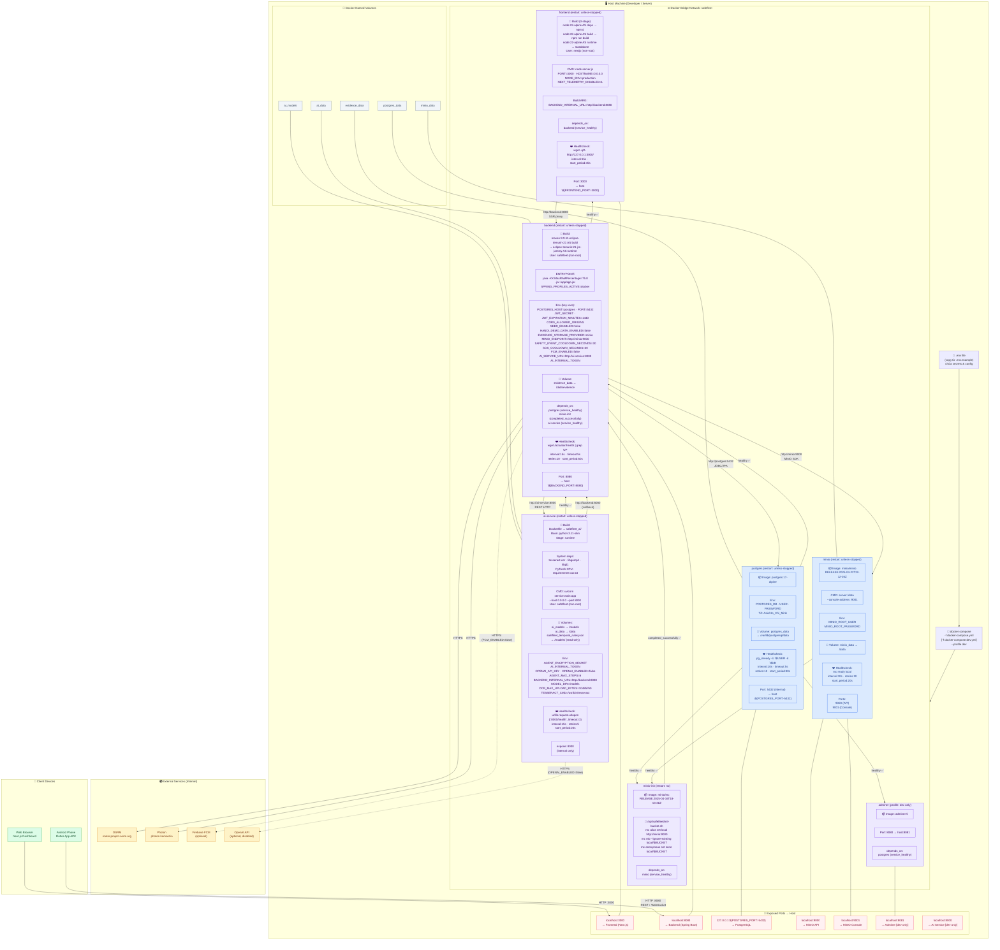
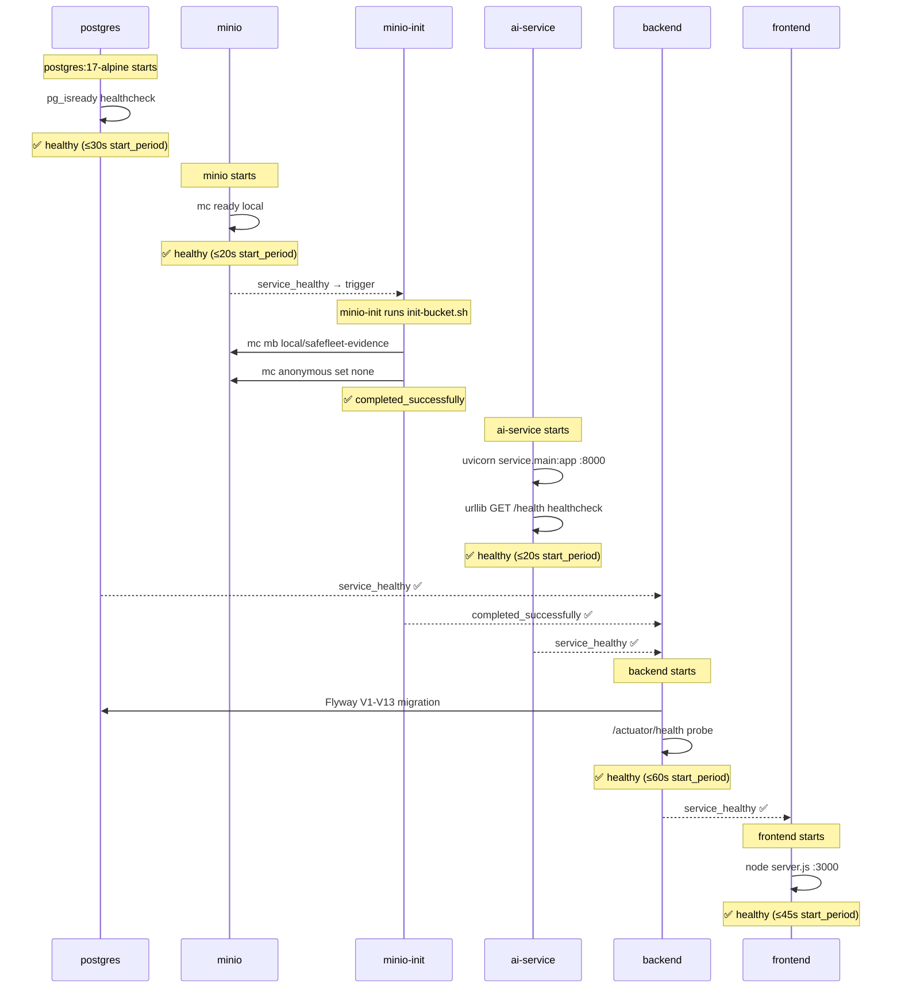

# Deployment Architecture Diagram — SafeFleet

> **Nguồn:** Toàn bộ thông tin được trích xuất trực tiếp từ `docker-compose.yml`, `docker-compose.dev.yml`, và các `Dockerfile`.

---

## Biểu Đồ Triển Khai

---

## Thứ Tự Khởi Động (Startup Order)

---

## Docker Build — Từng Service

| Service | Base Image | Build Stages | User | Port |
|---|---|---|---|---|
| **backend** | `maven:3.9.11-eclipse-temurin-21` → `eclipse-temurin:21-jre-jammy` | 2 stages: build + runtime | `safefleet` (non-root) | 8080 |
| **frontend** | `node:22-alpine` | 3 stages: deps + build + runtime | `nextjs` (uid:1001) | 3000 |
| **ai-service** | `python:3.11-slim` | 3 stages: base + test + runtime | `safefleet` (non-root) | 8000 |
| **postgres** | `postgres:17-alpine` | Official image | `postgres` | 5432 |
| **minio** | `minio/minio:RELEASE.2025-04-22T22-12-26Z` | Official image | `minio` | 9000/9001 |
| **minio-init** | `minio/mc:RELEASE.2025-04-16T18-13-26Z` | Official image, run once | — | — |

---

## So Sánh: Production vs Dev Profile

| Cấu hình | Production (`docker-compose.yml`) | Dev (`docker-compose.dev.yml`) |
|---|---|---|
| AI Service port | Internal only (`expose: 8000`) | Exposed to host `:8000` |
| Seed data | `SEED_ENABLED=false` | `SEED_ENABLED=true` |
| Hà Nội demo data | `HANOI_DEMO_DATA_ENABLED=false` | `HANOI_DEMO_DATA_ENABLED=true` |
| Log level | `INFO` | `DEBUG` |
| Adminer UI | ❌ Không có | ✅ `adminer:5` tại `:8081` |

---

## Bảng Nguồn Source Code

| Thành phần | File nguồn | Dòng / Chi tiết |
|---|---|---|
| Backend base image | `web_quan_ly/backend/Dockerfile:2,9` | `maven:3.9.11-eclipse-temurin-21` → `eclipse-temurin:21-jre-jammy` |
| Backend JVM flag | `Dockerfile:24` | `-XX:MaxRAMPercentage=75.0` |
| Backend healthcheck | `Dockerfile:22-23` | `curl /actuator/health`, interval:15s, start_period:45s |
| Backend non-root user | `Dockerfile:13-14,19` | `useradd safefleet`, `USER safefleet` |
| Frontend base image | `web_quan_ly/frontend/Dockerfile:2,7,16` | `node:22-alpine` 3 stages |
| Frontend internal URL | `Dockerfile:10-11` | `ARG BACKEND_INTERNAL_URL=http://backend:8080` |
| Frontend healthcheck | `Dockerfile:28-29` | `wget -qO- http://127.0.0.1:3000/`, start_period:30s |
| AI base image | `safefleet_ai/Dockerfile:2` | `python:3.11-slim` |
| AI system deps | `Dockerfile:7` | `tesseract-ocr libgomp1` (base) + `libgl1` (runtime) |
| AI PyTorch CPU | `Dockerfile:11` | `--index-url https://download.pytorch.org/whl/cpu` |
| AI healthcheck | `Dockerfile:34-35` | `urllib.request.urlopen('/health', timeout=3)` |
| AI test stage | `Dockerfile:14-21` | `--target test`, runs `pytest -q` |
| MinIO image | `docker-compose.yml:134` | `minio/minio:RELEASE.2025-04-22T22-12-26Z` |
| MinIO init anonymous | `docker/minio/init-bucket.sh:10` | `mc anonymous set none` (bucket private) |
| Startup order | `docker-compose.yml:65-70` | `depends_on` với conditions |
| Backend start_period | `docker-compose.yml:76` | 60s (chờ Flyway migration) |
| Docker network | `docker-compose.yml:175-177` | `driver: bridge`, name: `safefleet` |
| Dev: Adminer | `docker-compose.dev.yml:14-23` | `adminer:5`, port 8081, profile: dev |
| Health check script | `docker/scripts/health-check.sh` | Kiểm tra 4 endpoints: backend, frontend, ai-service, minio |
