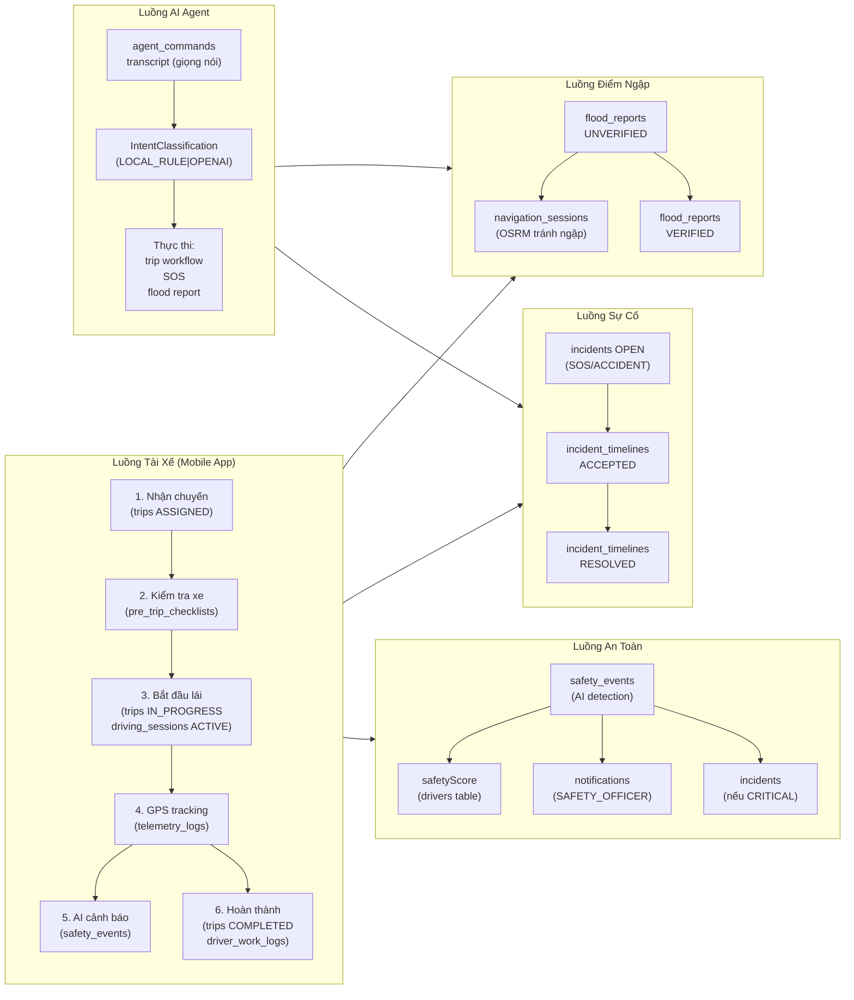

# Mô Hình Quan Hệ Dữ Liệu — SafeFleet

> **Nguồn:** Trích xuất từ 13 Flyway migration SQL và JPA entity annotations.
> File này trình bày **quan hệ giữa các domain** ở mức kiến trúc — không liệt kê từng cột chi tiết.
> Phù hợp để đặt trong phần thiết kế hệ thống của báo cáo DATN.

---

## Biểu Đồ Tổng Quan — Quan Hệ Giữa Các Domain

```mermaid
graph TB
    %% ═══════════════════════════════════
    %% DOMAIN NODES
    %% ═══════════════════════════════════
    subgraph ACC ["🔐 Account & Phân Quyền"]
        users["users\n(UserAccount)"]
        roles["roles"]
        permissions["permissions"]
        role_perms["role_permissions"]
    end

    subgraph VEH ["🚗 Xe & Thiết Bị"]
        vehicles["vehicles\n(Vehicle)"]
        devices["devices\n(Device)"]
        device_logs["device_connection_logs"]
        mobile_devices["mobile_devices"]
    end

    subgraph DRV ["👤 Tài Xế"]
        drivers["drivers\n(Driver)"]
    end

    subgraph TRIP_DOM ["📋 Chuyến Đi"]
        trips["trips\n(Trip)"]
        timelines["trip_timelines"]
        checklist["pre_trip_checklists"]
        telemetry["telemetry_logs"]
    end

    subgraph SAFETY_DOM ["🛡️ An Toàn & Giám Sát"]
        safety_ev["safety_events\n(SafetyEvent)"]
        drv_session["driving_sessions"]
        work_log["driver_work_logs"]
        evidence["safety_event_evidence\n(→ MinIO)"]
    end

    subgraph INC_DOM ["🆘 Sự Cố"]
        incidents["incidents\n(Incident)"]
        inc_timeline["incident_timelines"]
    end

    subgraph FLOOD_DOM ["🌊 Điểm Ngập"]
        flood["flood_reports\n(FloodReport)"]
    end

    subgraph NAV_DOM ["🗺️ Điều Hướng"]
        nav_session["navigation_sessions"]
        nav_cand["navigation_route_candidates\n(OSRM × 3)"]
        nav_ev["navigation_events"]
    end

    subgraph AGENT_DOM ["🤖 AI Agent & OCR"]
        agent_cmd["agent_commands\n(AgentCommand)"]
        ocr_job["document_ocr_jobs"]
    end

    subgraph NOTIF_DOM ["🔔 Thông Báo"]
        notifs["notifications"]
        push_tokens["push_tokens\n(FCM)"]
        pending_push["pending_push_notifications"]
        notif_reads["notification_reads"]
    end

    subgraph WAREHOUSE_DOM ["📦 Kho Hàng"]
        wh_doc["warehouse_issue_documents"]
        wh_items["warehouse_issue_items"]
        wh_confirm["warehouse_issue_confirmations"]
        wh_audit["warehouse_issue_audit_logs"]
    end

    subgraph SYNC_DOM ["🔄 Sync Offline"]
        sync_batch["sync_batches"]
        sync_items["sync_batch_items"]
        receipts["mobile_command_receipts"]
    end

    subgraph MAINT_DOM ["🔧 Bảo Dưỡng"]
        maint["maintenance_orders"]
    end

    subgraph SETTINGS_DOM ["⚙️ Cấu Hình"]
        settings["system_settings"]
        audit_log["audit_logs"]
    end

    %% ═══════════════════════════════════
    %% QUAN HỆ CỐT LÕI
    %% ═══════════════════════════════════

    %% Account → Role → Permission
    users -->|"role_id"| roles
    roles <-->|"M:N"| permissions

    %% users → drivers (1:1)
    users -->|"1:1 profile"| drivers

    %% users → mobile_devices (1:N)
    users -->|"1:N registers"| mobile_devices

    %% drivers ↔ vehicles (bidirectional current assignment)
    drivers <-->|"M:1 current\nassignment"| vehicles

    %% vehicles → devices (GPS + Camera)
    vehicles -->|"gps_device_id\ncamera_device_id"| devices
    devices -->|"device_logs"| device_logs

    %% Trip is central
    drivers -->|"driver_id"| trips
    vehicles -->|"vehicle_id"| trips
    trips -->|"1:N"| timelines
    trips -->|"1:1 checklist\n(bắt buộc trước start)"| checklist
    trips -->|"1:N GPS logs"| telemetry

    %% Safety links Trip
    drivers -->|"driver_id"| safety_ev
    vehicles -->|"vehicle_id"| safety_ev
    trips -->|"trip_id"| safety_ev
    users -->|"handled_by"| safety_ev
    safety_ev -->|"1:N evidence\n→ MinIO bucket"| evidence

    drivers -->|"driver_id"| drv_session
    trips -->|"trip_id"| drv_session
    drivers -->|"driver_id"| work_log
    trips -->|"trip_id"| work_log

    %% Incident links
    drivers -->|"driver_id"| incidents
    vehicles -->|"vehicle_id"| incidents
    trips -->|"trip_id"| incidents
    users -->|"assigned_to"| incidents
    incidents -->|"1:N timeline"| inc_timeline
    users -->|"actor_id"| inc_timeline
    incidents -->|"evidenced by"| evidence

    %% Flood
    drivers -->|"reported_by"| flood
    users -->|"verified_by"| flood

    %% Navigation
    drivers -->|"driver_id"| nav_session
    vehicles -->|"vehicle_id"| nav_session
    trips -->|"trip_id"| nav_session
    nav_session -->|"1:3 OSRM alternatives"| nav_cand
    nav_session -->|"selected_candidate_id"| nav_cand
    nav_session -->|"1:N events"| nav_ev

    %% Agent
    users -->|"user_id"| agent_cmd
    drivers -->|"driver_id"| agent_cmd
    trips -->|"trip_id"| agent_cmd

    %% OCR
    users -->|"owner_user_id"| ocr_job
    drivers -->|"driver_id"| ocr_job
    trips -->|"trip_id"| ocr_job
    users -->|"reviewed_by"| ocr_job

    %% Notification
    users -->|"recipient_id"| notifs
    notifs -->|"1:N push queue"| pending_push
    push_tokens -->|"sent via"| pending_push
    users -->|"1:N tokens"| push_tokens
    mobile_devices -->|"device_id"| push_tokens
    notifs <-->|"read tracking"| notif_reads
    users -->|"user_id"| notif_reads

    %% Warehouse
    trips -->|"1:1 phiếu"| wh_doc
    users -->|"prepared_by"| wh_doc
    drivers -->|"driver_id"| wh_doc
    vehicles -->|"vehicle_id"| wh_doc
    wh_doc -->|"1:N dòng vật tư"| wh_items
    wh_doc -->|"1:3 xác nhận\n(Driver/Recipient/Warehouse)"| wh_confirm
    wh_doc -->|"audit trail"| wh_audit

    %% Sync
    users -->|"user_id"| sync_batch
    drivers -->|"driver_id"| sync_batch
    sync_batch -->|"1:N items"| sync_items
    users -->|"idempotency"| receipts
    trips -->|"trip_id"| receipts

    %% Maintenance
    vehicles -->|"vehicle_id"| maint
    users -->|"assigned_to"| maint

    %% Settings & Audit
    users -->|"updated_by"| settings
    users -->|"actor_id"| audit_log

    %% Styles
    classDef account fill:#dbeafe,stroke:#2563eb,color:#1e3a8a
    classDef vehicle fill:#fef3c7,stroke:#d97706,color:#78350f
    classDef driver fill:#dcfce7,stroke:#16a34a,color:#14532d
    classDef trip fill:#f0fdf4,stroke:#16a34a,color:#14532d
    classDef safety fill:#fdf4ff,stroke:#9333ea,color:#581c87
    classDef incident fill:#fff1f2,stroke:#f43f5e,color:#881337
    classDef flood fill:#e0f2fe,stroke:#0284c7,color:#0c4a6e
    classDef nav fill:#fef9c3,stroke:#ca8a04,color:#713f12
    classDef agent fill:#f1f5f9,stroke:#64748b,color:#1e293b
    classDef notif fill:#fff7ed,stroke:#ea580c,color:#7c2d12
    classDef warehouse fill:#ecfdf5,stroke:#059669,color:#064e3b
    classDef sync fill:#f5f3ff,stroke:#7c3aed,color:#3b0764

    class users,roles,permissions,role_perms account
    class vehicles,devices,device_logs,mobile_devices vehicle
    class drivers driver
    class trips,timelines,checklist,telemetry trip
    class safety_ev,drv_session,work_log,evidence safety
    class incidents,inc_timeline incident
    class flood flood
    class nav_session,nav_cand,nav_ev nav
    class agent_cmd,ocr_job agent
    class notifs,push_tokens,pending_push,notif_reads notif
    class wh_doc,wh_items,wh_confirm,wh_audit warehouse
    class sync_batch,sync_items,receipts sync
```

---

## Bảng Quan Hệ Theo Domain

| Từ | Đến | Loại | Mô tả |
|---|---|---|---|
| `users` | `roles` | N:1 | Mỗi user được gán 1 role |
| `roles` | `permissions` | M:N | Qua bảng `role_permissions` |
| `users` | `drivers` | 1:1 | User tài xế có profile driver |
| `users` | `mobile_devices` | 1:N | Nhiều thiết bị đăng ký |
| `drivers` ↔ `vehicles` | — | M:1 | `current_vehicle_id` / `current_driver_id` |
| `vehicles` | `devices` | 1:2 | `gps_device_id` + `camera_device_id` |
| `trips` | `drivers` + `vehicles` | N:1 | Mỗi chuyến cần 1 xe + 1 tài xế |
| `trips` | `pre_trip_checklists` | 1:1 | Bắt buộc trước khi start |
| `trips` | `telemetry_logs` | 1:N | Nhiều GPS logs trong chuyến |
| `trips` | `trip_timelines` | 1:N | Lịch sử thay đổi trạng thái |
| `safety_events` | `drivers`,`vehicles`,`trips` | N:1 | Cảnh báo AI liên kết đa chiều |
| `safety_events` | `safety_event_evidence` | 1:N | File ảnh/video → MinIO |
| `incidents` | `drivers`,`vehicles`,`trips` | N:1 | Sự cố liên kết đa chiều |
| `incidents` | `incident_timelines` | 1:N | Lịch sử xử lý sự cố |
| `flood_reports` | `drivers` | N:1 | Tài xế báo điểm ngập |
| `navigation_sessions` | `navigation_route_candidates` | 1:3 | 3 tuyến OSRM alternatives |
| `navigation_sessions` | `navigation_route_candidates` | 1:1 | Tuyến được chọn |
| `agent_commands` | `users`,`drivers`,`trips` | N:1 | Lệnh AI Voice liên kết |
| `document_ocr_jobs` | `users`,`drivers`,`trips` | N:1 | OCR phiếu xuất kho |
| `notifications` | `users` | N:1 | Thông báo đến user cụ thể (hoặc NULL = global) |
| `notifications` | `pending_push_notifications` | 1:N | Queue FCM push |
| `push_tokens` | `users`,`mobile_devices` | N:1 | FCM token đăng ký |
| `warehouse_issue_documents` | `trips` | 1:1 | 1 chuyến → 1 phiếu xuất kho |
| `warehouse_issue_documents` | `warehouse_issue_items` | 1:N | Nhiều dòng vật tư |
| `warehouse_issue_documents` | `warehouse_issue_confirmations` | 1:3 | Driver / Recipient / Warehouse Keeper |
| `sync_batches` | `sync_batch_items` | 1:N | Batch GPS offline sync |
| `maintenance_orders` | `vehicles` | N:1 | Nhiều lệnh bảo dưỡng cho 1 xe |

---

## Luồng Dữ Liệu Chính Theo Nghiệp Vụ

