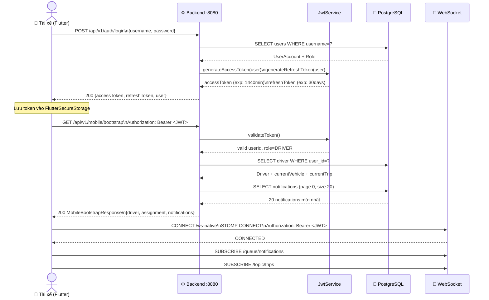
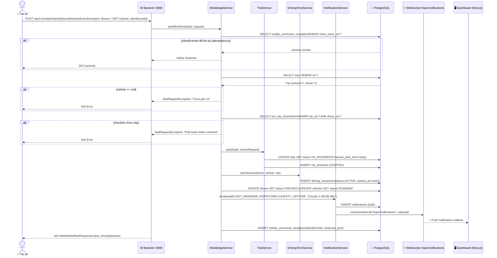
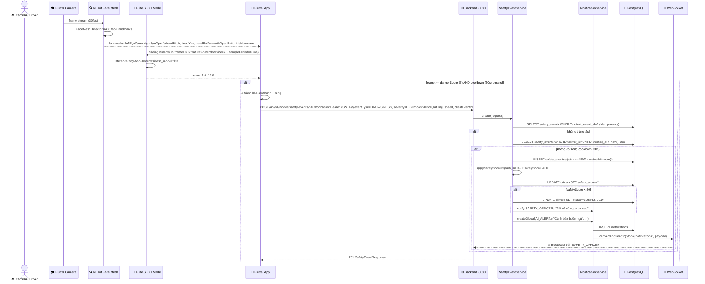
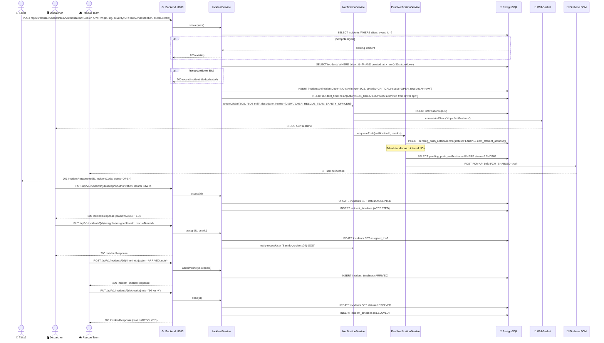
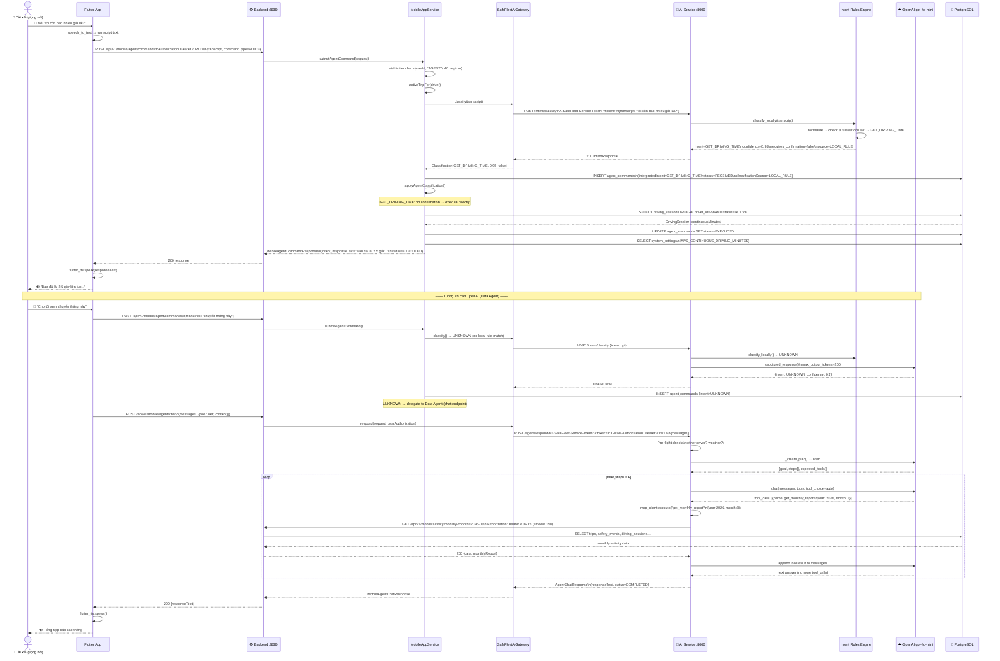

# Sequence Diagram — SafeFleet

> **Nguồn:** Toàn bộ thứ tự gọi hàm, HTTP endpoint, header và dữ liệu trao đổi được trích xuất từ source code thực tế.

---

## 1. Sequence: Đăng Nhập & Khởi Tạo App (Login & Bootstrap)

> Nguồn: `AuthController.java`, `JwtService.java`, `MobileAppService.java:bootstrap()`



---

## 2. Sequence: Bắt Đầu Chuyến Đi (Trip Start)

> Nguồn: `MobileController.java`, `MobileAppService.java:startWorkflow()`, `NotificationService.java`



---

## 3. Sequence: Phát Hiện & Gửi Cảnh Báo Buồn Ngủ (Drowsiness Alert)

> Nguồn: `stgt_drowsiness_engine.dart`, `MobileController.java`, `SafetyEventService.java`



---

## 4. Sequence: Gửi SOS & Xử Lý Cứu Hộ

> Nguồn: `IncidentService.java:sos()`, `NotificationService.java`, `PushNotificationService.java`



---

## 5. Sequence: Navigation — Tìm Tuyến Đường Tránh Ngập

> Nguồn: `NavigationService.java`, `OsrmRoutingProvider.java`, `FloodReportService.java:routeRisk()`

```mermaid
sequenceDiagram
    actor Driver as 📱 Tài xế
    participant API as ⚙️ Backend :8080
    participant NS as NavigationService
    participant FRS as FloodReportService
    participant OSRM as 🗺️ OSRM\nrouter.project-osrm.org
    participant DB as 🐘 PostgreSQL

    Driver->>API: POST /api/v1/mobile/navigation/start\nAuthorization: Bearer <JWT>\n{originLat, originLng\ndestLat, destLng, tripId}

    API->>NS: startSession(request, driver)
    NS->>DB: INSERT navigation_sessions\n{status=ACTIVE, session_uuid=UUID}

    NS->>OSRM: GET /route/v1/driving/{orig};{dest}\n?alternatives=3&geometries=geojson\nUser-Agent: SafeFleet-DATN/1.0
    OSRM-->>NS: [{routes}] × 3 alternatives

    NS->>FRS: routeRisk(routeCoords)
    FRS->>DB: SELECT flood_reports WHERE\nstatus IN (UNVERIFIED, VERIFIED)
    DB-->>FRS: active flood reports
    FRS->>FRS: Tính giao nhau giữa route và flood zones\n→ floodIntersectionCount, riskScore

    loop 3 route candidates
        NS->>DB: INSERT navigation_route_candidates\n{routeIndex, distanceMeters\ndurationSeconds, riskScore\nfloodIntersectionCount, geometryJson\nis_recommended=true (riskScore thấp nhất)}
    end

    API-->>Driver: 200 NavigationSessionResponse\n{sessionId, candidates[3]\nrecommendedCandidateId}

    Driver->>API: PUT /api/v1/mobile/navigation/{sessionId}/select\n{candidateId}
    API->>DB: UPDATE navigation_sessions\nSET selected_candidate_id=?
    API-->>Driver: 200 selected route

    loop Trong khi điều hướng
        Driver->>API: POST /api/v1/mobile/navigation/{sessionId}/events\n{eventType=OFF_ROUTE, lat, lng\ndistanceToRouteMeters}
        API->>DB: INSERT navigation_events\n{eventType, lat, lng\noccurredAt=now()}
        API-->>Driver: 200 NavigationEventResponse
    end

    Driver->>API: POST /api/v1/mobile/navigation/{sessionId}/end
    API->>DB: UPDATE navigation_sessions\nSET status=COMPLETED, ended_at=now()
    API-->>Driver: 200
```

---

## 6. Sequence: AI Voice Agent — Truy Vấn Dữ Liệu

> Nguồn: `MobileAppService.java:submitAgentCommand()`, `SafeFleetAiGateway.java`, `AgentOrchestrator.py`, `tools.py`



---

## Bảng Nguồn Source Code

| Sequence | File nguồn | Chi tiết kỹ thuật |
|---|---|---|
| Login JWT | `auth/service/AuthService.java` | accessToken exp: 1440min, refreshToken: 30days |
| Bootstrap | `mobile/service/MobileAppService.java:140` | notification page 0 size 20 |
| WebSocket connect | `config/WebSocketConfig.java:53` | `/ws-native`, STOMP, `/queue` + `/topic` |
| Trip start idempotency | `MobileAppService.java:462-464` | `mobile_command_receipts` lookup bằng clientEventId |
| Checklist gate | `MobileAppService.java:468-472` | `checklistPassed()` bắt buộc |
| DrivingSession start | `DrivingTimeService.java` | `status=ACTIVE, startedAt=now()` |
| Notification broadcast | `NotificationService.java:48,74` | `messagingTemplate.convertAndSend("/topic/notifications")` |
| Safety cooldown | `SafetyEventService.java:76` | `now().minusSeconds(cooldownSeconds)` |
| Safety score penalty | `SafetyEventService.java:244-256` | HIGH:-10, CRITICAL:-20, suspend <50 |
| SOS cooldown | `IncidentService.java:63,138` | `@Value("${app.sos.cooldown-seconds:30}")` |
| SOS idempotency | `IncidentService.java:123-126` | clientEventId deduplication |
| OSRM call | `OsrmRoutingProvider.java` | User-Agent: SafeFleet-DATN/1.0, alternatives=3 |
| Flood route risk | `FloodReportService.java:166` | Giao nhau route với active flood reports |
| AI Gateway classify | `SafeFleetAiGateway.java:70-79` | `POST /intent/classify`, RestClient |
| AI Gateway respond | `SafeFleetAiGateway.java:47-57` | `POST /agent/respond`, X-User-Authorization |
| Rate limiter | `MobileAppService.java:857` | AGENT: 10 req/min |
| Agent direct exec | `MobileAppService.java:880` | `applyAgentClassification()` cho GET_DRIVING_TIME |
| Agent confirm | `MobileAppService.java:885-961` | switch(intent) → gọi workflow/sos/flood |
| MCP tool executor | `agent/tools.py:11-17` | 5 ALLOWED_TOOLS, HTTP GET timeout 15s |
| Agent max steps | `agent/orchestrator.py:105` | `while step_index < max_steps` |
| TTS response | `safe_fleet_driver_ui/lib/core/` | `flutter_tts.speak(responseText)` |
