# System Diagram — SafeFleet

> **Nguồn:** Toàn bộ thông tin được trích xuất từ source code thực tế.
> Các luồng dữ liệu, port, endpoint và component đều có file nguồn cụ thể.

---

## Biểu Đồ Kiến Trúc Hệ Thống

```mermaid
graph TB
    %% ════════════════════════════════════════
    %% LAYER 0 — NGƯỜI DÙNG
    %% ════════════════════════════════════════
    subgraph USERS ["👥 Người Dùng"]
        DRV(["📱 Tài xế\n(DRIVER)"])
        WEB_USR(["🖥️ Quản lý / Điều phối\nFLEET_MANAGER · DISPATCHER\nSAFETY_OFFICER · RESCUE_TEAM · ADMIN"])
    end

    %% ════════════════════════════════════════
    %% LAYER 1 — CLIENT APPS
    %% ════════════════════════════════════════
    subgraph CLIENTS ["📲 Client Applications"]
        direction TB

        subgraph FLUTTER ["Flutter App  (safe_fleet_driver_ui)"]
            direction TB
            FL_UI["🎨 UI Layer\ngo_router · Riverpod\n16 Feature Modules"]
            FL_NET["🌐 Network Layer\nDio · ApiClient\nJWT auto-refresh\n(api_client.dart)"]
            FL_DB["💾 Local DB\nSQLite (sqflite v3)\noffline_queue · cached_documents\ndriving_log · document_ocr_queue\n(local_database.dart)"]
            FL_SYNC["🔄 Sync Queue\nBatch GPS offline\n(sync_queue.dart)"]

            subgraph FL_AI ["🧠 On-Device AI  (core/ai/)"]
                FL_TFLITE["TFLite Engine\ndrowsiness_model.tflite\nSTGT-fold-1\n(stgt_drowsiness_engine.dart)"]
                FL_MLKIT["ML Kit\nFace Mesh 468 điểm\nleftEyeOpen · rightEyeOpen\nheadPitch · headYaw · headRoll\nmouthOpenRatio · irisMovement"]
                FL_TEMPORAL["Temporal Rules\nmlKitTemporal mode\n(temporal_safety_engine.dart)"]
                FL_OCR_DEV["ML Kit OCR\nText Recognition"]
            end

            FL_MAP["🗺️ MapLibre GL\nmaplibre_gl ^0.26.2"]
            FL_VOICE["🎤 Voice I/O\nspeech_to_text\nflutter_tts"]
        end

        subgraph NEXTJS ["Next.js Frontend  (web_quan_ly/frontend)"]
            direction TB
            NX_PAGE["📄 16 Dashboard Pages\nApp Router (Next.js 16.2)"]
            NX_MAP["🗺️ MapLibre GL 5\nBản đồ realtime"]
            NX_CHART["📊 Recharts\nBiểu đồ thống kê"]
            NX_ANIM["✨ Framer Motion\nAnimation"]
            NX_HTTP["🌐 Axios\nHTTP Client"]
            NX_WS["🔌 WebSocket\nSTOMP/SockJS\n/ws endpoint"]
        end
    end

    %% ════════════════════════════════════════
    %% LAYER 2 — BACKEND (Spring Boot)
    %% ════════════════════════════════════════
    subgraph BACKEND ["⚙️ Backend  (web_quan_ly/backend)  :8080"]
        direction TB

        subgraph BE_SEC ["🔐 Security Layer"]
            BE_JWT["JWT Filter\nJwtAuthenticationFilter\nJwtService\n(infrastructure/security/)"]
            BE_CORS["CORS Guard\nno wildcard\n(SecurityConfig.java)"]
        end

        subgraph BE_WS ["🔌 WebSocket Broker"]
            BE_WS_EP["/ws — SockJS\n/ws-native — raw\nSTOMP topics: /topic /queue\n(WebSocketConfig.java)"]
        end

        subgraph BE_DOMAINS ["📦 17 Domain Modules  (com.safefleet.*)"]
            direction LR
            BE_ACCOUNT["account\n(CRUD tài khoản)"]
            BE_DRIVER["driver\n(hồ sơ tài xế)"]
            BE_VEHICLE["vehicle\n(quản lý xe)"]
            BE_TRIP["trip\n(chuyến đi)"]
            BE_SAFETY["safety\n(SafetyEvent\nDrivingSession\nDriverWorkLog)"]
            BE_INCIDENT["incident\n(SOS, sự cố)"]
            BE_FLOOD["flood\n(vùng ngập)"]
            BE_TELEMETRY["telemetry\n(GPS logs)"]
            BE_LOCATION["location\n(geocoding)"]
            BE_NAVIGATION["navigation\n(OSRM routing)"]
            BE_NOTIFICATION["notification\n(in-app + push)"]
            BE_DISPATCH["dispatch\n(điều phối)"]
            BE_EVIDENCE["evidence\n(ảnh/video → MinIO)"]
            BE_MAINTENANCE["maintenance\n(bảo dưỡng xe)"]
            BE_WAREHOUSE["warehouse\n(kho phụ tùng)"]
            BE_REPORT["report\n(dashboard, báo cáo)"]
            BE_SETTINGS["settings\n(cấu hình)"]
        end

        subgraph BE_MOBILE ["📱 Mobile API Layer"]
            BE_MOBILE_CTRL["MobileController\n(com.safefleet.mobile)\nAPI riêng cho Flutter\n/api/v1/mobile/*"]
            BE_OCR_CTRL["DocumentPlateReviewController\n/document-plate-reviews"]
            BE_AGENT_CTRL["AgentAiConfigurationController\n/api/v1/agent/config\n[ADMIN only]"]
        end

        subgraph BE_INFRA ["🏗️ Infrastructure Layer"]
            BE_AI_GW["SafeFleetAiGateway\nHTTP → AI Service\nX-SafeFleet-Service-Token\nconnect: 5s · read: 120s\n(infrastructure/ai/)"]
            BE_FLYWAY["Flyway Migrations\nV1–V13 (13 migrations)\n(db/migration/)"]
            BE_PUSH["PushNotificationService\nFCM queue → pending_push_notifications\ndispatch interval: 30s"]
            BE_RATE["ActionRateLimiter\nSafety cooldown: 30s\nSOS cooldown: 30s"]
        end

        BE_ACTUATOR["Spring Actuator\n/actuator/health\n(health probe Docker)"]
        BE_SWAGGER["SpringDoc/Swagger\n/swagger-ui/index.html\n/v3/api-docs"]
    end

    %% ════════════════════════════════════════
    %% LAYER 3 — AI SERVICE (Python)
    %% ════════════════════════════════════════
    subgraph AI_SVC ["🤖 AI Service  (safefleet_ai)  :8000"]
        direction TB
        AI_MAIN["FastAPI 0.116\nUvicorn ASGI\n(service/main.py)"]

        subgraph AI_ROUTERS ["API Routers"]
            AI_HEALTH["GET /health"]
            AI_MODELS["GET /models"]
            AI_INTENT["POST /intent/classify\n→ AgentIntent + confidence\n+ requires_confirmation"]
            AI_CHAT["POST /chat"]
            AI_OCR["POST /ocr/extract\n→ Tesseract + ML"]
            AI_AGENT["POST /agent/respond\nGET|PUT /agent/config\nPOST /agent/config/test"]
            AI_MCP["MCP endpoint\n(mcp.py)"]
        end

        AI_TEMPORAL["⏱️ Temporal Rules Engine\nsafefleet_temporal_rules.json\ngiờ nghỉ · lái liên tục\n(service/temporal.py)"]
        AI_PROVIDER["Provider Abstraction\nLocal Rules (default)\nOpenAI gpt-4o-mini (optional)\n(service/providers/openai.py)"]
        AI_AGENT_ORCH["Data Agent Orchestrator\ntối đa 6 bước\nyêu cầu xác nhận\nquery PostgreSQL trực tiếp"]
    end

    %% ════════════════════════════════════════
    %% LAYER 4 — DATA STORES
    %% ════════════════════════════════════════
    subgraph STORES ["🗄️ Data Stores"]
        PG[("🐘 PostgreSQL 17\n:5432\nFlyway-managed schema\nddl-auto: validate\nTZ: Asia/Ho_Chi_Minh")]
        MINIO[("📦 MinIO\n:9000 API · :9001 Console\nbucket: safefleet-evidence\nmax file: 8MB\npre-signed URL")]
    end

    %% ════════════════════════════════════════
    %% LAYER 5 — EXTERNAL APIs
    %% ════════════════════════════════════════
    subgraph EXT ["🌍 External APIs"]
        OSRM["OSRM\nrouter.project-osrm.org\n/route/v1/driving\nUser-Agent: SafeFleet-DATN/1.0"]
        PHOTON["Photon — Komoot\nphoton.komoot.io/api/\ngeocode, lang=vi\nbias: lat=21.0285 lon=105.8542"]
        FCM["Firebase FCM\nPush notification\nAndroid/iOS\n(FCM_ENABLED=false default)"]
        OPENAI["OpenAI API\ngpt-4o-mini\n(OPENAI_ENABLED=false default)"]
    end

    %% ════════════════════════════════════════
    %% CONNECTIONS
    %% ════════════════════════════════════════

    %% Client → Backend
    DRV --> FL_UI
    WEB_USR --> NX_PAGE

    FL_NET -->|"HTTPS REST\nBearer JWT\nDio / connect:10s / recv:15s"| BACKEND
    FL_NET -->|"WebSocket STOMP\n/ws-native"| BE_WS_EP
    NX_HTTP -->|"HTTPS REST\nAxios"| BACKEND
    NX_WS -->|"WebSocket STOMP\nSockJS /ws"| BE_WS_EP

    %% On-device AI flow
    FL_MLKIT -->|"468 face mesh points"| FL_TFLITE
    FL_TFLITE -->|"drowsiness score 1-10"| FL_AI
    FL_TEMPORAL -->|"temporal rules"| FL_AI
    FL_AI -->|"SafetyDetection event"| FL_NET

    %% Offline queue
    FL_DB <-->|"queue/dequeue"| FL_SYNC
    FL_SYNC -->|"batch GPS sync\nPOST /mobile/telemetry/batch"| FL_NET

    %% Backend internal flows
    BE_SEC --> BE_DOMAINS
    BE_WS_EP --> BE_DOMAINS
    BE_MOBILE_CTRL --> BE_DOMAINS
    BE_RATE --> BE_SAFETY
    BE_RATE --> BE_INCIDENT
    BE_AI_GW --> AI_MAIN
    BE_PUSH --> FCM
    BE_EVIDENCE --> MINIO

    %% Backend → Data stores
    BE_DOMAINS -->|"JPA/JDBC\nFlyway V1-V13"| PG
    BE_FLYWAY -->|"schema migration"| PG

    %% Backend → External
    BE_LOCATION -->|"HTTP GET\n?q=&lat=21.02&lon=105.85"| PHOTON
    BE_NAVIGATION -->|"HTTP GET\n/route/v1/driving"| OSRM

    %% AI Service internal
    AI_MAIN --> AI_INTENT
    AI_MAIN --> AI_OCR
    AI_MAIN --> AI_AGENT
    AI_MAIN --> AI_CHAT
    AI_TEMPORAL --> AI_INTENT
    AI_TEMPORAL --> AI_AGENT_ORCH
    AI_PROVIDER --> AI_AGENT_ORCH
    AI_PROVIDER -->|"when OPENAI_ENABLED=true"| OPENAI
    AI_AGENT_ORCH -->|"SQL queries\n(Data Agent)"| PG

    %% FCM → Device
    FCM -->|"push notification"| DRV

    %% Styling
    classDef store fill:#dbeafe,stroke:#2563eb,color:#1e3a8a
    classDef ext fill:#fef3c7,stroke:#d97706,color:#78350f
    classDef ai fill:#f0fdf4,stroke:#16a34a,color:#14532d
    classDef backend fill:#fdf4ff,stroke:#9333ea,color:#581c87
    classDef client fill:#fff7ed,stroke:#ea580c,color:#7c2d12

    class PG,MINIO store
    class OSRM,PHOTON,FCM,OPENAI ext
    class AI_SVC,AI_MAIN,AI_ROUTERS,AI_TEMPORAL,AI_PROVIDER,AI_AGENT_ORCH,AI_HEALTH,AI_MODELS,AI_INTENT,AI_CHAT,AI_OCR,AI_AGENT,AI_MCP ai
    class BACKEND,BE_SEC,BE_WS,BE_DOMAINS,BE_MOBILE,BE_INFRA,BE_JWT,BE_CORS,BE_WS_EP,BE_ACCOUNT,BE_DRIVER,BE_VEHICLE,BE_TRIP,BE_SAFETY,BE_INCIDENT,BE_FLOOD,BE_TELEMETRY,BE_LOCATION,BE_NAVIGATION,BE_NOTIFICATION,BE_DISPATCH,BE_EVIDENCE,BE_MAINTENANCE,BE_WAREHOUSE,BE_REPORT,BE_SETTINGS,BE_MOBILE_CTRL,BE_OCR_CTRL,BE_AGENT_CTRL,BE_AI_GW,BE_FLYWAY,BE_PUSH,BE_RATE,BE_ACTUATOR,BE_SWAGGER backend
    class FLUTTER,NEXTJS,FL_UI,FL_NET,FL_DB,FL_SYNC,FL_AI,FL_TFLITE,FL_MLKIT,FL_TEMPORAL,FL_OCR_DEV,FL_MAP,FL_VOICE,NX_PAGE,NX_MAP,NX_CHART,NX_ANIM,NX_HTTP,NX_WS client
```

---

## Bảng Nguồn Source Code — System Diagram

| Thành phần | File nguồn | Chi tiết |
|---|---|---|
| Flutter Network: Dio, timeout | `core/network/api_client.dart:22-30` | connect:10s, recv:15s, JWT auto-refresh on 401 |
| Flutter Local DB: SQLite v3 | `core/storage/local_database.dart:7,17` | Tables: offline_queue, cached_documents, driving_log, document_ocr_queue |
| Flutter TFLite: STGT model | `core/ai/stgt_drowsiness_engine.dart:35-36` | asset: `drowsiness_model.tflite`, model: `stgt-fold-1-tflite` |
| Flutter Face Mesh 468 pts | `core/ai/stgt_drowsiness_engine.dart:38` | `mlkit-face-mesh-468-stgt25-v3` |
| Drowsiness score thang 1-10 | `core/ai/stgt_drowsiness_engine.dart:12-14,31` | dangerScore=6, cooldown=20s |
| Flutter AI mode: stgtTflite / mlKitTemporal | `core/ai/temporal_safety_engine.dart:3` | enum `DrowsinessModelMode` |
| Backend port 8080 | `application.yml:2` | `${SERVER_PORT:8080}` |
| Backend DB URL | `application.yml:8` | `jdbc:postgresql://localhost:5432/safefleet` |
| JPA ddl-auto: validate | `application.yml:14` | Schema chỉ validate, không tự sửa |
| Flyway V1→V13 | `db/migration/` | 13 migration files: V1__init_schema → V13__ |
| WebSocket /ws + /ws-native | `config/WebSocketConfig.java:53-57` | SockJS + raw STOMP |
| STOMP topics /topic /queue | `config/WebSocketConfig.java:47` | SimpleBroker |
| AI Gateway: connect 5s, read 120s | `infrastructure/ai/SafeFleetAiGateway.java:37` | `connect-timeout-ms:5000`, `read-timeout-ms:120000` |
| Safety cooldown 30s | `application.yml:56-58` | `SAFETY_EVENT_COOLDOWN_SECONDS`, `SOS_COOLDOWN_SECONDS` |
| Push dispatch interval 30s | `application.yml:70` | `PUSH_DISPATCH_INTERVAL_MS:30000` |
| Evidence max 8MB | `application.yml:62` | `EVIDENCE_MAX_SIZE_BYTES:8388608` |
| Multipart max 8MB | `application.yml:30-31` | `max-file-size:8MB`, `max-request-size:9MB` |
| AI Service port 8000 | `docker-compose.yml:120` | `expose: "8000"` |
| AI Temporal Rules | `service/temporal.py` + `models/safefleet_temporal_rules.json` | Quy tắc giờ nghỉ, lái liên tục |
| AI Agent max steps | `.env.example:21` | `AGENT_MAX_STEPS=6` |
| AI Provider: OpenAI model | `service/api/routers/agent.py:44` | `gpt-4o-mini` |
| MinIO bucket | `application.yml:67` | `MINIO_BUCKET:safefleet-evidence` |
| Photon geocode bias Hà Nội | `location/service/LocationService.java:29-30` | `HANOI_LAT=21.0285`, `HANOI_LNG=105.8542` |
| OSRM User-Agent | `navigation/provider/OsrmRoutingProvider.java:54` | `SafeFleet-DATN/1.0` |
