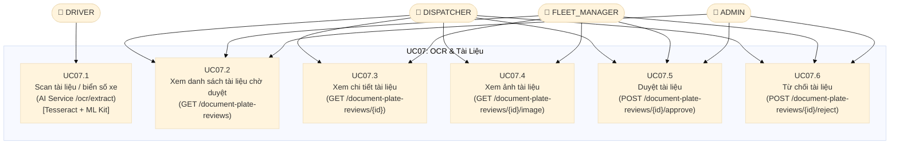
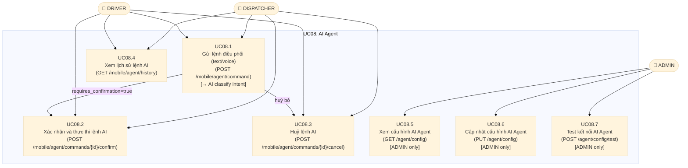

# Use Case Diagram Phân Rã — SafeFleet

> **Nguồn:** Mỗi use case con được trích xuất trực tiếp từ các method trong controller tương ứng.
> Xem chi tiết từng file controller để đối chiếu.

---

## UC02 Phân Rã — Quản Lý Lái Xe

> **Nguồn:** `TripController.java`, `DrivingSessionController.java`, `TelemetryController.java`, `MobileNavigationController.java`, `MobileController.java`

```mermaid
%%{init: {"theme": "base"}}%%
graph TB
    DRIVER(["👤 DRIVER"])
    DISPATCHER(["👤 DISPATCHER"])
    FLEET_MGR(["👤 FLEET_MANAGER"])

    subgraph UC02 ["UC02: Quản Lý Lái Xe"]
        direction TB
        UC02_1["UC02.1\nTạo chuyến đi mới\n(POST /trips)"]
        UC02_2["UC02.2\nXem danh sách chuyến đi\n(GET /trips)"]
        UC02_3["UC02.3\nXem chi tiết chuyến đi\n(GET /trips/{id})"]
        UC02_4["UC02.4\nBắt đầu chuyến đi\n(POST /trips/{id}/start)"]
        UC02_5["UC02.5\nHoàn thành chuyến đi\n(POST /trips/{id}/complete)"]
        UC02_6["UC02.6\nHuỷ chuyến đi\n(POST /trips/{id}/cancel)"]

        UC02_7["UC02.7\nBắt đầu phiên lái xe\n(POST /driving-sessions/start)"]
        UC02_8["UC02.8\nTạm dừng phiên lái xe\n(POST /driving-sessions/{id}/pause)"]
        UC02_9["UC02.9\nTiếp tục phiên lái xe\n(POST /driving-sessions/{id}/resume)"]
        UC02_10["UC02.10\nKết thúc phiên lái xe\n(POST /driving-sessions/{id}/finish)"]
        UC02_11["UC02.11\nXem thời gian lái còn lại\n(GET /driving-sessions/drivers/{id}/remaining-time)"]

        UC02_12["UC02.12\nGửi GPS telemetry\n(POST /mobile/telemetry)"]
        UC02_13["UC02.13\nGửi batch GPS offline\n(POST /mobile/telemetry/batch)"]
        UC02_14["UC02.14\nXem lịch sử GPS chuyến đi\n(GET /telemetry/trips/{tripId}/history)"]
        UC02_15["UC02.15\nXem replay hành trình\n(GET /telemetry/trips/{tripId}/replay)"]

        UC02_16["UC02.16\nTìm kiếm địa điểm (Photon)\n(GET /mobile/locations/autocomplete)"]
        UC02_17["UC02.17\nTính tuyến đường (OSRM)\n(POST /mobile/navigation/routes)"]
        UC02_18["UC02.18\nTính lại tuyến đường\n(POST /mobile/navigation/reroute)"]
        UC02_19["UC02.19\nGửi sự kiện điều hướng\n(POST /mobile/navigation/events)"]
        UC02_20["UC02.20\nXem phiên điều hướng hiện tại\n(GET /mobile/navigation/current)"]
    end

    DRIVER --> UC02_1
    DRIVER --> UC02_4
    DRIVER --> UC02_5
    DRIVER --> UC02_6
    DRIVER --> UC02_7
    DRIVER --> UC02_8
    DRIVER --> UC02_9
    DRIVER --> UC02_10
    DRIVER --> UC02_11
    DRIVER --> UC02_12
    DRIVER --> UC02_13
    DRIVER --> UC02_14
    DRIVER --> UC02_15
    DRIVER --> UC02_16
    DRIVER --> UC02_17
    DRIVER --> UC02_18
    DRIVER --> UC02_19
    DRIVER --> UC02_20

    DISPATCHER --> UC02_1
    DISPATCHER --> UC02_2
    DISPATCHER --> UC02_3
    DISPATCHER --> UC02_4
    DISPATCHER --> UC02_5
    DISPATCHER --> UC02_6
    FLEET_MGR --> UC02_2
    FLEET_MGR --> UC02_3
```

---

## UC03 Phân Rã — An Toàn Tài Xế

> **Nguồn:** `SafetyEventController.java`, `DrivingSessionController.java`, `IncidentController.java`, `EvidenceController.java`, `MobileController.java`

```mermaid
%%{init: {"theme": "base"}}%%
graph TB
    DRIVER(["👤 DRIVER"])
    SAFETY_OFF(["👤 SAFETY_OFFICER"])
    FLEET_MGR(["👤 FLEET_MANAGER"])
    ADMIN(["👤 ADMIN"])

    subgraph UC03 ["UC03: An Toàn Tài Xế"]
        direction TB
        UC03_1["UC03.1\nGửi sự kiện an toàn on-device\n(POST /mobile/safety-events)\n[buồn ngủ, mất tập trung...]"]
        UC03_2["UC03.2\nXem sự kiện an toàn hôm nay\n(GET /mobile/safety-events/today)"]
        UC03_3["UC03.3\nXem tất cả sự kiện an toàn\n(GET /safety-events)"]
        UC03_4["UC03.4\nXem chi tiết sự kiện an toàn\n(GET /safety-events/{id})"]
        UC03_5["UC03.5\nXem sự kiện an toàn theo tài xế\n(GET /drivers/{id}/safety-events)"]
        UC03_6["UC03.6\nXem sự kiện an toàn theo xe\n(GET /vehicles/{id}/safety-events)"]
        UC03_7["UC03.7\nTính lại điểm an toàn tài xế\n(POST /drivers/{id}/recalculate-safety-score)"]

        UC03_8["UC03.8\nBáo động SOS khẩn cấp\n(POST /mobile/incidents/sos)"]
        UC03_9["UC03.9\nUpload bằng chứng sự cố\n(POST /mobile/evidence)\n[ảnh/video, tối đa 8MB → MinIO]"]
        UC03_10["UC03.10\nXem bằng chứng (metadata)\n(GET /evidence/{id})"]
        UC03_11["UC03.11\nTải nội dung bằng chứng\n(GET /evidence/{id}/content)"]
    end

    DRIVER --> UC03_1
    DRIVER --> UC03_2
    DRIVER --> UC03_5
    DRIVER --> UC03_8
    DRIVER --> UC03_9

    SAFETY_OFF --> UC03_3
    SAFETY_OFF --> UC03_4
    SAFETY_OFF --> UC03_5
    SAFETY_OFF --> UC03_6
    SAFETY_OFF --> UC03_7
    SAFETY_OFF --> UC03_10
    SAFETY_OFF --> UC03_11

    FLEET_MGR --> UC03_3
    FLEET_MGR --> UC03_4
    FLEET_MGR --> UC03_7
    ADMIN --> UC03_7
```

---

## UC04 Phân Rã — Cảnh Báo Ngập Lụt

> **Nguồn:** `FloodReportController.java`, `MobileController.java`

```mermaid
%%{init: {"theme": "base"}}%%
graph TB
    DRIVER(["👤 DRIVER"])
    DISPATCHER(["👤 DISPATCHER"])
    FLEET_MGR(["👤 FLEET_MANAGER"])
    SAFETY_OFF(["👤 SAFETY_OFFICER"])
    ADMIN(["👤 ADMIN"])

    subgraph UC04 ["UC04: Cảnh Báo Ngập Lụt"]
        direction TB
        UC04_1["UC04.1\nBáo điểm ngập đầy đủ\n(POST /mobile/flood-reports)"]
        UC04_2["UC04.2\nBáo điểm ngập nhanh\n(POST /mobile/flood-reports/quick)"]
        UC04_3["UC04.3\nXem điểm ngập lân cận\n(GET /mobile/flood-points/nearby?lat=&lng=)"]
        UC04_4["UC04.4\nKiểm tra rủi ro tuyến đường\n(POST /mobile/route-check)"]
        UC04_5["UC04.5\nXem tất cả điểm ngập\n(GET /flood-reports)"]
        UC04_6["UC04.6\nXem chi tiết điểm ngập\n(GET /flood-reports/{id})"]
        UC04_7["UC04.7\nTạo vùng ngập mới\n(POST /flood-reports)"]
        UC04_8["UC04.8\nCập nhật vùng ngập\n(PUT /flood-reports/{id})"]
        UC04_9["UC04.9\nXoá vùng ngập\n(DELETE /flood-reports/{id})"]
        UC04_10["UC04.10\nPhát cảnh báo đến xe gần đó\n(POST /flood-reports/{id}/warn-nearby)"]
        UC04_11["UC04.11\nTóm tắt rủi ro tuyến đường\n(POST /flood-reports/route-risk-summary)"]
    end

    DRIVER --> UC04_1
    DRIVER --> UC04_2
    DRIVER --> UC04_3
    DRIVER --> UC04_4

    DISPATCHER --> UC04_5
    DISPATCHER --> UC04_6
    DISPATCHER --> UC04_7
    DISPATCHER --> UC04_8
    DISPATCHER --> UC04_9
    DISPATCHER --> UC04_10
    DISPATCHER --> UC04_11

    FLEET_MGR --> UC04_5
    FLEET_MGR --> UC04_6
    SAFETY_OFF --> UC04_5
    SAFETY_OFF --> UC04_6
    SAFETY_OFF --> UC04_11
    ADMIN --> UC04_10
```

---

## UC05 Phân Rã — Quản Lý Sự Cố

> **Nguồn:** `IncidentController.java`, `MobileController.java`

```mermaid
%%{init: {"theme": "base"}}%%
graph TB
    DRIVER(["👤 DRIVER"])
    DISPATCHER(["👤 DISPATCHER"])
    RESCUE(["👤 RESCUE_TEAM"])
    SAFETY_OFF(["👤 SAFETY_OFFICER"])
    ADMIN(["👤 ADMIN"])

    subgraph UC05 ["UC05: Quản Lý Sự Cố"]
        direction TB
        UC05_1["UC05.1\nTạo SOS (từ tài xế)\n(POST /mobile/incidents/sos)"]
        UC05_2["UC05.2\nTạo sự cố thủ công\n(POST /incidents)"]
        UC05_3["UC05.3\nTìm kiếm sự cố\n(GET /incidents?type=&status=)"]
        UC05_4["UC05.4\nXem chi tiết sự cố\n(GET /incidents/{id})"]
        UC05_5["UC05.5\nChấp nhận sự cố\n(POST /incidents/{id}/accept)"]
        UC05_6["UC05.6\nPhân công xử lý\n(POST /incidents/{id}/assign)"]
        UC05_7["UC05.7\nThêm mốc tiến trình\n(POST /incidents/{id}/timeline)"]
        UC05_8["UC05.8\nXem tiến trình sự cố\n(GET /incidents/{id}/timeline)"]
        UC05_9["UC05.9\nĐóng sự cố\n(POST /incidents/{id}/close)"]
        UC05_10["UC05.10\nXem sự cố của mình (tài xế)\n(GET /mobile/incidents)"]
    end

    DRIVER --> UC05_1
    DRIVER --> UC05_10

    DISPATCHER --> UC05_2
    DISPATCHER --> UC05_3
    DISPATCHER --> UC05_4
    DISPATCHER --> UC05_5
    DISPATCHER --> UC05_6
    DISPATCHER --> UC05_7
    DISPATCHER --> UC05_8
    DISPATCHER --> UC05_9

    RESCUE --> UC05_3
    RESCUE --> UC05_4
    RESCUE --> UC05_5
    RESCUE --> UC05_7
    RESCUE --> UC05_8
    RESCUE --> UC05_9

    SAFETY_OFF --> UC05_2
    SAFETY_OFF --> UC05_3
    SAFETY_OFF --> UC05_4
    SAFETY_OFF --> UC05_7
    SAFETY_OFF --> UC05_8

    ADMIN --> UC05_2
    ADMIN --> UC05_3
    ADMIN --> UC05_5
    ADMIN --> UC05_6
    ADMIN --> UC05_9
```

---

## UC07 Phân Rã — OCR & Tài Liệu

> **Nguồn:** `DocumentPlateReviewController.java`, `MobileController.java`, AI Service `/ocr` router

---

## UC08 Phân Rã — AI Agent

> **Nguồn:** `MobileController.java`, `AgentAiConfigurationController.java`, `SafeFleetAiGateway.java`

---

## UC06 Phân Rã — Quản Lý Đội Xe

> **Nguồn:** `VehicleController.java`, `DriverController.java`, `MaintenanceController.java`, `DispatchController.java`

```mermaid
%%{init: {"theme": "base"}}%%
graph TB
    FLEET_MGR(["👤 FLEET_MANAGER"])
    DISPATCHER(["👤 DISPATCHER"])
    SAFETY_OFF(["👤 SAFETY_OFFICER"])
    ADMIN(["👤 ADMIN"])

    subgraph UC06 ["UC06: Quản Lý Đội Xe"]
        direction TB
        UC06_1["UC06.1\nTạo xe mới\n(POST /vehicles)"]
        UC06_2["UC06.2\nTìm kiếm / Danh sách xe\n(GET /vehicles?plateNumber=&status=)"]
        UC06_3["UC06.3\nCập nhật thông tin xe\n(PUT /vehicles/{id})"]
        UC06_4["UC06.4\nXoá xe\n(DELETE /vehicles/{id})"]
        UC06_5["UC06.5\nXem trạng thái realtime xe\n(GET /vehicles/{id}/realtime-status)"]
        UC06_6["UC06.6\nXem vị trí tất cả xe\n(GET /vehicles/map/positions)"]
        UC06_7["UC06.7\nXem lịch sử chuyến đi của xe\n(GET /vehicles/{id}/trips)"]

        UC06_8["UC06.8\nTạo hồ sơ tài xế\n(POST /drivers)"]
        UC06_9["UC06.9\nTìm kiếm / Danh sách tài xế\n(GET /drivers)"]
        UC06_10["UC06.10\nCập nhật hồ sơ tài xế\n(PUT /drivers/{id})"]
        UC06_11["UC06.11\nXem lịch sử chuyến của tài xế\n(GET /drivers/{id}/trips)"]

        UC06_12["UC06.12\nTạo lệnh bảo dưỡng\n(POST /maintenance-orders)"]
        UC06_13["UC06.13\nXem lệnh bảo dưỡng\n(GET /maintenance-orders)"]
        UC06_14["UC06.14\nXem cảnh báo bảo dưỡng đến hạn\n(GET /maintenance-orders/due-alerts)"]
        UC06_15["UC06.15\nXem cảnh báo hết hạn tài liệu\n(GET /maintenance-orders/document-expiry-alerts)"]

        UC06_16["UC06.16\nĐiều phối xe/tài xế\n(POST /dispatch)"]
        UC06_17["UC06.17\nXem lịch điều phối\n(GET /dispatch)"]
    end

    FLEET_MGR --> UC06_1
    FLEET_MGR --> UC06_2
    FLEET_MGR --> UC06_3
    FLEET_MGR --> UC06_4
    FLEET_MGR --> UC06_5
    FLEET_MGR --> UC06_6
    FLEET_MGR --> UC06_7
    FLEET_MGR --> UC06_8
    FLEET_MGR --> UC06_9
    FLEET_MGR --> UC06_10
    FLEET_MGR --> UC06_11
    FLEET_MGR --> UC06_12
    FLEET_MGR --> UC06_13
    FLEET_MGR --> UC06_14
    FLEET_MGR --> UC06_15

    DISPATCHER --> UC06_2
    DISPATCHER --> UC06_5
    DISPATCHER --> UC06_6
    DISPATCHER --> UC06_7
    DISPATCHER --> UC06_9
    DISPATCHER --> UC06_11
    DISPATCHER --> UC06_13
    DISPATCHER --> UC06_14
    DISPATCHER --> UC06_15
    DISPATCHER --> UC06_16
    DISPATCHER --> UC06_17

    SAFETY_OFF --> UC06_2
    SAFETY_OFF --> UC06_5
    SAFETY_OFF --> UC06_6
    SAFETY_OFF --> UC06_9

    ADMIN --> UC06_1
    ADMIN --> UC06_3
    ADMIN --> UC06_4
    ADMIN --> UC06_8
    ADMIN --> UC06_10
    ADMIN --> UC06_12
```

