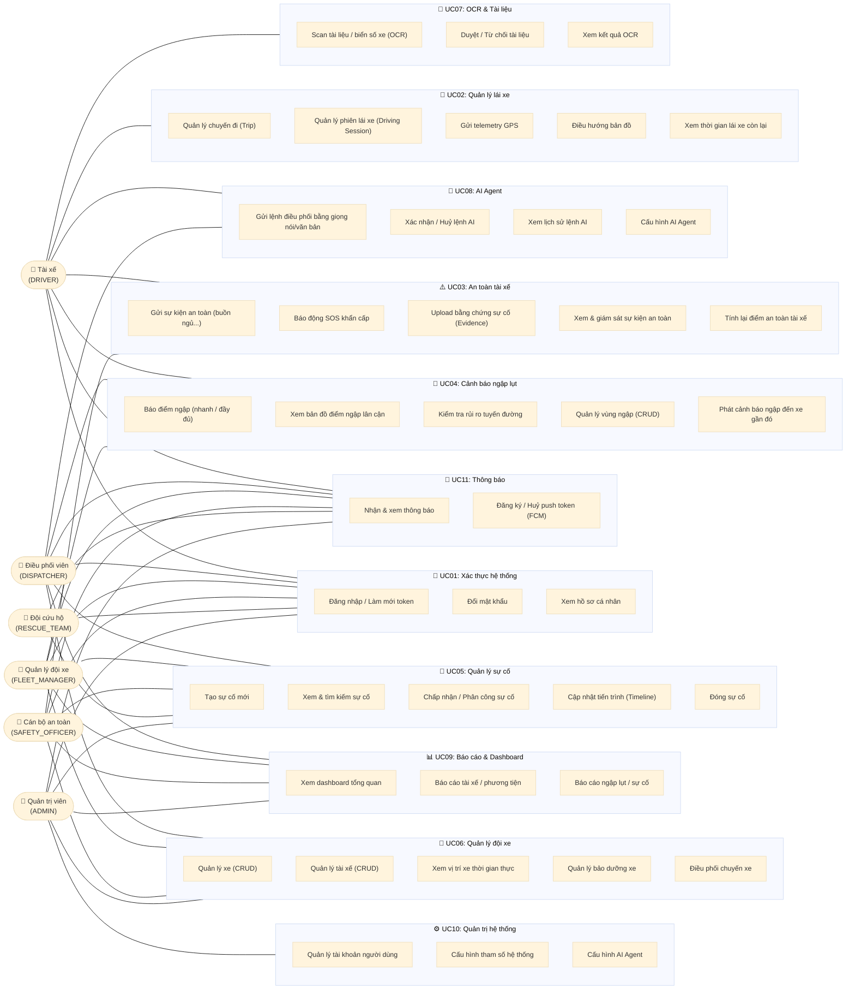

# Use Case Diagram Tổng Quát — SafeFleet

> **Nguồn:** Toàn bộ use case được trích xuất từ `@PreAuthorize` trong các controller thực tế.
> Actors dựa trên `RoleName.java`: `ADMIN, FLEET_MANAGER, DISPATCHER, SAFETY_OFFICER, RESCUE_TEAM, DRIVER`

---

## Biểu Đồ Tổng Quát

---

## Bảng Phân Quyền Actor – Use Case (từ `@PreAuthorize`)

| Use Case | ADMIN | FLEET_MGR | DISPATCHER | SAFETY_OFF | RESCUE | DRIVER |
|---|:---:|:---:|:---:|:---:|:---:|:---:|
| **Xác thực** | ✅ | ✅ | ✅ | ✅ | ✅ | ✅ |
| **Quản lý lái xe (Trip, Telemetry)** | ✅ | ✅ | ✅ | — | — | ✅ |
| **An toàn (Safety Events, SOS)** | ✅ | ✅ | ✅ | ✅ | — | ✅ |
| **Ngập lụt (báo cáo, kiểm tra)** | ✅ | ✅ | ✅ | ✅ | — | ✅ |
| **Sự cố (xem)** | ✅ | ✅ | ✅ | ✅ | ✅ | ✅ |
| **Sự cố (xử lý, phân công, đóng)** | ✅ | — | ✅ | — | ✅ | — |
| **Quản lý xe / tài xế (xem)** | ✅ | ✅ | ✅ | ✅ | — | — |
| **Quản lý xe / tài xế (CRUD)** | ✅ | ✅ | — | — | — | — |
| **Bảo dưỡng xe** | ✅ | ✅ | ✅ | — | — | — |
| **OCR tài liệu (scan)** | — | — | — | — | — | ✅ |
| **OCR tài liệu (duyệt)** | ✅ | ✅ | ✅ | — | — | — |
| **AI Agent (gửi lệnh)** | ✅ | — | ✅ | — | — | ✅ |
| **AI Agent (cấu hình)** | ✅ | — | — | — | — | — |
| **Báo cáo & Dashboard** | ✅ | ✅ | ✅ | ✅ | ✅* | — |
| **Cấu hình hệ thống** | ✅ | ✅** | — | — | — | — |
| **Quản lý tài khoản** | ✅ | — | — | — | — | — |

> *RESCUE_TEAM chỉ xem báo cáo sự cố (`ReportController.java:83 @PreAuthorize("hasAnyRole('ADMIN','FLEET_MANAGER','DISPATCHER','SAFETY_OFFICER','RESCUE_TEAM')")`)
> **FLEET_MANAGER chỉ xem cấu hình, không sửa (chỉ ADMIN được `PUT /settings/{key}`)
