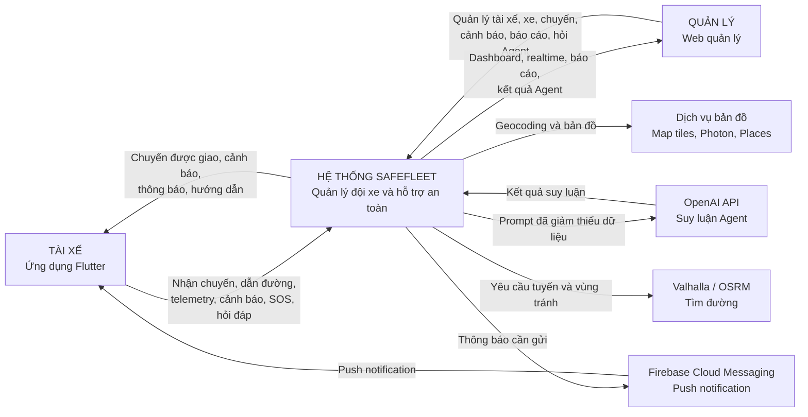
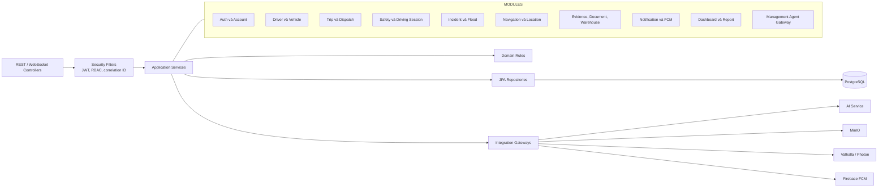
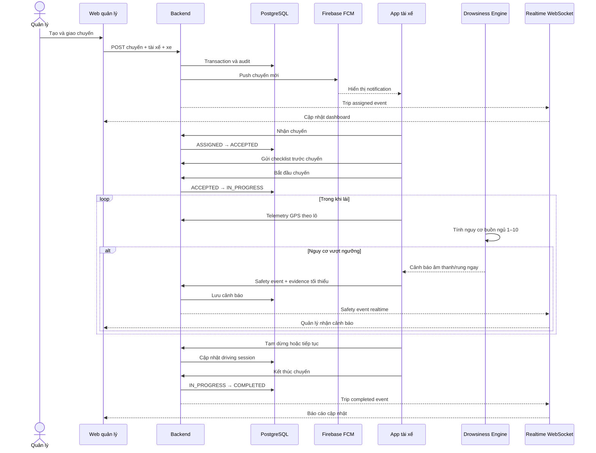
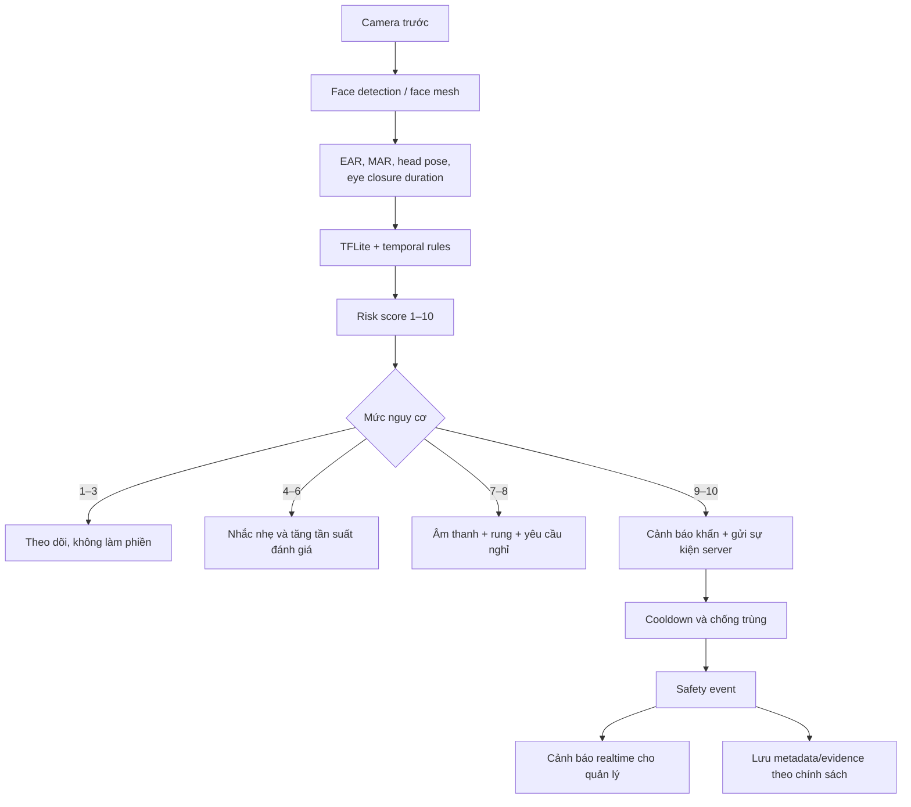
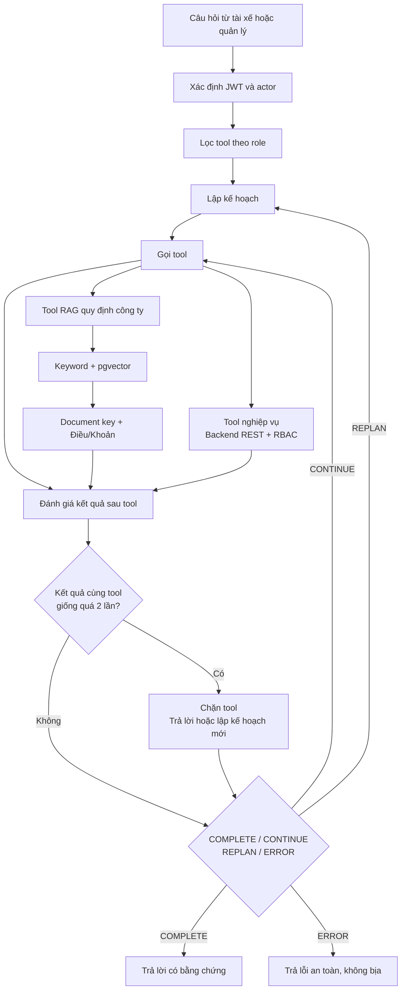
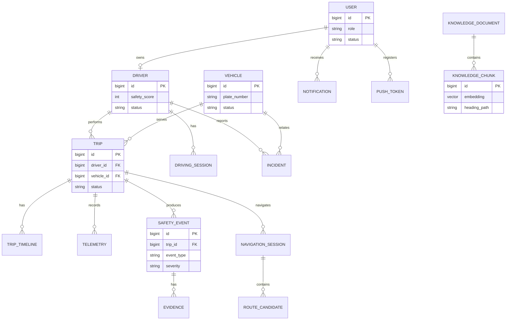
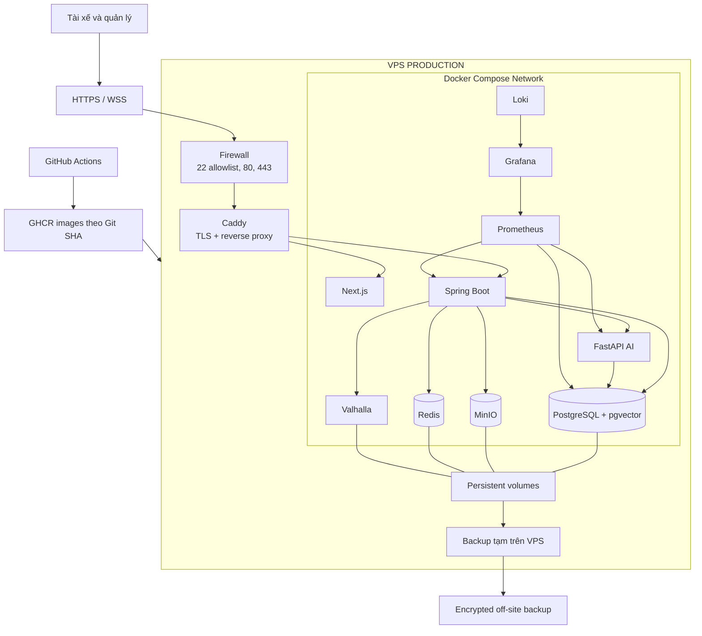

# KIẾN TRÚC TỔNG THỂ SAFEFLEET KHI HOÀN THIỆN

> Tài liệu này mô tả **kiến trúc đích của toàn hệ thống khi hoàn thiện**, không chỉ mô tả cấu hình Docker/VPS hiện tại.

## 1. Phạm vi hệ thống

SafeFleet là hệ thống nội bộ hỗ trợ quản lý đội xe và bảo đảm an toàn tài xế. Hệ thống chỉ có hai actor nghiệp vụ:

1. **Tài xế**: sử dụng ứng dụng Flutter trên điện thoại.
2. **Quản lý**: sử dụng web quản lý; các quyền quản trị, điều phối, an toàn và xử lý sự cố là các nhóm quyền con của actor quản lý.

Các dịch vụ OpenAI, Firebase, bản đồ và tìm đường là hệ thống ngoài, không phải actor nghiệp vụ.

## 2. Sơ đồ ngữ cảnh toàn hệ thống

## 3. Kiến trúc tổng thể khi hoàn thiện

```mermaid
flowchart TB
    subgraph Actors["LỚP NGƯỜI DÙNG"]
        Driver["Tài xế"]
        Manager["Quản lý"]
    end

    subgraph Clients["LỚP TRÌNH BÀY"]
        Mobile["Flutter Driver App<br/>Android / iOS"]
        Web["Next.js Management Web<br/>Responsive dashboard"]
    end

    subgraph MobileEdge["XỬ LÝ TẠI ĐIỆN THOẠI"]
        Drowsy["Drowsiness Engine<br/>Camera + Face Mesh + TFLite"]
        Offline["Offline SQLite + Sync Queue<br/>Idempotency + retry"]
        Navigation["Turn-by-turn Navigation<br/>GPS + voice guidance"]
        LocalAlert["Cảnh báo tại chỗ<br/>Âm thanh + rung + risk 1-10"]
    end

    subgraph Edge["LỚP BIÊN PRODUCTION"]
        DNS["DNS"]
        Proxy["Caddy Reverse Proxy<br/>TLS, HTTPS, WSS, security headers"]
    end

    subgraph Application["LỚP ỨNG DỤNG"]
        API["Spring Boot Backend<br/>REST API + nghiệp vụ trung tâm"]
        Realtime["STOMP WebSocket<br/>Realtime events"]
        Worker["Background Jobs<br/>Push, retry, cleanup, aggregation"]
    end

    subgraph Business["CÁC MODULE NGHIỆP VỤ"]
        IAM["Tài khoản, JWT, RBAC"]
        Fleet["Tài xế, xe, thiết bị"]
        Trip["Điều phối và vòng đời chuyến"]
        Safety["Telemetry, ngủ gật,<br/>cảnh báo an toàn"]
        Incident["SOS, sự cố, điểm ngập"]
        Notify["Thông báo web + mobile"]
        Report["Dashboard và báo cáo"]
        Docs["Chứng từ, OCR, bằng chứng"]
    end

    subgraph Intelligence["LỚP AI"]
        Agent["Agent Orchestrator<br/>Plan, Execute, Check, Replan"]
        Tools["MCP Tool Registry<br/>Tool theo quyền + audit"]
        RAG["RAG Engine<br/>Chunk, hybrid search, citation"]
        OCR["OCR Pipeline<br/>Tesseract + VietOCR"]
        LoopGuard["Loop Guard<br/>Chặn kết quả trùng quá 2 lần"]
    end

    subgraph Data["LỚP DỮ LIỆU"]
        PostgreSQL[("PostgreSQL 17<br/>Dữ liệu nghiệp vụ")]
        PGVector[("pgvector<br/>Knowledge embeddings")]
        MinIO[("MinIO<br/>Ảnh và bằng chứng")]
        Redis[("Redis<br/>Cache, queue, distributed lock")]
    end

    subgraph Platform["LỚP NỀN TẢNG NGOÀI"]
        OpenAI["OpenAI API"]
        FCM["Firebase FCM"]
        Valhalla["Valhalla Routing"]
        Photon["Photon / Places"]
        Tiles["Map Tile Provider"]
    end

    subgraph Operations["LỚP VẬN HÀNH"]
        Monitor["Prometheus + Grafana"]
        Logs["Loki + log shipper"]
        Backup["Backup + Restore Drill<br/>Off-site encrypted copy"]
        CICD["GitHub Actions + GHCR<br/>CI/CD + rollback"]
    end

    Driver --> Mobile
    Manager --> Web
    Mobile --> Drowsy
    Mobile --> Offline
    Mobile --> Navigation
    Drowsy --> LocalAlert

    Mobile -->|"HTTPS"| DNS
    Web -->|"HTTPS"| DNS
    DNS --> Proxy
    Proxy -->|"/"| Web
    Proxy -->|"/api/v1"| API
    Proxy -->|"/ws-native"| Realtime

    API --- Realtime
    API --- Worker
    API --- IAM
    API --- Fleet
    API --- Trip
    API --- Safety
    API --- Incident
    API --- Notify
    API --- Report
    API --- Docs

    Safety --> PostgreSQL
    Trip --> PostgreSQL
    Fleet --> PostgreSQL
    IAM --> PostgreSQL
    Incident --> PostgreSQL
    Notify --> PostgreSQL
    Report --> PostgreSQL
    Docs --> MinIO
    Worker --> Redis
    Realtime --> Redis

    API --> Agent
    Agent --> Tools
    Agent --> LoopGuard
    Tools -->|"API có JWT/RBAC"| API
    Tools --> RAG
    RAG --> PGVector
    PGVector --- PostgreSQL
    Docs --> OCR
    Agent --> OpenAI

    Notify --> FCM
    Navigation --> Valhalla
    API --> Valhalla
    API --> Photon
    Mobile --> Tiles
    Web --> Tiles

    Monitor -.-> API
    Monitor -.-> Agent
    Monitor -.-> PostgreSQL
    Logs -.-> API
    Logs -.-> Agent
    Backup -.-> PostgreSQL
    Backup -.-> MinIO
    CICD -.-> Proxy
    CICD -.-> API
    CICD -.-> Web
    CICD -.-> Agent
```

## 4. Vai trò từng khối

| Khối | Trách nhiệm khi hoàn thiện |
|---|---|
| Flutter Driver App | Giao/nhận chuyến, checklist, bắt đầu–tạm dừng–tiếp tục–kết thúc, dẫn đường, SOS, thông báo, Agent tài xế và offline sync. |
| Drowsiness Engine | Xử lý camera tại thiết bị, tính nguy cơ 1–10, cảnh báo tức thời và chỉ gửi sự kiện/bằng chứng cần thiết lên server. |
| Next.js Management Web | Quản lý tài xế, tài khoản, xe, chuyến, bản đồ realtime, cảnh báo, sự cố, bảo trì, báo cáo và Agent quản lý. |
| Caddy | Điểm vào Internet duy nhất, TLS tự động, reverse proxy HTTP/WebSocket và security headers. |
| Spring Boot Backend | Nguồn sự thật nghiệp vụ; xác thực, RBAC, transaction, audit, REST, realtime và tích hợp dịch vụ. |
| AI Service | Lập kế hoạch Agent, gọi tool theo quyền, kiểm tra sau mỗi tool, RAG có citation và OCR. |
| PostgreSQL + pgvector | Lưu toàn bộ dữ liệu nghiệp vụ, lịch sử, audit, cấu hình và vector tri thức. |
| MinIO | Lưu ảnh sự cố, ảnh cảnh báo, chứng từ OCR và evidence; database chỉ lưu metadata/object key. |
| Redis | Kiến trúc đích cho cache, queue push/background job, distributed lock và WebSocket scale-out. |
| Valhalla | Tìm tuyến xe tải, áp hạn chế xe và vùng nguy hiểm; OSRM chỉ là fallback suy giảm. |
| Observability | Metrics, log tập trung, cảnh báo vận hành, truy vết request và giám sát backup. |

## 5. Kiến trúc module backend

Backend tiếp tục là **modular monolith** trong giai đoạn một. Không nên tách microservice sớm vì hệ thống nội bộ chỉ có hai actor và phần lớn flow chuyến cần transaction nhất quán. Chỉ tách service khi có số liệu tải hoặc nhu cầu scale độc lập rõ ràng.

## 6. Luồng hoàn chỉnh của một chuyến

## 7. Luồng phát hiện ngủ gật

Nguyên tắc thiết kế: cảnh báo an toàn phải chạy ngay trên điện thoại, không phụ thuộc Internet hoặc OpenAI. Server dùng để lưu lịch sử, phân tích và thông báo cho quản lý.

## 8. Kiến trúc Agent và RAG hoàn chỉnh

### Quyền Agent

- Agent tài xế chỉ đọc dữ liệu của chính tài xế đang đăng nhập.
- Agent quản lý đọc dữ liệu toàn đội thông qua tool nghiệp vụ được kiểm soát.
- Không cấp SQL tự do cho LLM.
- Tool thay đổi dữ liệu trong tương lai phải có xác nhận, idempotency và audit riêng.
- RAG phải trả citation theo mã tài liệu và đường dẫn Điều/Khoản.

## 9. Kiến trúc dữ liệu

PostgreSQL là nguồn sự thật duy nhất. Redis chỉ lưu dữ liệu tạm thời có thể tái tạo; MinIO lưu object và PostgreSQL lưu metadata, checksum, owner và quyền truy cập.

## 10. Kiến trúc triển khai production hoàn chỉnh

## 11. Các yêu cầu chất lượng khi hoàn thiện

| Thuộc tính | Yêu cầu kiến trúc |
|---|---|
| Bảo mật | HTTPS/WSS, JWT ngắn hạn, refresh rotation, RBAC, audit, secret độc lập, không public database/AI/MinIO. |
| Tính sẵn sàng | Health check, restart policy, offline mobile, retry có backoff, queue bền vững và application rollback. |
| Nhất quán | Backend giữ transaction nghiệp vụ; Flyway quản lý schema; command mobile có idempotency key. |
| Hiệu năng | Telemetry gửi batch, ảnh lưu object storage, vector index HNSW, cache dữ liệu đọc nhiều. |
| An toàn AI | Tool allowlist, schema chặt, post-tool check, loop guard, citation, không bịa dữ liệu thiếu. |
| Quan sát | Metrics, structured log, request ID, release SHA, alert và dashboard vận hành. |
| Khôi phục | Backup PostgreSQL + MinIO, checksum, off-site copy, restore drill và migration expand/contract. |
| Riêng tư | Xử lý camera ngủ gật tại thiết bị; chỉ tải evidence theo chính sách; giảm thiểu dữ liệu gửi OpenAI. |

## 12. Lộ trình từ hệ thống hiện tại đến kiến trúc hoàn thiện

### Giai đoạn 1 — Hoàn thiện production tối thiểu

- Caddy HTTPS và domain production.
- CI kiểm thử backend, frontend, AI và Flutter.
- Build image immutable theo Git SHA và deploy VPS có rollback.
- Backup PostgreSQL/MinIO và restore drill.
- Firebase FCM thật và mobile build dùng endpoint HTTPS.
- Valhalla có persistent graph Việt Nam.

### Giai đoạn 2 — Hoàn thiện vận hành

- Bổ sung Redis cho background queue, distributed lock và realtime scale-out.
- Prometheus, Grafana, Loki và cảnh báo ngoài hệ thống.
- Theo dõi dung lượng evidence, database, AI latency và push backlog.
- Vulnerability scanning, SBOM và quy trình xoay secret.

### Giai đoạn 3 — Mở rộng khi có tải thật

- Tách PostgreSQL sang dịch vụ managed hoặc máy riêng.
- Chuyển MinIO/backup sang object storage ngoài VPS.
- Tách Valhalla sang node có CPU/RAM riêng.
- Nhân bản backend, frontend và AI sau load balancer.
- Chỉ tách microservice khi module có nhu cầu scale hoặc vòng đời triển khai độc lập đã được đo lường.

## 13. Kết luận

Kiến trúc hoàn thiện giữ **Spring Boot modular monolith** làm trung tâm nghiệp vụ, **Flutter xử lý an toàn tức thời tại thiết bị**, **Next.js phục vụ quản lý**, và **AI service là lớp hỗ trợ có kiểm soát**. PostgreSQL/pgvector là nguồn dữ liệu chính, MinIO lưu bằng chứng, Redis đảm nhiệm trạng thái tạm/queue, còn Caddy tạo một biên HTTPS duy nhất. Cấu trúc này đủ đơn giản cho hệ thống nội bộ hai actor nhưng vẫn có đường mở rộng rõ ràng khi số tài xế, chuyến và dữ liệu tăng.
