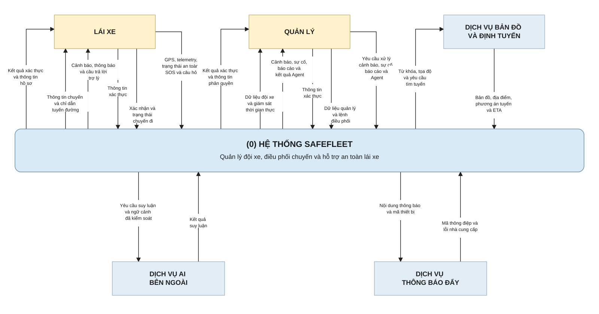
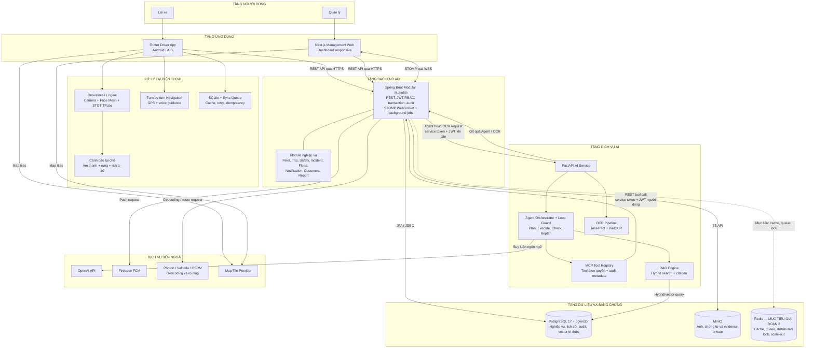
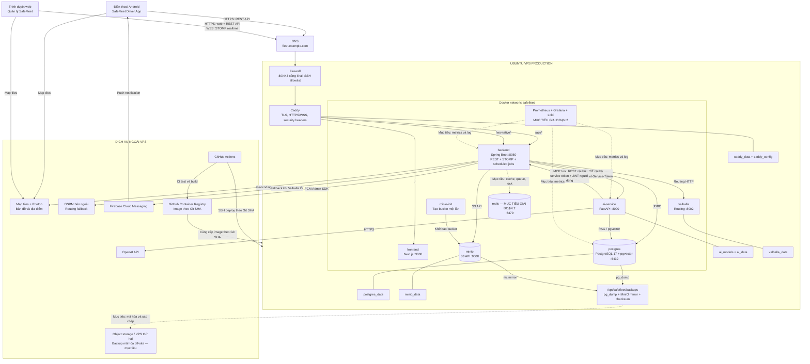

# 2.2. THIẾT KẾ HỆ THỐNG SAFEFLEET

Tài liệu này cung cấp ba sơ đồ Mermaid dùng cho mục 2.2 của báo cáo. Sơ đồ được xây dựng từ kiến trúc đích và đã đối chiếu với Docker Compose, Caddy, Spring Boot, AI service, Flutter, Next.js và PostgreSQL hiện có.

## 1. Phạm vi và quy ước

- Hệ thống chỉ có hai actor nghiệp vụ: **Lái xe** và **Quản lý**. Các vai trò quản trị, điều phối và an toàn là nhóm quyền con của actor Quản lý.
- PostgreSQL 17 và pgvector là **một hệ quản trị/cùng một container PostgreSQL**, không phải hai database độc lập.
- STOMP/WebSocket và background jobs đang nằm **bên trong Spring Boot**, không phải hai service triển khai riêng.
- Backend là điểm kiểm soát nghiệp vụ duy nhất. Mobile và web không truy cập trực tiếp PostgreSQL, MinIO hoặc AI service.
- AI service chỉ truy cập PostgreSQL trực tiếp cho RAG/pgvector. OCR nhận file từ backend và trả kết quả có cấu trúc; AI service không tự ghi evidence vào MinIO.
- Backend là thành phần duy nhất giữ thông tin kết nối MinIO và gửi FCM.
- Valhalla là routing provider chính được self-host trong Docker; OSRM là fallback ngoài hệ thống. Photon/map tiles là dịch vụ bản đồ bên ngoài.
- Redis, Prometheus, Grafana và Loki thuộc **kiến trúc đích giai đoạn vận hành**, chưa phải container hiện có. Trong sơ đồ, các kết nối này dùng nét đứt và nhãn “mục tiêu”.

---

## 2.2.1. Kiến trúc tổng thể

### 2.2.1.1. Biểu đồ ngữ cảnh

Biểu đồ ngữ cảnh được xây dựng theo dạng **DFD mức ngữ cảnh (Context Diagram/Level 0)**. Toàn bộ SafeFleet được biểu diễn bằng một tiến trình duy nhất mang số **(0)**. Bên ngoài ranh giới hệ thống có hai tác nhân nghiệp vụ là **Lái xe**, **Quản lý** và ba hệ thống hỗ trợ gồm **Dịch vụ bản đồ và định tuyến**, **Dịch vụ AI bên ngoài**, **Dịch vụ thông báo đẩy**.

Các mũi tên chỉ biểu diễn **luồng dữ liệu**, không biểu diễn thứ tự xử lý hay giao thức kỹ thuật. Vì vậy, sơ đồ không tách ứng dụng Flutter, web Next.js, backend, AI service nội bộ, PostgreSQL hoặc MinIO; các thành phần này được trình bày ở Hình 2.9 và Hình 2.10.

**Hình 2.8. Biểu đồ ngữ cảnh của SafeFleet**

**Mã draw.io độc lập:** [Hình 2.8 — mxGraphModel](drawio/kien-truc-he-thong-2-2/hinh-2-8-bieu-do-ngu-canh.mxgraph.xml)

#### Mô tả các luồng dữ liệu

| Mã | Nguồn → đích | Nội dung dữ liệu |
|---|---|---|
| D1 | Lái xe → SafeFleet | Thông tin đăng nhập; xác nhận nhận hoặc từ chối chuyến; thao tác bắt đầu/kết thúc chuyến; vị trí GPS và telemetry; chỉ số/cảnh báo an toàn; SOS, bằng chứng và câu hỏi gửi trợ lý. |
| D2 | SafeFleet → Lái xe | Kết quả xác thực và hồ sơ; chuyến được giao; tuyến và chỉ dẫn điều hướng; mức nguy cơ buồn ngủ 1–10; cảnh báo an toàn, trạng thái SOS, thông báo và câu trả lời của trợ lý. |
| D3 | Quản lý → SafeFleet | Thông tin đăng nhập; dữ liệu và thao tác quản lý tài khoản, tài xế, phương tiện, thiết bị, chuyến; lệnh điều phối; xử lý cảnh báo/sự cố; yêu cầu tra cứu, báo cáo và Agent. |
| D4 | SafeFleet → Quản lý | Kết quả xác thực/phân quyền; danh sách và hồ sơ đội xe; trạng thái chuyến; vị trí thời gian thực; cảnh báo, sự cố, dữ liệu bảo trì/kho; báo cáo thống kê và kết quả Agent. |
| D5 | SafeFleet → Dịch vụ bản đồ và định tuyến | Từ khóa tìm kiếm địa điểm, tọa độ điểm đi/đến, vị trí hiện tại, tùy chọn phương tiện và yêu cầu tính hoặc tính lại tuyến. |
| D6 | Dịch vụ bản đồ và định tuyến → SafeFleet | Map tiles, kết quả geocoding, tọa độ, hình học tuyến, khoảng cách, thời gian dự kiến và phương án tuyến thay thế. |
| D7 | SafeFleet → Dịch vụ AI bên ngoài | Yêu cầu suy luận cùng phần ngữ cảnh tối thiểu cần thiết sau khi áp dụng kiểm soát quyền và chính sách giảm thiểu/che dữ liệu nhạy cảm. |
| D8 | Dịch vụ AI bên ngoài → SafeFleet | Kết quả suy luận ngôn ngữ để hệ thống kiểm tra, định dạng và trả về đúng actor. Dịch vụ ngoài không trực tiếp thao tác cơ sở dữ liệu. |
| D9 | SafeFleet → Dịch vụ thông báo đẩy | Mã thiết bị, tiêu đề/nội dung thông báo và dữ liệu điều hướng tối thiểu cho các sự kiện như giao chuyến, thay đổi chuyến, cảnh báo hoặc SOS. |
| D10 | Dịch vụ thông báo đẩy → SafeFleet | Mã thông điệp hoặc lỗi khi nhà cung cấp tiếp nhận yêu cầu, bao gồm token không hợp lệ và lỗi dịch vụ, để SafeFleet cập nhật trạng thái và áp dụng retry có giới hạn. Luồng này không được hiểu là biên nhận người dùng đã đọc thông báo. |

#### Ranh giới và quy tắc đọc Hình 2.8

1. **Lái xe** và **Quản lý** là con người ở ngoài ranh giới hệ thống; ứng dụng tài xế và web quản lý là các thành phần bên trong SafeFleet.
2. Mọi luồng đều đi qua tiến trình **(0) Hệ thống SafeFleet**. Không có luồng trực tiếp giữa hai actor hoặc giữa actor và dịch vụ ngoài ở mức ngữ cảnh.
3. SafeFleet bao gồm các ứng dụng client, backend, AI service nội bộ và kho dữ liệu do hệ thống sở hữu. Vì vậy không vẽ PostgreSQL, MinIO, REST API, WebSocket hoặc container trong Hình 2.8.
4. Dịch vụ AI bên ngoài chỉ là nhà cung cấp suy luận, ví dụ OpenAI API; nó khác với AI service nội bộ dùng để điều phối Agent, RAG và OCR.
5. Nhóm bản đồ/định tuyến là một phụ thuộc logic ngoài miền nghiệp vụ SafeFleet. Việc Valhalla có thể được self-host cùng VPS là chi tiết triển khai và được thể hiện ở Hình 2.10.
6. Firebase Cloud Messaging được khái quát thành dịch vụ thông báo đẩy. Ở mức ngữ cảnh, thông báo tới Lái xe được xem là đầu ra D2 của SafeFleet; không vẽ Firebase gửi thẳng tới actor.

---

### 2.2.1.2. Kiến trúc hệ thống

Biểu đồ này mô tả kiến trúc logic theo tầng. Các mũi tên thể hiện hướng phụ thuộc hoặc luồng gọi chính; không biểu diễn mọi endpoint riêng lẻ.

**Hình 2.9. Kiến trúc tổng thể của SafeFleet**

**Mã draw.io độc lập:** [Hình 2.9 — mxGraphModel](drawio/kien-truc-he-thong-2-2/hinh-2-9-kien-truc-tong-the.mxgraph.xml)

#### Điểm cần đọc đúng trong Hình 2.9

1. Cảnh báo ngủ gật chạy tại điện thoại và không phụ thuộc backend, OpenAI hoặc kết nối Internet.
2. Web dùng REST để tải snapshot/command và STOMP WebSocket để nhận cập nhật realtime. Khi WebSocket mất kết nối, REST/polling vẫn là nguồn phục hồi.
3. Mobile hiện dùng REST, FCM và polling; không vẽ mobile sử dụng WebSocket vì mã hiện tại không có kênh STOMP mobile.
4. Agent tool quay lại backend bằng JWT của người dùng để backend tiếp tục kiểm tra RBAC và ownership; AI service không được cấp SQL tự do.
5. Backend ghi/đọc MinIO. AI OCR chỉ xử lý byte ảnh do backend chuyển sang và trả trường OCR.
6. PostgreSQL và pgvector được biểu diễn chung vì pgvector là extension trong cùng PostgreSQL service.
7. Redis là thành phần đích cho scale-out, không được hiểu là đã triển khai trong phiên bản hiện tại.

---

### 2.2.1.3. Kiến trúc triển khai

Biểu đồ triển khai mô tả topology production một VPS. Caddy là điểm vào công khai duy nhất cho ứng dụng; database, MinIO, AI service và Valhalla không mở cổng Internet.

**Hình 2.10. Kiến trúc triển khai của SafeFleet**

**Mã draw.io độc lập:** [Hình 2.10 — mxGraphModel](drawio/kien-truc-he-thong-2-2/hinh-2-10-kien-truc-trien-khai.mxgraph.xml)

**Bản draw.io gồm ba trang riêng:** [SafeFleet — kiến trúc 3 trang](drawio/kien-truc-he-thong-2-2/safefleet-kien-truc-3-trang.drawio). Toàn bộ ba đoạn mã để sao chép trực tiếp được tập hợp tại [Mã mxGraphModel cho mục 2.2](drawio/kien-truc-he-thong-2-2/MA_MXGRAPH_SO_DO_THIET_KE_HE_THONG_2_2.md).

#### Cổng và giao thức

| Nguồn → đích | Giao thức | Trạng thái/ý nghĩa |
|---|---|---|
| Android → Caddy → Backend | HTTPS REST | Đăng nhập, chuyến, telemetry, safety, SOS, OCR job, Agent |
| Browser → Caddy → Frontend | HTTPS | Tải web Next.js |
| Browser → Caddy → Backend | HTTPS REST + WSS/STOMP | Nghiệp vụ quản lý và cập nhật realtime |
| Backend → PostgreSQL | JDBC trong Docker network | Dữ liệu nghiệp vụ và transaction |
| AI service → PostgreSQL | PostgreSQL protocol trong Docker network | RAG và pgvector; không dùng cho mutation nghiệp vụ tự do |
| Backend → MinIO | S3 API trong Docker network | Lưu/đọc evidence private |
| Backend ↔ AI service | REST nội bộ | Agent, OCR và MCP tool; có service token |
| Backend → Valhalla | HTTP nội bộ | Routing chính |
| Backend → Photon/OSRM | HTTP(S) bên ngoài | Geocoding và routing fallback |
| Backend → Firebase | HTTPS qua Firebase Admin SDK | Push notification |
| AI service → OpenAI | HTTPS | Suy luận Agent khi được bật |

---

## 3. Bảng kiểm độ chính xác của ba sơ đồ

| Nội dung cần kiểm tra | Kết quả đối chiếu | Bằng chứng chính |
|---|---|---|
| Chỉ có hai actor nghiệp vụ | Đúng | Kiến trúc đích quy ước Tài xế và Quản lý; role quản trị là quyền con |
| Mobile/web không gọi thẳng database | Đúng | Client chỉ cấu hình API URL; PostgreSQL chỉ nằm trong Docker network |
| Mobile/web không gọi thẳng AI service | Đúng | `SafeFleetAiGateway` và `DocumentOcrService` của backend gọi AI service |
| Agent tool gọi ngược backend bằng quyền người dùng | Đúng | AI MCP client gửi service token và JWT người dùng |
| WebSocket nằm trong backend | Đúng | `WebSocketConfig` dùng Spring simple broker và endpoint `/ws-native` |
| Mobile không dùng STOMP/WebSocket | Đúng với mã hiện tại | Mobile dùng REST, FCM và polling; không có STOMP client |
| PostgreSQL + pgvector là cùng một service | Đúng | Image `pgvector/pgvector:pg17`; Flyway V15 tạo vector store |
| Backend là thành phần truy cập MinIO | Đúng | `MinioEvidenceStorage` dùng MinIO Java client; client không giữ credential |
| AI OCR không ghi trực tiếp MinIO | Đúng | Backend chuyển multipart tới `/ocr/driving-log`, AI trả `DocumentOcrResponse` |
| AI service truy cập PostgreSQL cho RAG | Đúng | AI container nhận `POSTGRES_*`; RAG query `knowledge_documents/knowledge_chunks` |
| Valhalla chạy nội bộ, OSRM là fallback | Đúng | `docker-compose.routing.yml`; `ValhallaRoutingProvider` và fallback provider |
| Caddy là public edge | Đúng với cấu hình production | Caddy route `/`, `/api/*`, `/ws-native*`; hạ tầng không public trong production override |
| FCM do backend gửi | Đúng về thiết kế/code | `PushNotificationService` dùng Firebase Admin; runtime chỉ gửi khi FCM được bật |
| Redis đã tồn tại | Không; chỉ là kiến trúc đích | Không có Redis service/dependency trong compose hiện tại |
| Prometheus/Grafana/Loki đã tồn tại | Chưa đầy đủ | Backend có Prometheus exporter; chưa có server/dashboard/log stack |
| Backup off-site đã tự động | Chưa | Script hiện tạo local dump/mirror/checksum; off-site copy vẫn là mục tiêu |

## 4. Các lỗi mô hình đã tránh

1. Không vẽ OpenAI, Firebase hoặc bản đồ như actor nghiệp vụ.
2. Không vẽ tài xế/quản lý truy cập trực tiếp backend database.
3. Không vẽ WebSocket như một container độc lập trong deployment.
4. Không vẽ pgvector như một database/container tách khỏi PostgreSQL.
5. Không vẽ AI OCR truy cập trực tiếp MinIO.
6. Không vẽ mobile gọi AI service hoặc OpenAI trực tiếp.
7. Không vẽ OSRM là container nội bộ khi Compose hiện chỉ self-host Valhalla.
8. Không thể hiện Redis và observability như thành phần đã triển khai; chúng được đánh dấu là mục tiêu giai đoạn 2.
9. Không thể hiện FCM là luôn hoạt động; đây là integration có điều kiện cấu hình.

## 5. Nguồn đối chiếu

- `docs/KIEN_TRUC_TONG_THE_HE_THONG_HOAN_THIEN.md`
- `docker-compose.yml`
- `docker-compose.production.yml`
- `docker-compose.routing.yml`
- `deploy/vps/docker-compose.vps.yml`
- `deploy/vps/Caddyfile`
- `web_quan_ly/backend/src/main/java/com/safefleet/config/WebSocketConfig.java`
- `web_quan_ly/backend/src/main/java/com/safefleet/infrastructure/ai/SafeFleetAiGateway.java`
- `web_quan_ly/backend/src/main/java/com/safefleet/mobile/service/DocumentOcrService.java`
- `web_quan_ly/backend/src/main/java/com/safefleet/evidence/storage/MinioEvidenceStorage.java`
- `web_quan_ly/backend/src/main/java/com/safefleet/notification/service/PushNotificationService.java`
- `safefleet_ai/service/mcp/client.py`
- `safefleet_ai/service/rag/knowledge_base.py`
- `web_quan_ly/frontend/context/RealtimeContext.tsx`
- `safe_fleet_driver_ui/lib/core/notifications/push_registration_service.dart`

## 6. Chú thích hình dùng trong báo cáo

- **Hình 2.8. Biểu đồ ngữ cảnh của SafeFleet.**
- **Hình 2.9. Kiến trúc tổng thể của SafeFleet.**
- **Hình 2.10. Kiến trúc triển khai của SafeFleet.**

Ba biểu đồ trên được thiết kế theo ba mức trừu tượng khác nhau: Hình 2.8 mô tả quan hệ giữa hệ thống và môi trường; Hình 2.9 mô tả các tầng logic; Hình 2.10 mô tả node/container, giao thức và topology production.
