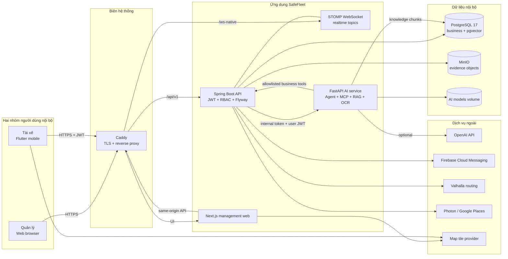
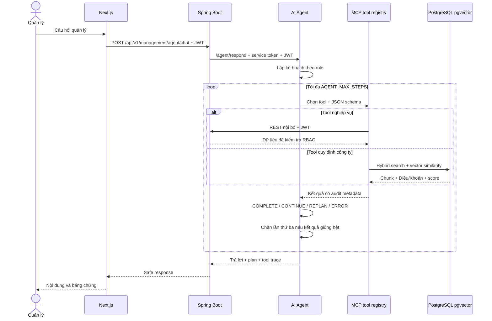

# SafeFleet — thiết kế hệ thống, triển khai VPS và CI/CD

> Sơ đồ kiến trúc đích của toàn bộ hệ thống khi hoàn thiện nằm tại [KIEN_TRUC_TONG_THE_HE_THONG_HOAN_THIEN.md](./KIEN_TRUC_TONG_THE_HE_THONG_HOAN_THIEN.md). Tài liệu này tập trung sâu hơn vào VPS và CI/CD.

Ngày rà soát: 2026-08-27  
Phạm vi: web quản lý, ứng dụng tài xế, Spring Boot API, AI Agent/RAG/OCR, PostgreSQL/pgvector, MinIO, dẫn đường, realtime và push notification.

## 1. Kết luận kiến trúc

SafeFleet hiện là một modular monolith có ba ứng dụng thực thi chính:

- Web quản lý Next.js 16 cho nhóm quản lý.
- Mobile Flutter cho tài xế, có offline queue, camera, drowsiness model, dẫn đường và FCM.
- Backend Spring Boot 3.3/Java 21 là nguồn sự thật nghiệp vụ, RBAC, JWT, REST, STOMP WebSocket, Flyway và điều phối dịch vụ.
- AI service FastAPI/Python 3.11 cung cấp Agent/MCP, RAG pgvector, OCR và gọi OpenAI khi được bật.

PostgreSQL 17 + pgvector là database duy nhất. MinIO lưu ảnh/bằng chứng. Valhalla là routing engine chính; Photon/Google Places phục vụ tìm địa điểm; OSRM chỉ là tuyến suy giảm. Cấu hình production mục tiêu chạy bằng Docker Compose trên một VPS, chỉ Caddy mở cổng Internet.

## 2. Sơ đồ kiến trúc logic



### Nguyên tắc biên tin cậy

1. Client không được truy cập PostgreSQL, MinIO console hoặc AI service.
2. Backend là cổng nghiệp vụ duy nhất và luôn kiểm tra JWT/RBAC.
3. Backend gọi AI bằng `X-SafeFleet-Service-Token`; Agent chuyển tiếp JWT người dùng để tool backend tiếp tục kiểm tra quyền.
4. AI chỉ đọc nghiệp vụ qua tool cho phép; truy cập PostgreSQL trực tiếp chỉ dành cho kho tri thức RAG/pgvector.
5. Caddy là dịch vụ duy nhất công khai `80/443`; PostgreSQL, MinIO, backend, frontend, AI và Valhalla ở Docker bridge network.

## 3. Các miền nghiệp vụ và dữ liệu

| Miền | Thành phần chính | Dữ liệu PostgreSQL |
|---|---|---|
| Danh tính và quyền | JWT, refresh token, RBAC, audit | users, roles, permissions, refresh_tokens, audit_logs |
| Đội xe | tài xế, xe, thiết bị, kết nối | drivers, vehicles, devices, device_connection_logs |
| Chuyến và ca lái | phân công, timeline, checklist, thời gian lái | trips, trip_timelines, driving_sessions, driver_work_logs, pre_trip_checklists |
| An toàn | telemetry, buồn ngủ, cảnh báo, SOS | telemetry_logs, safety_events, incidents, incident_timelines |
| Dẫn đường | phiên điều hướng, tuyến, sự kiện, điểm ngập | navigation_sessions, navigation_route_candidates, navigation_events, flood_reports |
| Offline/mobile | đồng bộ, idempotency, receipt | sync_batches, sync_batch_items, idempotency_records, mobile_command_receipts |
| Thông báo | thiết bị, token và hàng đợi FCM | mobile_devices, push_tokens, pending_push_notifications, notifications |
| Chứng từ | OCR, ảnh, phiếu xuất kho | document_ocr_jobs, warehouse_issue_documents/items/confirmations |
| AI/RAG | cấu hình Agent và vector nội bộ | agent_ai_configurations, agent_commands, knowledge_documents, knowledge_chunks |

Schema được quản lý bằng Flyway V1–V22; `ddl-auto=validate`, vì vậy migration phải chạy trước khi instance backend mới nhận traffic.

## 4. Luồng Agent quản lý và RAG



## 5. Sơ đồ triển khai một VPS

```mermaid
flowchart TB
    Internet[Internet / mạng công ty]
    DNS[DNS A/AAAA<br/>fleet.example.com]

    subgraph VPS[Ubuntu VPS]
        FW[Firewall<br/>22 allowlist, 80, 443]
        Caddy[Caddy container<br/>TLS tự động]

        subgraph Net[Docker network safefleet]
            Front[frontend :3000]
            Back[backend :8080]
            AI[ai-service :8000]
            PG[(postgres :5432)]
            OBJ[(minio :9000)]
            Route[valhalla :8002]
        end

        subgraph Volumes[Persistent volumes]
            PGV[postgres_data]
            MV[minio_data]
            AIV[ai_models + ai_data]
            CV[caddy_data]
        end

        Backup[/opt/safefleet/backups<br/>encrypted off-site copy]
    end

    Internet --> DNS --> FW --> Caddy
    Caddy -->|/| Front
    Caddy -->|/api/*| Back
    Caddy -->|/ws-native*| Back
    Back --> PG
    Back --> OBJ
    Back --> AI
    Back --> Route
    AI --> PG
    PG --- PGV
    OBJ --- MV
    AI --- AIV
    Caddy --- CV
    PGV --> Backup
    MV --> Backup
```

### Cổng mạng

| Cổng | Công khai | Mục đích |
|---|---:|---|
| 22/TCP | Có, giới hạn IP/VPN | SSH triển khai và vận hành |
| 80/TCP | Có | ACME challenge và redirect HTTPS |
| 443/TCP + UDP | Có | HTTPS/HTTP3, REST và WebSocket |
| 3000, 8080 | Chỉ `127.0.0.1` | Chẩn đoán qua SSH tunnel |
| 5432, 8000, 8002, 9000, 9001 | Không | Chỉ nội bộ Docker |

### Ước lượng VPS ban đầu

Đây là sizing khởi điểm, phải load test bằng dữ liệu thật:

- Không tự build Valhalla: 4 vCPU, 8 GB RAM, SSD 80 GB.
- Chạy Valhalla và AI/RAG cùng máy: ưu tiên 8 vCPU, 16 GB RAM, SSD 150 GB.
- Dữ liệu evidence/video tăng nhanh: đặt cảnh báo dung lượng từ 70%, chuyển MinIO/backup sang object storage ngoài VPS khi vượt ngưỡng.
- Khi cần HA: tách PostgreSQL managed, object storage và Valhalla trước; sau đó mới nhân bản backend/frontend/AI.

## 6. Cấu hình production đã chuẩn bị

| File | Vai trò |
|---|---|
| `docker-compose.yml` | topology và volume gốc |
| `docker-compose.production.yml` | read-only filesystem, bỏ cổng hạ tầng, drop capabilities |
| `docker-compose.routing.yml` | Valhalla Việt Nam |
| `deploy/vps/docker-compose.vps.yml` | image GHCR và Caddy public edge |
| `deploy/vps/Caddyfile` | TLS, `/api`, `/ws-native`, frontend |
| `deploy/vps/.env.production.example` | hợp đồng biến môi trường, không chứa secret thật |
| `deploy/vps/deploy.sh` | backup, pull image SHA, up, health check, app rollback |
| `deploy/vps/backup.sh` | dump PostgreSQL, mirror MinIO qua object API, checksum và retention |
| `deploy/vps/systemd/*` | chạy backup hằng ngày và bù lịch khi VPS từng tắt |
| `.github/workflows/ci-cd.yml` | test, build/push GHCR và deploy qua SSH |

Caddy phù hợp với mô hình một VPS vì tự xin/gia hạn certificate và tự chuyển HTTP sang HTTPS khi DNS/cổng đúng. `reverse_proxy` hỗ trợ WebSocket upgrade trực tiếp.

## 7. Pipeline CI/CD

```mermaid
flowchart LR
    PR[Pull request] --> CI
    Main[Push main] --> CI

    subgraph CI[Quality gates chạy song song]
        Java[Maven tests<br/>Java 21 + PostgreSQL]
        Next[npm ci<br/>lint + Next build]
        Py[AI Docker test<br/>pytest MCP RAG]
        Flutter[Flutter 3.44.5<br/>analyze + test]
        Compose[Compose config<br/>bash syntax]
    end

    CI --> Gate{Tất cả pass?}
    Gate -->|Không| Stop[Chặn merge/deploy]
    Gate -->|Có, PR| Merge[Cho phép review/merge]
    Gate -->|Có, main| Images[Build 3 image<br/>tag Git SHA + main]
    Images --> GHCR[(GitHub Container Registry)]
    GHCR --> Approval[GitHub production environment<br/>approval + secrets]
    Approval --> Backup[Backup PostgreSQL + MinIO]
    Backup --> Pull[VPS pull image theo SHA]
    Pull --> Migrate[Backend chạy Flyway]
    Migrate --> Health[Wait healthy + HTTPS smoke]
    Health -->|Pass| Release[Đánh dấu current SHA]
    Health -->|Fail| Rollback[Rollback application image]
```



### Branch và release policy

- Pull request vào `main`: bắt buộc toàn bộ CI xanh; không cấp production secrets.
- Push `main`: build image immutable theo commit SHA, đồng thời cập nhật tag `main` để quan sát.
- Deploy chỉ dùng SHA, không dùng `latest/main`, để rollback xác định được đúng binary.
- GitHub Environment `production`: bật required reviewer và concurrency một deployment.
- Migration database phải theo expand/contract. Không tự downgrade database khi app rollback.
- CI mobile chạy analyze, test và compile Android debug APK. Phát hành AAB/iOS cần workflow riêng có Android signing key, Play Console service account và macOS runner/App Store Connect; không trộn khóa ký mobile vào job deploy VPS.

### GitHub Environment cần tạo

Variables:

- `APP_DOMAIN`: tên miền production.

Secrets:

- `VPS_HOST`, `VPS_USER`.
- `VPS_SSH_PRIVATE_KEY`: key riêng chỉ dành cho deployment user.
- `VPS_KNOWN_HOSTS`: host key đã kiểm tra ngoài băng, không dùng `ssh-keyscan` mù trong pipeline.
- `GHCR_USERNAME`, `GHCR_READ_TOKEN`: chỉ quyền đọc package trên VPS.
- `OCR_MODELS_ARCHIVE_URL`, `OCR_MODELS_DOWNLOAD_TOKEN`, `OCR_MODELS_ARCHIVE_SHA256`: tải bundle model OCR ngoài Git và bắt buộc kiểm tra checksum trước khi build AI image.

Secret ứng dụng như database, JWT, OpenAI và Firebase giữ trong `/opt/safefleet/.env.production` hoặc secret manager trên VPS; không đóng gói thành một secret YAML/JSON trong workflow.

## 8. Chuẩn bị VPS lần đầu

### 8.1 Hạ tầng

1. Tạo Ubuntu LTS VPS, user `safefleet`, chỉ SSH key; tắt password login và root login.
2. Cập nhật OS, bật firewall; chỉ mở `22` từ IP quản trị/VPN và `80/443` công khai.
3. Cài Docker Engine + Compose plugin. Có thể dùng rootless Docker nếu đội vận hành xử lý được bind cổng đặc quyền; nếu dùng Docker daemon chuẩn, coi membership nhóm `docker` là quyền cao.
4. Tạo:

```bash
sudo install -d -o safefleet -g safefleet /opt/safefleet/app
sudo install -d -o safefleet -g safefleet /opt/safefleet/backups
sudo install -d -m 700 -o safefleet -g safefleet /opt/safefleet/secrets
```

5. Copy `deploy/vps/.env.production.example` thành `/opt/safefleet/.env.production`, sinh secret độc lập tối thiểu 32–48 ký tự.
6. Đặt Firebase Admin JSON tại `/opt/safefleet/secrets/firebase-service-account.json`, mode `600`. Nếu chưa dùng push thì để `FCM_ENABLED=false`, nhưng file mount vẫn phải tồn tại và có nội dung JSON hợp lệ.
7. Đóng gói thư mục `safefleet_ai/models/ocr` thành archive riêng, lưu ở kho private và cấu hình URL/token/checksum cho GitHub Actions; binary model đang được chủ động loại khỏi Git.
8. Trỏ DNS `APP_DOMAIN` về VPS, đợi DNS propagate, sau đó mới chạy Caddy để xin certificate.
9. Đăng nhập GHCR bằng token read-only.

Cài lịch backup sau khi đã có deployment definitions:

```bash
sudo cp /opt/safefleet/app/deploy/vps/systemd/safefleet-backup.* /etc/systemd/system/
sudo systemctl daemon-reload
sudo systemctl enable --now safefleet-backup.timer
systemctl list-timers safefleet-backup.timer
```

Unit mẫu dùng Docker daemon socket `/run/docker.sock`. Nếu chọn rootless Docker, đổi unit sang user service và đặt đúng `DOCKER_HOST=/run/user/<uid>/docker.sock`.

### 8.2 Deploy đầu tiên

Workflow sẽ đồng bộ deployment definitions. Có thể chạy thủ công lần đầu:

```bash
cd /opt/safefleet/app
bash deploy/vps/deploy.sh <40-character-git-commit-sha>
```

Lần đầu chưa có PostgreSQL đang chạy nên bước pre-deploy backup được bỏ qua. Valhalla phải tải và tạo graph Việt Nam, vì vậy lần đầu có thể kéo dài đáng kể; không đặt `VALHALLA_FORCE_REBUILD=True` trong lần deploy thường.

### 8.3 Mobile production build

Mobile không dùng `localhost`; build với domain HTTPS:

```bash
flutter build appbundle --release \
  --dart-define=API_BASE_URL=https://fleet.example.com/api/v1 \
  --dart-define=MAP_STYLE_URL=https://tiles.openfreemap.org/styles/bright \
  --dart-define=FIREBASE_API_KEY=... \
  --dart-define=FIREBASE_PROJECT_ID=... \
  --dart-define=FIREBASE_MESSAGING_SENDER_ID=... \
  --dart-define=FIREBASE_ANDROID_APP_ID=...
```

Firebase client identifiers được phép nằm trong build; Firebase Admin service-account tuyệt đối chỉ ở server.

## 9. Backup, restore và DR

### Chính sách đề xuất

- PostgreSQL custom dump và MinIO archive mỗi ngày; giữ local 14 ngày.
- Copy backup đã mã hóa sang object storage/VPS thứ hai; local backup không bảo vệ khi mất cả VPS.
- RPO mục tiêu ban đầu: 24 giờ. Nếu telemetry/chuyến quan trọng hơn, tăng PostgreSQL backup lên mỗi 6 giờ hoặc dùng WAL archiving.
- RTO mục tiêu ban đầu: 2–4 giờ cho một VPS mới.
- Mỗi tháng thực hiện restore drill; checksum tồn tại chưa chứng minh restore dùng được.

### Restore có kiểm soát

1. Dừng ghi dữ liệu hoặc bật maintenance window.
2. Tạo database tạm, `pg_restore`, đối chiếu số bản ghi cốt lõi và Flyway version.
3. Khôi phục MinIO vào volume tạm, kiểm tra object evidence ngẫu nhiên.
4. Chỉ chuyển production sau khi health/API/agent/mobile smoke test pass.

### Rollback

- `deploy.sh` tự quay lại ba application image cũ nếu health check thất bại.
- Không tự rollback PostgreSQL: migration Flyway phải backward-compatible với bản app trước.
- Với migration phá vỡ schema, triển khai ba pha: thêm schema mới → app chuyển đổi/dual-read → xóa schema cũ ở release sau.

## 10. Observability cần bổ sung trước production chính thức

Backend đã có `/actuator/prometheus` và request ID. Còn thiếu stack thu thập/alert thực tế.

Ưu tiên:

1. Prometheus scrape backend, container metrics và PostgreSQL exporter.
2. Grafana dashboard: request rate/error/latency, JVM, DB pool, active trips, safety event backlog, pending push, AI duration/error.
3. Loki/Promtail hoặc log shipper tương đương; giữ `requestId`, `userId` đã băm, service và release SHA.
4. Alert: service unhealthy 2 phút, 5xx > 2%, disk > 80%, PostgreSQL connection > 80%, backup quá 26 giờ, push queue retry tăng, AI p95 quá timeout.
5. Uptime monitor từ ngoài VPS cho `/login` và một synthetic API read-only.

Không log JWT, refresh token, OpenAI key, Firebase credential, mật khẩu, ảnh cabin hoặc nội dung bằng chứng.

## 11. Bảo mật và quyền riêng tư khi vận hành AI

- `OPENAI_ENABLED` chỉ bật sau khi chấp thuận chính sách dữ liệu. Prompt gửi ra ngoài phải giảm thiểu tên, số điện thoại, GPS chi tiết, ảnh cabin và chứng từ.
- RAG quy định công ty nằm trong PostgreSQL/pgvector nội bộ; không mở endpoint AI trực tiếp ra Internet.
- Agent quản lý chỉ dùng allowlisted read tools. Mọi mutation tương lai phải có tool riêng, RBAC, xác nhận và audit; không cấp SQL tự do.
- Xoay vòng định kỳ JWT secret, AI internal token, OpenAI key, Firebase Admin key và GHCR token; mỗi loại phải độc lập.
- CI tạo SBOM và provenance cho image ứng dụng. Trước go-live cần thêm vulnerability gate cho base image/dependency với quy tắc chặn CVE critical chưa được miễn trừ.
- Evidence và backup phải mã hóa khi truyền và khi lưu off-site; quyền xem ảnh chỉ qua backend có authorization.

## 12. Các thiếu sót phát hiện trong trạng thái cũ

| Mức | Thiếu sót | Xử lý trong thiết kế |
|---|---|---|
| P0 | Chưa có reverse proxy/TLS trong Compose production | Thêm Caddy, chỉ public 80/443 |
| P0 | Chưa có GitHub Actions CI/CD | Thêm pipeline test → GHCR → deploy VPS |
| P0 | WebSocket mặc định trỏ `domain:8080` | Production dùng same-origin `/ws-native`; local vẫn dùng 8080 |
| P0 | Chưa có pre-deploy backup/rollback script Linux | Thêm backup, checksum, health và application rollback |
| P1 | Backup hiện tại chủ yếu là PowerShell/local | Thêm `deploy/vps/backup.sh` cho Linux VPS |
| P1 | Prometheus dependency có nhưng chưa có collector/dashboard | Đưa vào giai đoạn observability |
| P1 | Dữ liệu và backup cùng VPS | Bắt buộc thêm encrypted off-site copy |
| P1 | Valhalla build nặng và kéo dài lần đầu | Provision riêng, giữ persistent volume, không force rebuild |
| P1 | Mobile endpoint là build-time config | Quy định release build bằng domain HTTPS |
| P1 | Model OCR bị loại khỏi Git nên runner không thể tự build runtime image | CI tải bundle riêng và kiểm SHA-256 trước build |
| P1 | Chưa có vulnerability scanner làm quality gate | CI đã sinh SBOM/provenance; cần thêm scanner trước go-live |
| P2 | `main` image tag có thể thay đổi | Deploy chỉ dùng Git SHA immutable |

## 13. Checklist go-live

### Trước triển khai

- [ ] Domain/DNS đúng; cổng 80/443 mở; SSH giới hạn.
- [ ] `.env.production` không còn `change_me`, secret độc lập và mode 600.
- [ ] `SEED_ENABLED=false`, `HANOI_DEMO_DATA_ENABLED=false`, OpenAPI public tắt.
- [ ] Firebase Admin key đặt trên VPS; FCM test trên thiết bị thật.
- [ ] GHCR package và read-only token hoạt động.
- [ ] CI pass trên commit sẽ triển khai.
- [ ] Backup/restore drill pass từ snapshot gần nhất.
- [ ] CORS chỉ chứa domain HTTPS production.
- [ ] Valhalla graph đã build và route truck smoke test pass.

### Trong triển khai

- [ ] Freeze thay đổi nghiệp vụ trong maintenance window đầu tiên.
- [ ] Backup PostgreSQL + MinIO và lưu checksum.
- [ ] Pull image đúng Git SHA.
- [ ] Flyway V1–V22 thành công, Hibernate validate pass.
- [ ] Backend, frontend, AI, PostgreSQL, MinIO, Valhalla healthy.
- [ ] HTTPS, REST, WebSocket, upload evidence và Agent/RAG smoke pass.

### Sau triển khai

- [ ] Quản lý đăng nhập, giao chuyến và nhận realtime notification.
- [ ] Tài xế nhận chuyến, bắt đầu/kết thúc, FCM và cảnh báo buồn ngủ.
- [ ] Agent quản lý tra cứu nhóm tài xế, báo cáo kỳ và quy định có citation.
- [ ] Kiểm tra log không lộ secret/PII.
- [ ] Theo dõi 5xx, latency, CPU/RAM/disk và queue trong ít nhất 60 phút.
- [ ] Ghi release SHA, thời điểm, migration version và người phê duyệt.

## 14. Tài liệu tham chiếu vận hành

- Docker khuyến nghị dùng Compose file bổ sung cho production và triển khai lại service bằng image/container mới: <https://docs.docker.com/compose/how-tos/production/>.
- GitHub hướng dẫn build/push container image và khuyến nghị pin third-party action bằng commit SHA: <https://docs.github.com/en/actions/tutorials/publish-packages/publish-docker-images>.
- GitHub Environment hỗ trợ approval, secret theo môi trường và deployment concurrency: <https://docs.github.com/en/actions/how-tos/deploy/configure-and-manage-deployments/control-deployments>.
- Caddy tự cấp/gia hạn HTTPS khi DNS và 80/443 hợp lệ: <https://caddyserver.com/docs/automatic-https>.
- Caddy reverse proxy hỗ trợ WebSocket upgrade: <https://caddyserver.com/docs/caddyfile/directives/reverse_proxy>.
