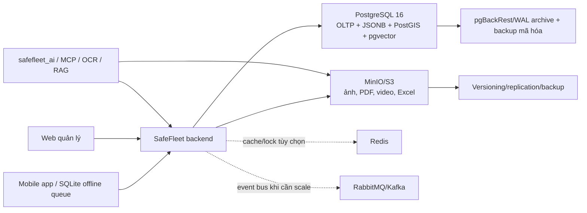

# Thiết kế cơ sở dữ liệu PostgreSQL cho SafeFleet

## 1. Kết luận kiến trúc

PostgreSQL 16+ được chọn làm **nguồn dữ liệu chuẩn duy nhất (system of record)** thay cho MySQL. Việc chuyển đổi không có nghĩa mọi dữ liệu đều được nhét vào PostgreSQL:

| Loại dữ liệu | Nơi lưu chính | Lý do |
|---|---|---|
| Người dùng, phân quyền, tài xế, xe, chuyến, sự cố, trạng thái OCR, kết quả OCR | PostgreSQL | Cần giao dịch ACID, ràng buộc và truy vấn liên bảng |
| JSON nghiệp vụ, payload đồng bộ, kế hoạch/trace của agent | PostgreSQL `jsonb` | Có thể đánh chỉ mục GIN và vẫn giao dịch cùng bản ghi nghiệp vụ |
| Vị trí, tuyến đường, vùng ngập | PostgreSQL + PostGIS | Truy vấn khoảng cách/giao cắt đúng và có chỉ mục GiST |
| Metadata tài liệu RAG, chunk, embedding | PostgreSQL + pgvector | Kết hợp lọc quyền, tìm kiếm từ khóa và vector trong một truy vấn |
| Ảnh phiếu OCR, ảnh bằng chứng, PDF, video, audio, file Excel xuất ra | MinIO/S3 | File lớn không làm phình WAL, backup và bảng OLTP |
| API key OpenAI, mật khẩu dịch vụ, khóa MinIO | Docker/Kubernetes secrets hoặc secret manager | Không được lưu dạng cấu hình nghiệp vụ trong database |
| Cache ngắn hạn, rate limit, distributed lock, trạng thái tiến trình tạm | Redis (chỉ thêm khi có nhu cầu) | Dữ liệu có thể tái tạo; Redis không phải nguồn dữ liệu chuẩn |
| Log ứng dụng, trace, metric | Loki/ELK + OpenTelemetry/Prometheus | Tách tải quan sát hệ thống khỏi OLTP |
| Hàng đợi sự kiện lớn | Broker tùy chọn (RabbitMQ/Kafka) | Chỉ cần khi tải bất đồng bộ vượt khả năng hàng đợi trong PostgreSQL |
| Dữ liệu offline trên điện thoại | SQLite cục bộ | Chỉ là queue/cache; sau đồng bộ PostgreSQL vẫn là nguồn chuẩn |

MinIO đã có trong hệ thống hiện tại nên không cần thêm một kho file mới. Redis và message broker **không bắt buộc ở giai đoạn chuyển đổi đầu tiên**.

## 2. Phạm vi đã kiểm kê

Schema MySQL đang chạy có 41 bảng nghiệp vụ, 86 khóa ngoại và 13 migration Flyway. Các nhóm dữ liệu gồm:

- IAM: `users`, `roles`, `permissions`, token và thiết bị mobile.
- Fleet: `drivers`, `vehicles`, `devices`, nhật ký kết nối.
- Operations: chuyến đi, timeline, checklist, phiên lái, log công việc.
- Safety: telemetry, sự kiện an toàn, sự cố, ngập, bằng chứng.
- Navigation: phiên điều hướng, tuyến ứng viên, sự kiện điều hướng.
- Mobile/offline: idempotency, sync batch, command receipt, push notification.
- Documents: phiếu xuất kho, dòng hàng, xác nhận, audit, hàng đợi OCR.
- Agent: lệnh agent và cấu hình AI nằm ở dịch vụ `safefleet_ai`.

Các phụ thuộc MySQL cần sửa trong code khi triển khai thật:

1. `ON DUPLICATE KEY UPDATE` -> `INSERT ... ON CONFLICT ... DO UPDATE`.
2. `JSON_EXTRACT/JSON_UNQUOTE` -> toán tử `jsonb` (`->`, `->>`, `#>>`).
3. Hibernate dialect và JDBC driver MySQL -> PostgreSQL.
4. `columnDefinition = "json"`, `LONGTEXT`, `MEDIUMTEXT`, `MEDIUMBLOB` -> mapping PostgreSQL/MinIO.
5. Integration test dùng `MySQLContainer` -> `PostgreSQLContainer` hoặc image PostgreSQL có extension.
6. MySQL `DATETIME(6)` không có múi giờ -> tải sang `timestamptz(6)` với giả định nguồn là `Asia/Ho_Chi_Minh`, lưu nội bộ theo UTC.

## 3. Quyết định mô hình dữ liệu

### 3.1 Khóa chính và tính tương thích

- Giữ khóa chính `bigint`, dùng `GENERATED BY DEFAULT AS IDENTITY` để nhập nguyên ID cũ khi migration.
- Không đổi toàn bộ sang UUID trong cùng dự án migration. Các ID public/offline hiện có (`*_uuid`, `client_event_id`) vẫn được giữ để chống gửi trùng.
- Dùng tên bảng/cột hiện tại ở phần lớn mô hình để giảm rủi ro sửa backend.

### 3.2 Loại bỏ khóa ngoại vòng

MySQL hiện có các cặp vòng:

- `drivers.current_vehicle_id` và `vehicles.current_driver_id`.
- `devices.vehicle_id` và `vehicles.gps_device_id/camera_device_id`.

Thiết kế mới thay bằng:

- `driver_vehicle_assignments`: lịch sử tài xế–xe, chỉ cho một phân công đang hoạt động trên mỗi tài xế và mỗi xe.
- `vehicle_device_assignments`: lịch sử gắn thiết bị–xe theo vai trò GPS/camera.

Ngoài việc bỏ vòng khóa ngoại, hai bảng này tạo bằng chứng lịch sử để đối chiếu biển số OCR với tài xế tại đúng thời điểm phiếu được chụp.

### 3.3 Dữ liệu vị trí

- Giữ `lat/lng` trong giai đoạn đầu để API mobile không phải đổi đồng loạt.
- Thêm cột PostGIS `geography(Point, 4326)` được sinh từ `lat/lng` ở các bảng truy vấn không gian quan trọng.
- Tuyến điều hướng giữ payload nhà cung cấp trong `jsonb` và có thêm `geometry(LineString, 4326)` để tính giao cắt/rủi ro.

### 3.4 JSON và dữ liệu phi cấu trúc

PostgreSQL lưu tốt dữ liệu phi cấu trúc bằng `jsonb`, nhưng chỉ dùng cho phần có cấu trúc biến đổi:

- waypoint, route payload, checklist mở rộng, response idempotency;
- payload đồng bộ/mobile;
- metadata OCR/RAG/agent.

Các trường cần lọc, join, thống kê hoặc ràng buộc vẫn phải là cột quan hệ. Không gom toàn bộ một chuyến đi vào một JSON lớn.

### 3.5 File và tài sản số

Thêm bảng `object_assets` làm catalog chung. PostgreSQL giữ bucket, object key, SHA-256, kích thước, MIME type, chủ sở hữu và trạng thái; nội dung file nằm ở MinIO.

`document_ocr_jobs.image_data` bị loại khỏi mô hình đích và thay bằng `source_asset_id`. `safety_event_evidence` và các ảnh ngập/xác nhận cũng liên kết tới `object_assets` thay vì URL rời rạc.

### 3.6 RAG và agent

RAG dùng các bảng:

- `rag_collections`, `rag_documents`, `rag_document_versions`;
- `rag_chunks` với `tsvector` và `vector(1536)`;
- `rag_ingestion_jobs`, `rag_access_grants`.

Kích thước embedding 1536 là profile triển khai ban đầu. Nếu đổi model có kích thước khác, tạo profile/cột embedding mới và re-index; không trộn vector khác chiều trong cùng index.

Agent có audit riêng:

- `ai_conversations`, `ai_messages`, `ai_agent_runs`, `ai_tool_calls`.

API key không nằm trong các bảng này. Chỉ lưu provider/model, trace thực thi, token/cost (nếu có), tool input/output đã loại bỏ bí mật và trạng thái.

## 4. Chỉ mục và tăng trưởng dữ liệu

- B-tree cho khóa ngoại, trạng thái + thời gian, driver/vehicle/trip + thời gian.
- GIN cho trường `jsonb` thực sự được truy vấn và `tsvector` của RAG.
- HNSW (`vector_cosine_ops`) cho embedding.
- GiST cho vị trí/tuyến PostGIS.
- BRIN cho bảng append-only lớn theo `received_at`/`created_at` như telemetry, audit và navigation event.

Không partition tất cả bảng ngay. Bắt đầu partition theo tháng khi một bảng append-only vượt khoảng 20–50 triệu bản ghi hoặc việc vacuum/retention đã trở thành vấn đề đo được. `telemetry_logs` là ứng viên đầu tiên. Partition quá sớm làm phức tạp khóa duy nhất, Flyway và vận hành.

## 5. Ràng buộc an toàn dữ liệu

- Confidence OCR: `0 <= confidence <= 1`.
- Tọa độ: latitude `[-90, 90]`, longitude `[-180, 180]`.
- Số lượng, thời lượng, tiến độ và điểm số không âm; progress trong `[0,100]`.
- Bằng chứng phải thuộc ít nhất một safety event hoặc incident.
- Chỉ một phân công tài xế–xe đang hoạt động cho mỗi phía (partial unique index).
- Dùng `CHECK` thay PostgreSQL enum cho trạng thái còn thay đổi thường xuyên, tránh migration khóa enum khi bổ sung giá trị.

## 6. Sơ đồ kiến trúc lưu trữ

## 7. File bàn giao

- `V1__postgresql_baseline.sql`: schema nghiệp vụ đích và chỉ mục.
- `V2__rag_and_agent.sql`: schema RAG và trace agent.
- `V3__postgis.sql`: projection không gian và chỉ mục GiST.
- `MIGRATION_RUNBOOK.md`: kế hoạch chuyển dữ liệu, đối soát, cutover và rollback.
- `MYSQL_TO_POSTGRES_COMPATIBILITY.md`: các thay đổi bắt buộc trong backend/test/deployment.
- `VALIDATION_REPORT.md`: kết quả chạy thử toàn bộ DDL trên PostgreSQL 16.

## 8. Tài liệu kỹ thuật tham chiếu

- PostgreSQL JSON/JSONB: <https://www.postgresql.org/docs/current/datatype-json.html>
- PostgreSQL partitioning: <https://www.postgresql.org/docs/current/ddl-partitioning.html>
- PostgreSQL BRIN: <https://www.postgresql.org/docs/current/brin.html>
- PostgreSQL full-text search: <https://www.postgresql.org/docs/current/textsearch.html>
- PostgreSQL binary/large objects: <https://www.postgresql.org/docs/current/lo-intro.html>
- PostGIS: <https://postgis.net/docs/>
- pgvector: <https://github.com/pgvector/pgvector>
